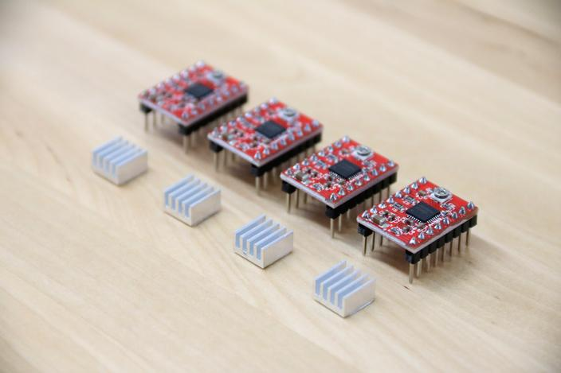
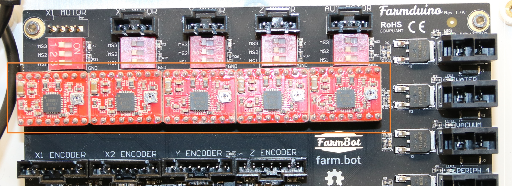

* toc
{:toc}

_A4988 Stepper Drivers_

It is possible for a stepper driver module to become damaged which may result in no movement at all along an axis. A common sign of a damaged stepper driver module is noticeable burn marks on the stepper driver chip or PCB.

_The stepper drivers are located on the Farmduino micro-control board. There is one available spare on the AUX MOTOR stepper driver._

If you suspect that one of your stepper drivers has been damaged, you can replace it with the extra 5th stepper driver module included in all kits.

# Step 1: Power down your FarmBot
From the web app, instruct FarmBot to **shutdown**. Once it has shutdown, unplug the **power supply** from the **power source**.

# Step 2: Replace the damaged stepper driver module
Carefully remove the damaged **stepper driver module** from the **Farmduino** or **RAMPS shield**. You may need to wiggle it slightly to facilitate removal.

Next, remove the **5th stepper driver module** that is connected to the **AUX motor slot**.

Keeping the orientation the same, insert the 5th stepper driver module into the slot that was holding the damaged stepper driver module.



# Step 3: Power up your FarmBot
You may now plug your FarmBot back in and turn it on to test out the new stepper driver.
