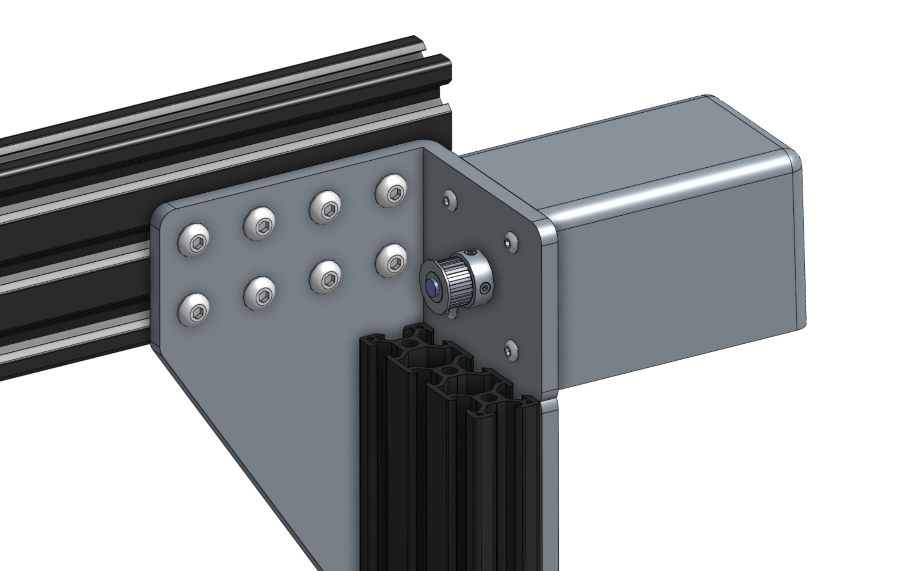
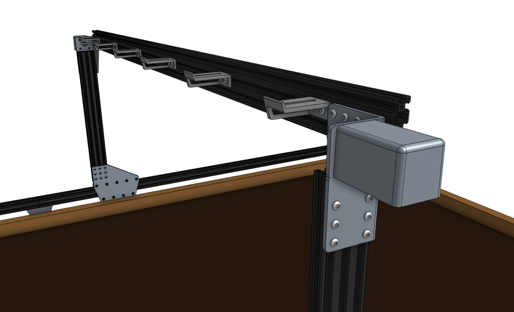
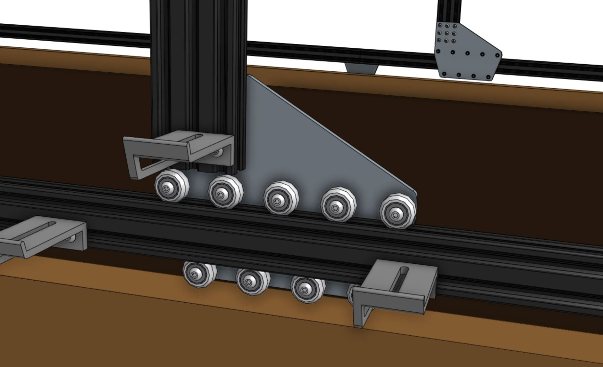

* toc
{:toc}

# Step 1: Attach the gantry motors
For this step you will need:
* Two [NEMA 17 stepper motors with rotary encoders](../../Extras/bom/electronics-and-wiring.md#nema-17-stepper-motors-with-rotary-encoders)
* Two [horizontal motor housings](../../Extras/bom/plastic-parts.md#horizontal-motor-housing)
* Eight [M3 x 12mm screws](../../Extras/bom/fasteners-and-hardware.md#m3-screws)
* [2mm hex driver](../../Extras/bom/miscellaneous.md#2mm-hex-driver)
* [3mm hex driver](../../Extras/bom/miscellaneous.md#3mm-hex-driver)

Slide a **motor** into a **horizontal motor housing**, ensuring that the shaft of the motor is coming out of the housing and that the motor and encoder connectors are facing down through the open bottom of the housing.

Position the motor and housing onto the gantry corner bracket and attach it with four **M3 x 12mm screws**.

Slide a **GT2 pulley** onto the **motor shaft** and tighten the two **setscrews** with the 2mm hex driver. Make sure that the two setscrews contact the two *flat areas* on the motor shaft.

Repeat the above steps for the second motor on the other gantry corner bracket.

# Step 2: Install the horizontal cable carrier supports
Attach six **horizontal cable carrier supports** to the back side of the **gantry main beam** using two **M5 x 10mm screws** and **M5 tee nuts** for each support. The supports should reside in the **middle slot** of the main beam extrusion and be equally spaced along its length.

Attach the last **horizontal cable carrier support** to the left-side **gantry column** using two **M5 x 10mm screws** and **M5 tee nuts**.

