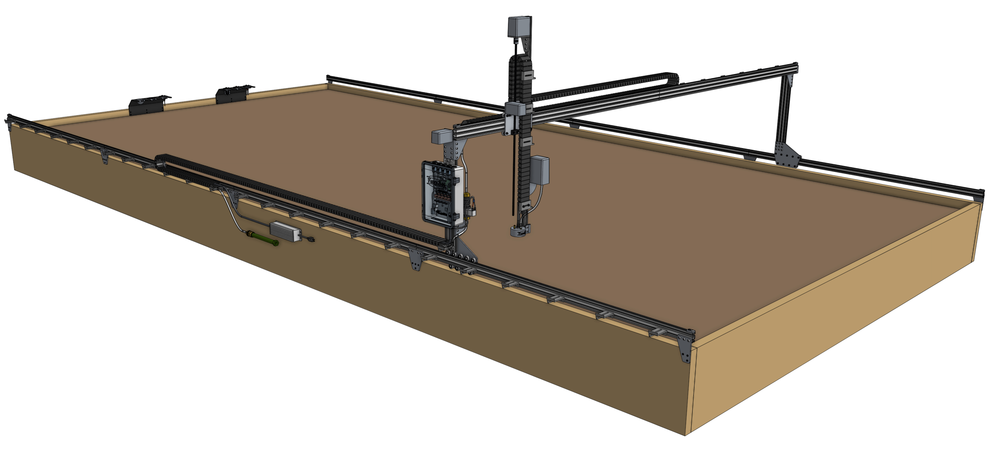

* toc
{:toc}

FarmBot Genesis and Genesis XL are small scale FarmBots primarily constructed from V-Slot aluminum extrusions and aluminum plates and brackets. They are driven by four NEMA 17 stepper motors with rotary encoders, the Farmduino microcontroller, and a Raspberry Pi 3 computer.

Current models can cover growing areas as small 1m2 up to a maximum of 18m2, and plants as tall as 1m. With additional hardware and modifications, it may be possible to scale the Genesis concept to cover approximately 50m2 and a maximum plant height of 1.5m, though at this time we do not offer kits with such capacity.

_FarmBot Genesis v1.4_

_FarmBot Genesis XL v1.4_

{%
include callout.html
type="success"
title="Not your typical product"
content="We've gone through great lengths to design FarmBot Genesis to be durable, easily assembled and modified with common tools, constructed from largely off-the-shelf components, and manufactured with readily available processes and materials. Nothing about FarmBot speaks obsolescence or proprietary.

We've done this because at our core, we're makers and hackers just like you. We enjoy tearing apart our gadgets and gizmos to fix them, improve them, and make them different and unique. So that's what FarmBot Genesis is all about - empowering you to truly own FarmBot technology inside and out.

Go ahead and make your tracks longer, design a tool that electrocutes weeds, program FarmBot to spray water at the local cats, grow mushrooms, flowers, hydroponically, or on your living room wall! We can't wait to see what you do with FarmBot.

We hope you'll find our documentation useful and a great starting point for working with FarmBot and making it your own. If you ever have any questions, please head on over to the [forum](http://forum.farmbot.org). Cheers! 🍻"
%}

# Tracks
Tracks are one of the components that really differentiate FarmBot technology from traditional free-driving wheeled tractors. The tracks are what allow the system to have great precision in an efficient and simple manner. There are many reasons of why tracks are superior, a few of which are listed below.
1. Tracks provide great precision and allow the the FarmBot to return to the same position repeatedly
2. Any type of packing structure of plants can be created and managed
3. Tracks take up less area than paths for tractor wheels and do not compact the soil

# Gantry
The Gantry is the the structural component that bridges the two Tracks and moves in the X-direction via an X-Direction Drive System. Typically, it serves as a linear guide for the Cross-Slide and a base for the Y-Direction Drive System that moves the Cross-Slide across the Gantry in the Y-direction. It can also serve as a base for mounting other tools, electronics, supplies, and/or sensors.

# Cross-slide
The Cross-Slide moves in the Y-Direction across the Gantry. This motion provides the second major degree of freedom for FarmBots and allows operations such as planting to be done anywhere in the XY plane. The Cross-Slide is moved using a Y-Direction Drive System and functions as the base for the Tool Mount and Z-Direction Drive System.

# Z-axis
The Z-axis attaches to the Cross-Slide and provides the FarmBot with Z-Direction movement. It serves as the base for attaching the Universal Tool Mount and other Tools.

  
  
Z-Axis

  
Cross-Slide

  
Gantry

  
Universal Tool Mount

  
Tracks

  
X-Direction

  
Z-Direction

  
Y-Direction

# Raised tracks vs low tracks
For FarmBots to properly grow taller plants, the Gantry, Cross-Slide, Z-Axis, and Tools must have adequate vertical clearance from the plants. This can generally be accomplished in two ways:

1. Using raised tracks and a low-profile gantry
2. Using low tracks with a tall gantry

In general, using low tracks with a tall gantry is the better design, especially for larger applications because it saves on material cost, is less of an eyesore, blocks less sunlight, and would be easier to maintain. However, in the case of a FarmBot being installed in a greenhouse or other structure, utilizing the existing walls to support the tracks higher may be a better solution.

  
  
Raised Tracks with Low-Profile Gantry

  
vs.

  
Low Tracks with Raised Gantry

# Economies of scale
The table below shows the cost/m2 of growing area based on the size of your FarmBot. Predictably, the larger your FarmBot is, the lower the cost will be per square meter of growing area. Thus, we recommend installing the largest possible FarmBot in your space in order to get the most value out of the device.

*Note that the costs below do not account for [supporting infrastructure](../../FarmBot-Genesis-V1-4/supporting-infrastructure.md), which will also increase in cost as the device size increases.*

|Model                         |Track Length                  |Gantry Width                  |Growing Area                  |Cost                          |Cost/m^2                      |
|------------------------------|------------------------------|------------------------------|------------------------------|------------------------------|------------------------------|
|Genesis                       |1.5m *                        |1.5m                          |2.25m2             |~$2,700                       |$1,200
|Genesis                       |3m                            |1.5m                          |4.5m2              |~$2,700                       |$600
|Genesis XL                    |3m *                          |3m                            |9m2                |~$4,000                       |$444
|Genesis XL                    |4.5m *                        |3m                            |13.5m2             |~$4,000                       |$296
|Genesis XL                    |6m                            |3m                            |18m2               |~$4,000                       |$222

** indicates tracks that are shorter from the stock kit. Please note that at this time we do not sell kits with shorter tracks, so these calculations are for someone who does not utilize all of the components in their kit.*
