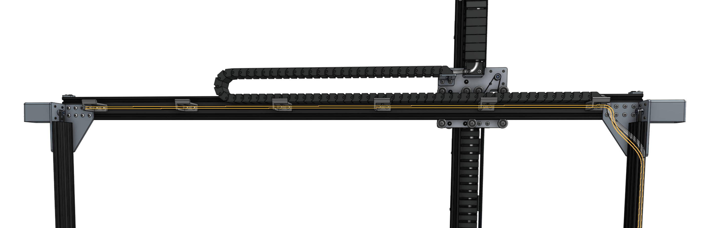

# Install the light strip

Feed the [LED light strip](../../Extras/bom/electronics-and-wiring.md#led-strip) through the horizontal cable carrier supports on the Gantry.

In a few steps from now, you will [plug the LED light strip into the **Farmduino**](../electronics.md#step-3-connect-the-peripherals).

# What's next?

 * [Universal Tool Mount](../tools/utm.md)
