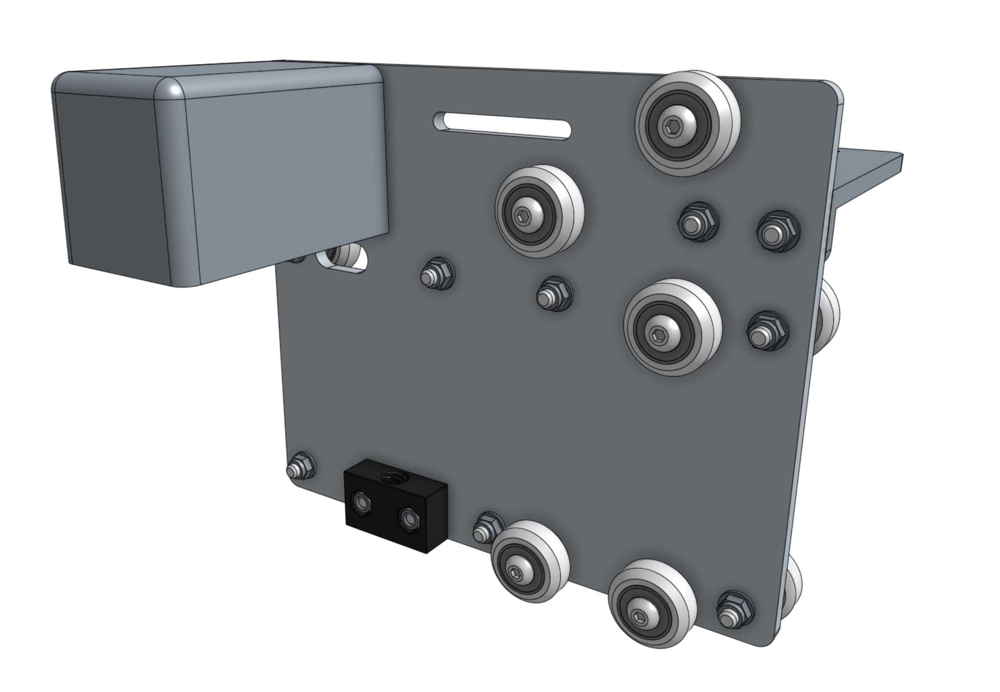
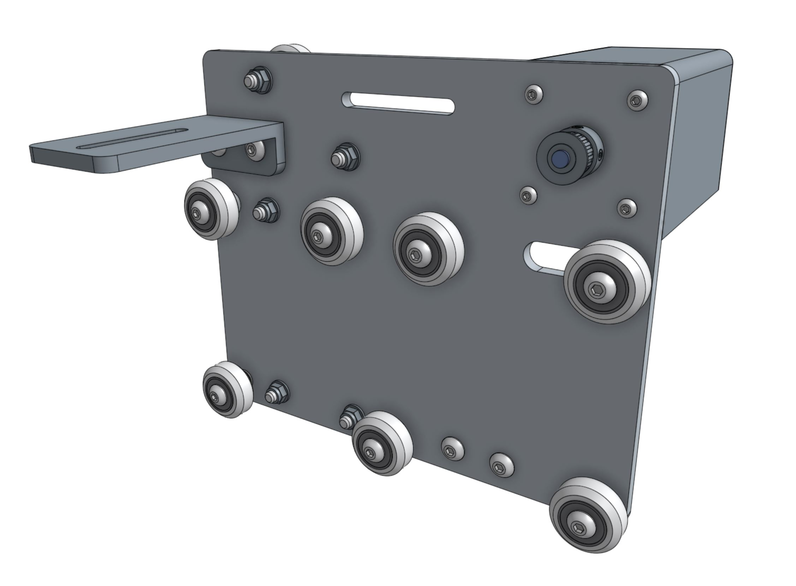
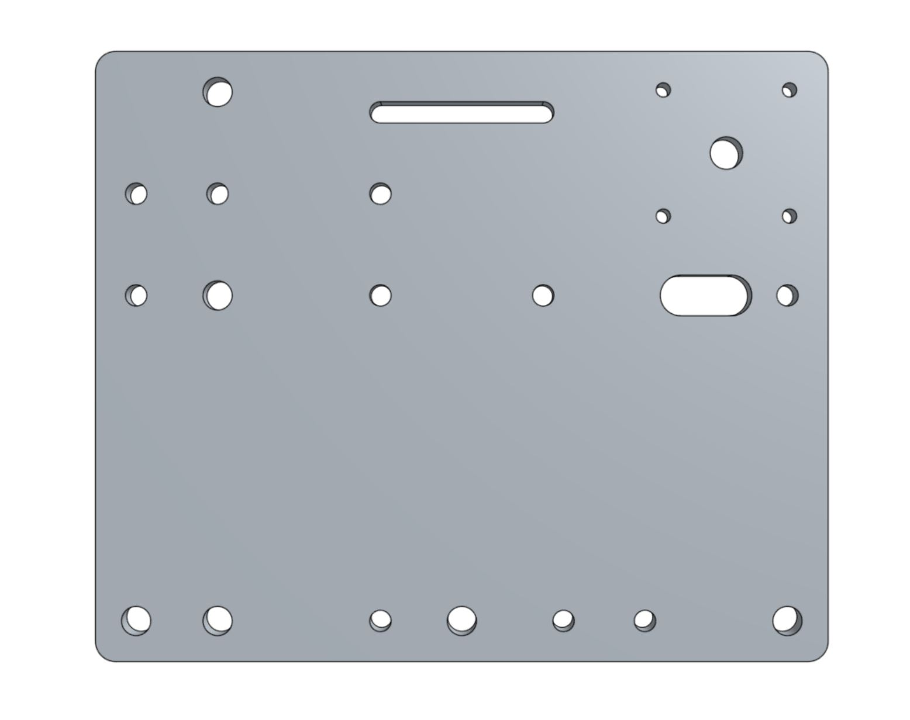
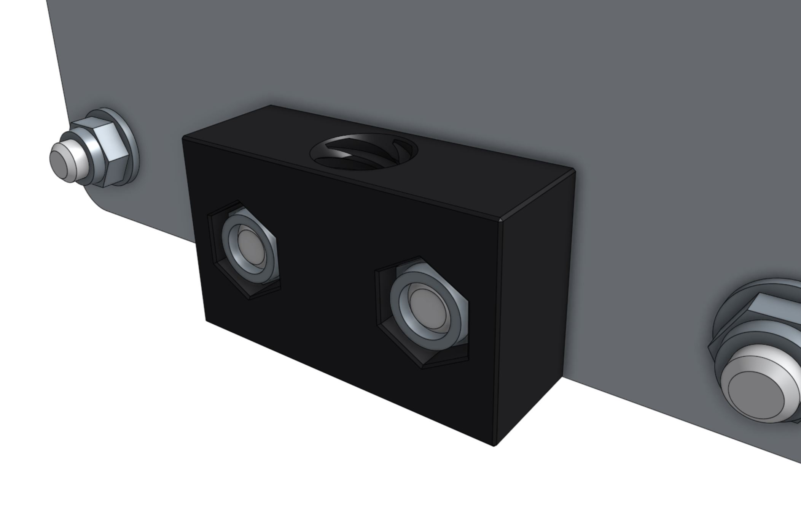
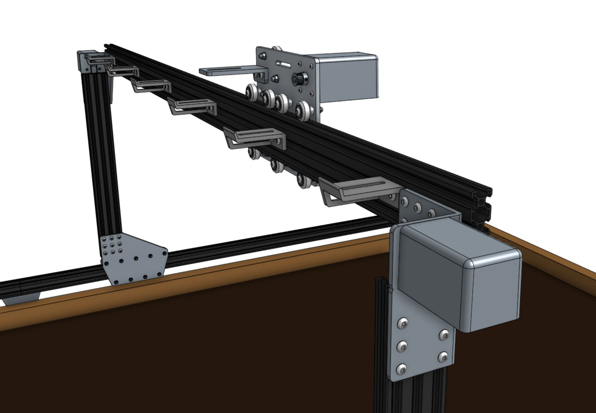
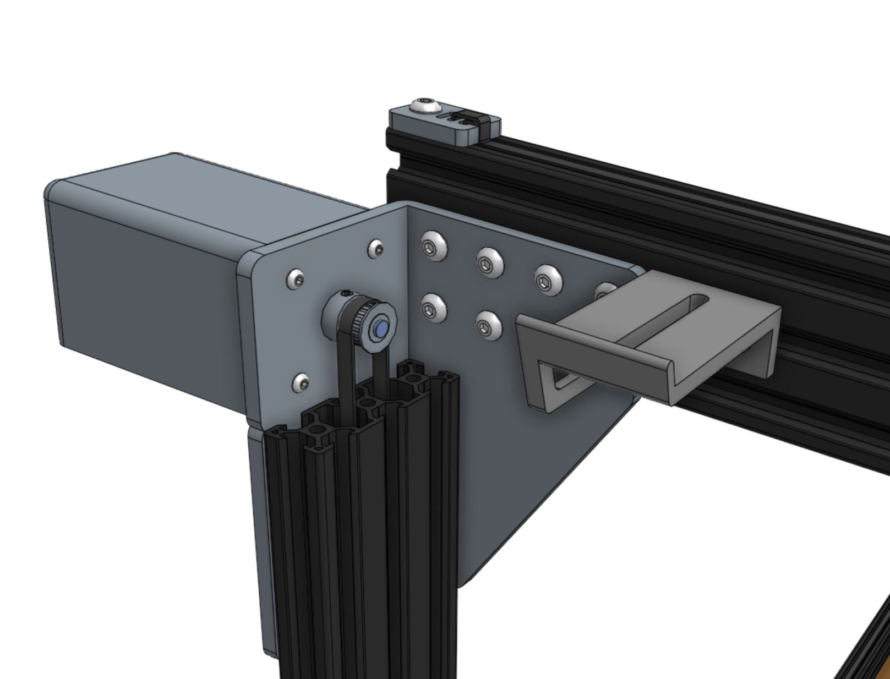

* toc
{:toc}

_View of the cross-slide from the front of FarmBot_

_View of the cross-slide from the back of FarmBot_

## Component list

|Qty.                          |Component                     |
|------------------------------|------------------------------|
|1                             |[Cross-Slide Plate](../Extras/bom/plates-and-brackets.md#cross-slide-plate)
|4                             |[M3 x 12mm Screws](../Extras/bom/fasteners-and-hardware.md#m3-x-12mm-screws)
|4                             |[M5 x 16mm Screws](../Extras/bom/fasteners-and-hardware.md#m5-x-16mm-screws)
|12                            |[M5 x 30mm Screws](../Extras/bom/fasteners-and-hardware.md#m5-x-30mm-screws)
|6                             |[M5 x 6mm Spacers](../Extras/bom/fasteners-and-hardware.md#m5-x-6mm-spacers)
|6                             |[6mm Eccentric Spacers](../Extras/bom/fasteners-and-hardware.md#m5-x-6mm-eccentric-spacers)
|14                            |[M5 Washers](../Extras/bom/fasteners-and-hardware.md#m5-washers)
|18                            |[M5 Locknuts](../Extras/bom/fasteners-and-hardware.md#m5-locknuts)
|12                            |[V-wheels](../Extras/bom/drivetrain.md#v-wheels)
|1                             |[Horizontal Motor Housing](../Extras/bom/plastic-parts.md#horizontal-motor-housings)
|1                             |[Long Cable Carrier Mount](../Extras/bom/plates-and-brackets.md#long-cable-carrier-mount)
|1                             |[Leadscrew Block](../Extras/bom/drivetrain.md#leadscrew-block)
|1                             |[NEMA 17 Stepper Motor with Rotary Encoder](../Extras/bom/electronics-and-wiring.md#nema-17-stepper-motors-with-rotary-encoders)
|1                             |[20 tooth GT2 Pulley](../Extras/bom/drivetrain.md#gt2-pulleys) (with setscrews)
|1                             |Y-Axis [GT2 Timing Belt](../Extras/bom/drivetrain.md#gt2-timing-belt) (2m long for Genesis, 3.5m long for XL)



# Step 1: Attach the gantry V-wheels

Use four **M5 x 30mm screws**, **M5 washers**, and **M5 locknuts** to attach four **V-wheels** with **normal 6mm spacers** to the **cross-slide plate**.



_Wheels with normal spacers._

Use three **M5 x 30mm screws** to attach three **V-wheels** with **eccentric 6mm spacers** to the holes shown. The V-wheels should be secured with an **M5 washer** and an **M5 locknut** on the other side.

_Bottom three wheels with eccentric spacers._

# Step 2: Add the Z-axis V-wheels

Flip the cross-slide over so that all of the V-wheels you have added so far are facing away from you.

Use two **M5 x 30mm screws** to attach two **V-wheels** with **normal 6mm spacers** to the holes shown. Secure these wheels with an **M5 washer** and an **M5 locknut** on the other side of the plate.

_Wheels with normal spacers._

Use three **M5 x 30mm screws** to attach three **V-wheels** with **eccentric 6mm spacers** to the holes shown. The V-wheels should be secured with an **M5 washer** and an **M5 locknut** on the other side.

_Right three wheels with eccentric spacers._

# Step 3: Attach the delrin leadscrew block
Insert two **M5 locknuts** into the **delrin leadscrew block's** hexagonal counterbores. With the locknuts and delrin block facing you, attach it to the side of **cross-slide plate** as shown. Secure the block using two **M5 x 16mm screws** from the opposite side of the plate.

# Step 4: Attach the stepper motor

Insert the **stepper motor** into the **horizontal motor housing** such that the motor and encoder connectors are facing down, out the open face of the housing.

Use four **M3 x 12mm screws** to attach the **stepper motor** and **motor housing** to the **cross-slide plate**.



Slide a **GT2 pulley** onto the **stepper motor** shaft. Make sure that both setscrews are lined up with the flat spots of the motor shaft. Then tighten the setscrews with the **2mm driver**.

# Step 5: Add the long cable carrier support
Use two **M5 x 16mm screws**, **M5 washers**, and **M5 locknuts** to secure the **long cable carrier support** to the **cross-slide plate**. The bracket should be on the opposite side of the plate as the motor. The washers should be on the same side of the plate as the motor.

# Step 6: Adjust the eccentric spacers
In order for the cross-slide to slide smoothly and wobble-free on the gantry main beam, you must first adjust the eccentric spacers of the bottom three V-wheels. Adjust the eccentric spacers using the [eccentric spacer adjustment reference guide](../Extras/reference/eccentric-spacer-adjustment.md).

# Step 7: Slide the cross-slide onto the gantry main beam
Once you have adjusted the eccentric spacers, slide the cross-slide onto the gantry main beam.

# Step 8: Feed and secure the belt
Use a **belt clip**, **M5 x 10mm screw**, and **M5 tee nut** to secure one end of the **y-axis GT2 timing belt** (2m long for Genesis, 3.5m long for XL) to the end of the gantry main beam. The belt must be wrapped through the clip as outlined in the [Belt Clip Installation](../Extras/reference/belt-clip-installation.md) reference guide.

Feed the **belt** under the end **V-wheel** of the cross-slide, then over the **GT2 pulley** and under the remaining three **V-wheels**. The flat side of the belt should be in contact with your V-wheels while the toothed side should engage with the teeth on the pulley.



Secure the belt at the other end of the gantry with another **belt clip**, **M5 x 10mm screw**, and **M5 tee nut**. Put a small amount of tension on the belt as you tighten the M5 screw.

# What's next?

 * [Z-Axis](z-axis.md)
