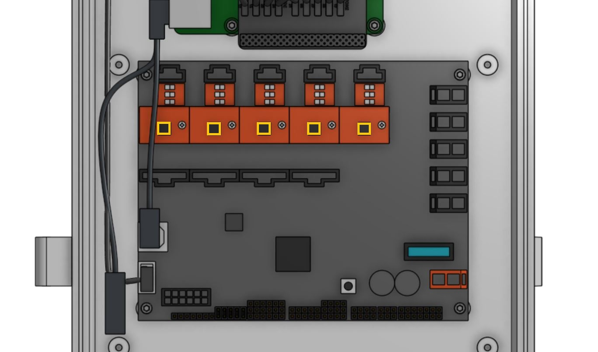
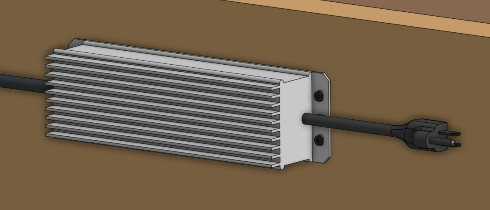
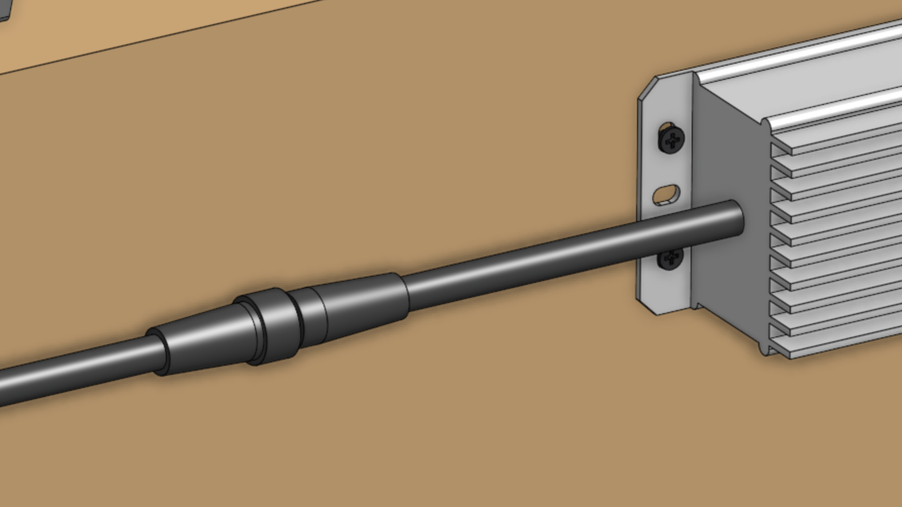

<iframe class="embedly-embed" src="//cdn.embedly.com/widgets/media.html?src=https%3A%2F%2Fwww.youtube.com%2Fembed%2Fr6vjSrMhUc0%3Ffeature%3Doembed&url=http%3A%2F%2Fwww.youtube.com%2Fwatch%3Fv%3Dr6vjSrMhUc0&image=https%3A%2F%2Fi.ytimg.com%2Fvi%2Fr6vjSrMhUc0%2Fhqdefault.jpg&key=f2aa6fc3595946d0afc3d76cbbd25dc3&type=text%2Fhtml&schema=youtube" width="854" height="480" scrolling="no" frameborder="0" allow="autoplay; fullscreen" allowfullscreen="true"></iframe>



# Component list

|Qty.                          |Component                     |
|------------------------------|------------------------------|
|1                             |Pre-assembled [Electronics Box](../Extras/bom/electronics-and-wiring.md#electronics-box)
|6                             |[M5 x 10mm Screws](../Extras/bom/fasteners-and-hardware.md#m5-screws)
|6                             |[M5 Tee Nuts](../Extras/bom/fasteners-and-hardware.md#m5-tee-nuts)
|2                             |[Cable Guides](../Extras/bom/plastic-parts.md#cable-guides)

# Step 1: Attach the electronics box to the gantry

Attach the pre-assembled **electronics box** to the middle slot on the outside of the **left gantry column** using two **M5 x 10mm screws** and **tee nuts**. The screws should be placed in the middle holes on the top and bottom mounting flanges of the electronics box. The top flange of the box should be butted against the bottom edge of the **gantry corner bracket**.

# Step 2: Attach the cable guides

Attach both **cable guides** to the back side of the left **gantry column** using **M5 x 10mm screws** and **tee nuts** as shown. Adjust the guides so they secure the **motor and encoder cables**, **UTM cable**, **LED lights cable**, **vacuum pump cable**, **camera cable**, and the **water tube**. Ensure the water tube is not compressed.

_Note: the cables and tubing are not shown in this image._

# Step 3: Connect the peripherals



{%
include callout.html
type="info"
title="All cables go through the slot"
content="Before proceeding with plugging everything in, remove the black rubber **supergland** from the slot in the bottom of the **electronics box**.

When plugging in cables in the following steps, ensure that you pass **every cable** through the slot in the bottom of the electronics box. Once everything is connected to the electronics, you will organize all of the cables into the supergland, and then push the supergland back into the slot."
%}

* Connect the **LED lights** to the **Farmduino** peripheral connector labelled `LIGHTING` (the top right connector on Farmduino). The connector will only fit in one direction.
* Connect the **solenoid valve cable** (with blue heat shrink) to the **Farmduino** peripheral connector labelled `WATER` (directly underneath the lighting connector). The connector will only fit in one direction.
* Connect the **vacuum pump cable** (with gray heat shrink) to the **Farmduino** peripheral connector labelled `VACUUM` (directly underneath the water connector). The connector will only fit in one direction.

_The peripheral connectors are highlighted in orange_



# Step 4: Plug in the stepper motors and rotary encoders
Plug in the **motor and encoder cables** to the **Farmduino**. Each cable is labelled with a white sleeve, which corresponds to the connectors on the Farmduino. From left to right, the connectors on Farmduino are `X1`, `X2`, `Y`, and `Z`. Each connector can only be inserted in one direction, and has a locking tab to prevent it from falling out.

_The motor and encoder connectors are highlighted in orange_



# Step 5: Plug in the camera
Plug in the **camera** to the **USB adapter cable**.

_The USB adapter cable is highlighted in orange_

# Step 6: Plug in the UTM cable
Plug in the **UTM cable** to the **Farmduino**. The connector will only fit in one direction.

_The UTM connector is highlighted in orange_

# Step 7: Plug the power supply into the Farmduino
Connect the red **2-pin power supply connector** to the **Farmduino's power input**. The connector will only fit in one direction.

_The power input connector is highlighted in orange_

# Step 8: Install the heat sinks on the stepper drivers.

The heat sinks allow for better heat transfer to the air. They are a set of small fins that effectively increase the surface area and allow for better heat rejection. Install the heat sinks in the vertical orientation to take advantage of natural convection.



Place the heat sinks squarely and directly on the stepper driver chip in the vertical orientation as shown in the graphic above. The heat sink components will allow the stepper driver chips to remain cool enough to operate in hot environments.

# Step 9: Insert the supergland
Insert one half of the **supergland** into the slot in the bottom of the **electronics box**. The left-most hole in the supergland should be small (it is for the camera) while the right-most hole should be medium-sized (it is for the power supply).

Organize and position the **cables** into the **supergland**. From left to right, the cables should be: camera, UTM, motors, encoders, peripherals, power supply.

Once the cables are all inserted into the first supergland half, gently insert the second half of the supergland into the slot in the electronics box. Ensure that the flanges of both supergland halves are on either side of the electronics box wall.



# Step 10: Install FarmBot OS onto the microSD card
Follow [these instructions](https://software.farm.bot/docs/farmbot-os) on the software documentation hub to install **FarmBot OS** onto the **microSD card**.

# Step 11: Mount the power supply
Mount the **power supply** to your **supporting infrastructure** using four **25mm wood screws**. The power supply is IP67 rated, so it can withstand rain and the elements.

# Step 12: Plug in the power supply
Connect the **waterproof screw-together 2-pin connector** of the **power supply cable** into the **power supply output**.

Before plugging the power supply into an outlet or an extension cord, please read the precaution below.

{%
include callout.html
type="danger"
title="Beware of electrical shock"
content="Remember that once you plug in the power supply, your system will be powered. Once powered, you cannot add, remove, or change any motor cables, peripheral cables, stepper drivers, etc, or you risk frying the electronics and/or being electrically shocked.

If you need to make any changes, you must first unplug the power supply from the wall. This will minimize the risk of electrical shock and the potential to permanently damage your electronics."
%}

If everything looks good, and you understand the precautions needed around powered electronics, go ahead and plug the power supply into a GFCI outlet.

If an appropriate outlet is not close enough to plug in directly, use an extension cord and the provided green outdoor electrical connection protector.







# What's next?

 * [Tools](tools.md)
