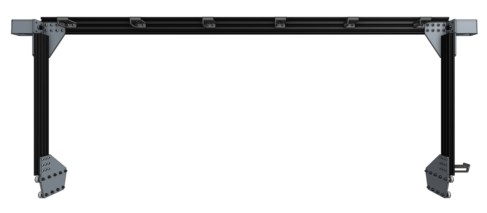

* toc
{:toc}

_Note: This image is of the back side of the gantry._

## Component list

|Component                     |Genesis Qty                   |XL Qty                        |
|------------------------------|------------------------------|------------------------------|
|[Gantry Main Beams](../Extras/bom/extrusions.md#gantry-main-beam) (20 x 60 x 1500mm extrusion)|1                             |2
|[Gantry Columns](../Extras/bom/extrusions.md#gantry-columns) (20 x 60 x 500mm extrusion)|2                             |2
|[Gantry Wheel Plates](../Extras/bom/plates-and-brackets.md#gantry-wheel-plates)|2                             |2
|[Gantry Corner Brackets](../Extras/bom/plates-and-brackets.md#gantry-corner-brackets) (left-hand and right-hand versions)|2                             |2
|[Gantry Joining Bracket](../Extras/bom/plates-and-brackets.md#gantry-joining-bracket)|-                             |1
|[Belt Clips](../Extras/bom/plates-and-brackets.md#belt-clips)|4                             |4
|[M3 x 12mm Screws](../Extras/bom/fasteners-and-hardware.md#m3-x-12mm-screws)|8                             |8
|[M5 x 10mm Screws](../Extras/bom/fasteners-and-hardware.md#m5-x-10mm-screws)|72                            |100
|[M5 x 30mm Screws](../Extras/bom/fasteners-and-hardware.md#m5-x-30mm-screws)|18                            |18
|[M5 x 6mm Spacers](../Extras/bom/fasteners-and-hardware.md#m5-x-6mm-spacers)|10                            |10
|[M5 x 6mm Eccentric Spacers](../Extras/bom/fasteners-and-hardware.md#m5-x-6mm-eccentric-spacers)|8                             |8
|[M5 Washers](../Extras/bom/fasteners-and-hardware.md#m5-washers)|18                            |18
|[M5 Tee Nuts](../Extras/bom/fasteners-and-hardware.md#m5-tee-nuts)|72                            |100
|[M5 Locknuts](../Extras/bom/fasteners-and-hardware.md#m5-locknuts)|18                            |18
|[Horizontal Motor Housings](../Extras/bom/plastic-parts.md#horizontal-motor-housings)|2                             |2
|[Horizontal Cable Carrier Supports](../Extras/bom/plastic-parts.md#horizontal-cable-carrier-supports)|7                             |13
|[V-wheels](../Extras/bom/drivetrain.md#v-wheels)|18                            |18
|[NEMA 17 Stepper Motor with Rotary Encoders](../Extras/bom/electronics-and-wiring.md#nema-17-stepper-motors-with-rotary-encoders)|2                             |2
|[20 tooth GT2 Pulleys with setscrews](../Extras/bom/drivetrain.md#gt2-pulleys)|2                             |2
|X-Axis [GT2 Timing Belts](../Extras/bom/drivetrain.md#gt2-timing-belt)|2                             |2



# What's next?

 * [Assemble the Gantry Wheel Plates](../FarmBot-Genesis-V1.4/gantry/assemble-the-gantry-wheel-plates.md)
