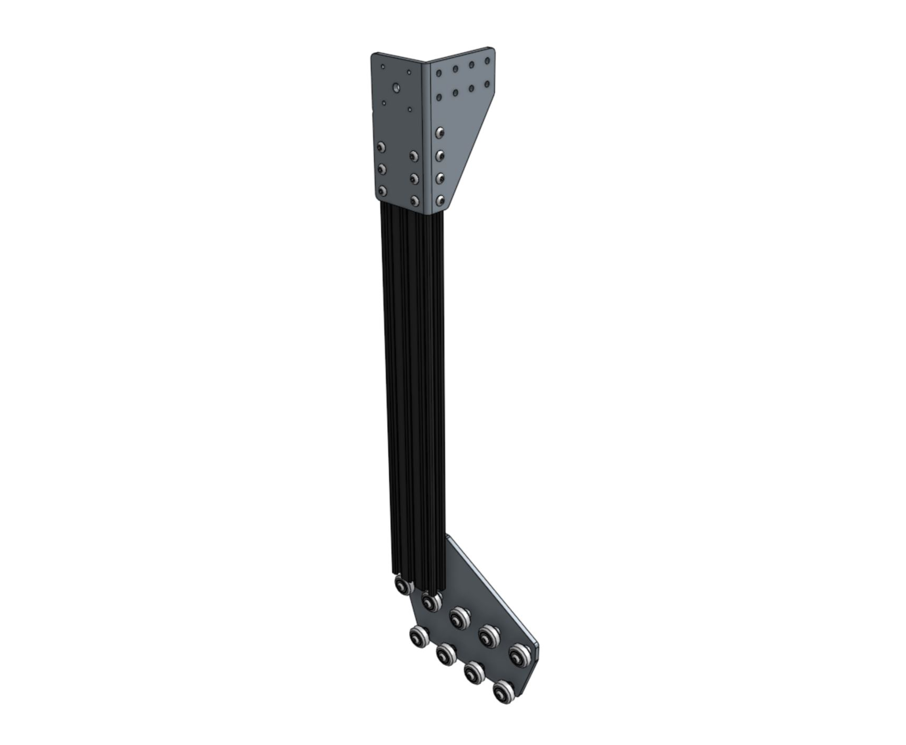
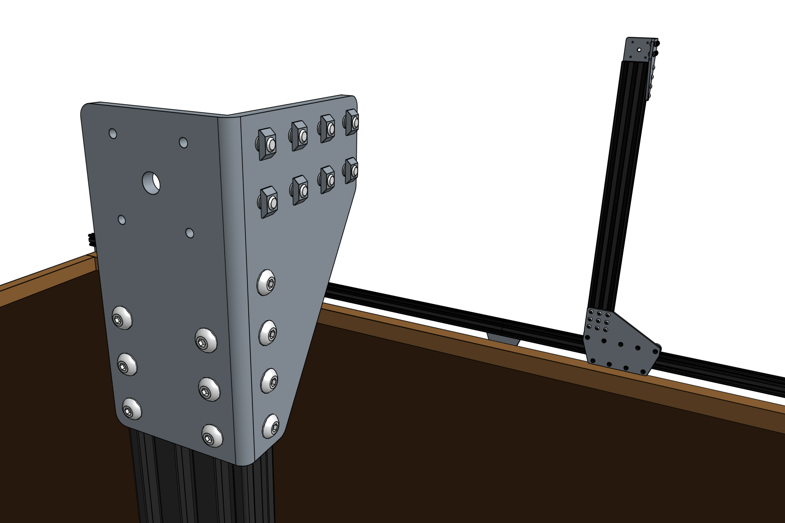
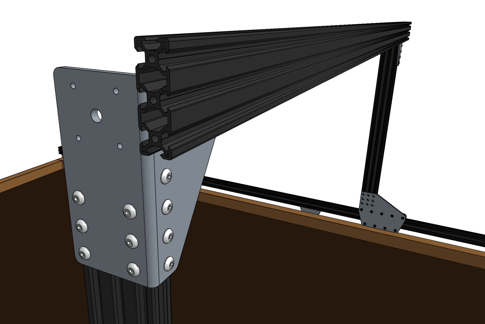
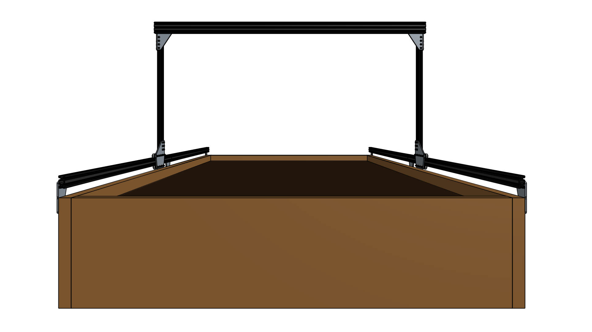

* toc
{:toc}

# Step 1: Attach the plates to the columns

For this part of the assembly you will need:
* The two [gantry wheel plate assemblies](assemble-the-gantry-wheel-plates.md) from the previous page
* The [gantry columns](../../Extras/bom/extrusions.md#gantry-columns) (20mm x 60mm x 500mm extrusions)
* [3mm hex driver](../../Extras/bom/miscellaneous.md#3mm-hex-driver)

Position the **gantry column** onto the **gantry wheel plate assembly**. The extrusion should reside on the same side of the plate as the V-wheels and the end of the extrusion should be aligned with the notch in the plate. Tighten the **M5 x 10mm screws** using the **3mm hex driver**.



Repeat for the second gantry wheel plate and aluminum extrusion.

# Step 2: Attach the gantry corner brackets

For this step you will need:
* The two gantry wheel plate/column assemblies completed in the previous step
* Two [gantry corner brackets](../../Extras/bom/plates-and-brackets.md#gantry-corner-brackets) (one left-hand and one right-hand version)
* 20 [M5 x 10mm screws](../../Extras/bom/fasteners-and-hardware.md#m5-screws)
* 20 [M5 tee nuts](../../Extras/bom/fasteners-and-hardware.md#m5-tee-nuts)
* [3mm hex driver](../../Extras/bom/miscellaneous.md#3mm-hex-driver)

Lightly screw together 10 **M5 x 10mm screws** and **M5 tee nuts** on the **left-side gantry corner bracket** as shown.

Position the corner bracket onto the gantry column/plate assembly. Pay special attention to the orientation of the bracket, extrusion, and wheel plate.

The top of the extrusion should line up with the notch in the corner bracket. Tighten the **M5 x 10mm screws** with the **3mm hex driver**.

# Step 3: Repeat

Repeat the above steps for the second corner bracket and column. You should end up with two assemblies that are mirror images of each other. Inspect these images closely to ensure your corner brackets are attached to the columns in the correct orientation.

# Step 4: Slide the gantry columns onto the tracks



Slide the **gantry columns** onto the **tracks**. The direction that the wheel plates extend from the column is towards the front of FarmBot.

# Step 5: Assemble the main beam (XL kits only)



Insert the slightly larger diameter half of three **dowel pins** half-way into the holes in the **gantry main beam**. The pins should fit snugly, and require a small amount of force to be put in. If a pin is loose, try inserting it into the second **gantry main beam**. Be careful to not lose any pins inside the extrusions.



Place both **gantry main beams** on a flat surface. Then slide the two extrusions together so the exposed dowel pins are inserted into the other beam.



Lightly screw 16 **M5 x 10mm screws** and **tee nuts** to the **gantry joining bracket**.

Position the **gantry joining bracket** onto the lower two slots of the **gantry main beam**, such that the notch in the middle of the bracket is aligned with the joint of the two extrusions. Then tighten all the screws.

# Step 6: Attach the main beam

Insert eight **M5 x 10mm screws** and **M5 tee nuts** into the front face of each of the gantry corner brackets. The tee nuts should be facing the front of FarmBot.



Lift up the **gantry main beam** and position it onto the front of the **gantry corner brackets**. The tee nuts should fit into the *lower two extrusion slots* of the main beam such that the top face of the main beam is 20mm above the top faces of the gantry corner brackets.

_Note that this image is from the backside of FarmBot_

*For XL kits*, ensure that the **gantry joining bracket** is on the same side of the **main beam** as the **gantry corner brackets**. The top face of the gantry joining bracket should be in the same plane as the top faces of the gantry corner brackets.

_This image is from the backside of a Genesis XL kit, illustrating the position of the gantry joining bracket_

Ensure that the gantry columns are vertical and then tighten the 16 **M5 x 10mm screws**. Depending on the spacing of your tracks, the gantry main beam may extend beyond the corner brackets. This is ok.

_This image is from the front of FarmBot_

# What's next?

 * [Attach the Drivetrain](attach-the-drivetrain.md)
