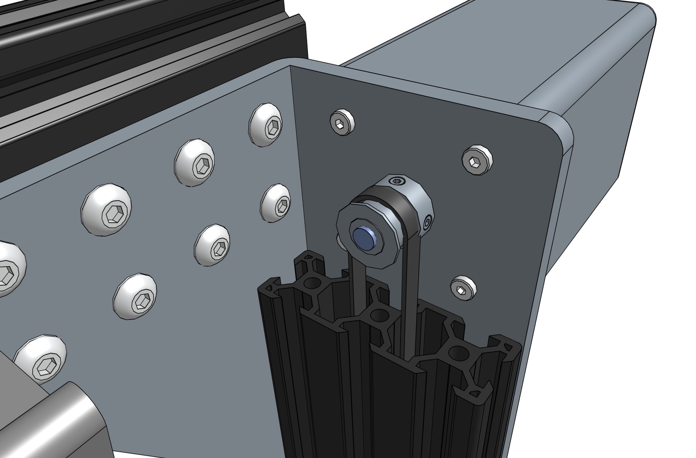
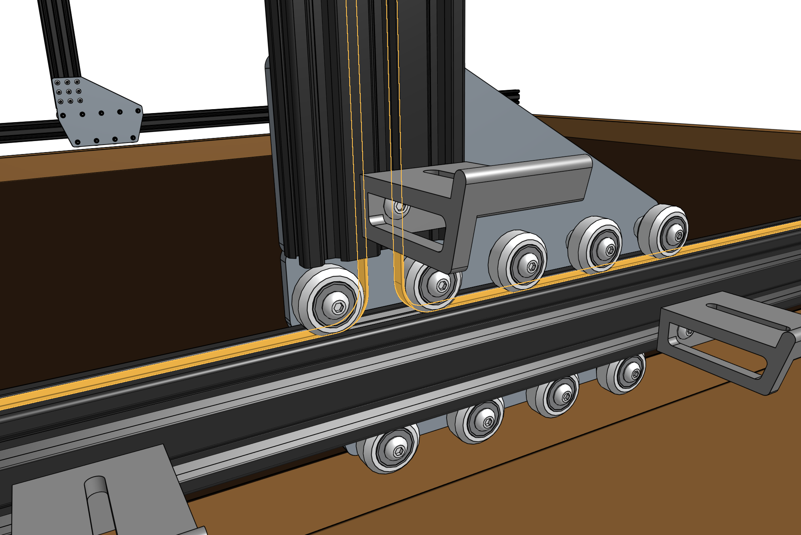
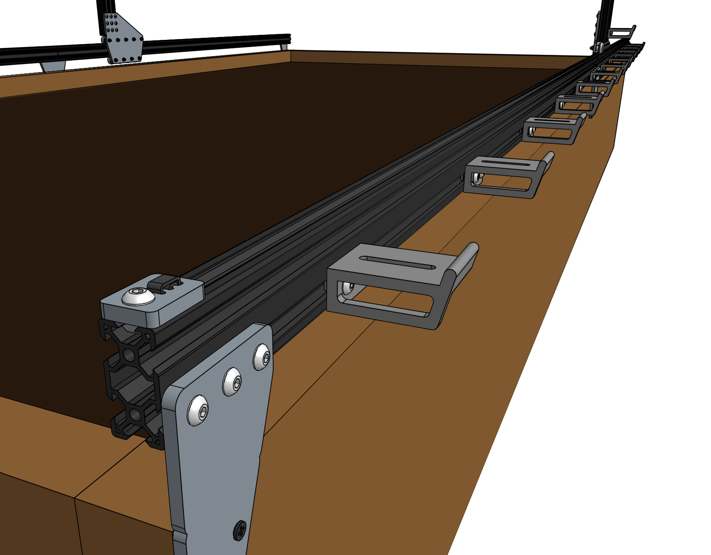

* toc
{:toc}

# Step 1: Feed the belts
Drop the ends of one of the **x-axis GT2 timing belts** down the two large openings of a **gantry column**, ensuring that the belt teeth engage the **GT2 pulley**.

Grab the ends of the **belt** at the bottom of the **gantry column** and feed them under the **V-wheels** of the **gantry wheel plate**, then along the top of the **track extrusions** to the ends of the tracks. The flat side of the belt should be in contact with the V-wheels.



_The belt has been highlighted orange for clarity._

# Step 2: Secure the belts
Secure the end of the belt to the front end of the tracks by using a **belt clip**, **M5 x 10mm screw**, and **M5 tee nut**.

The belt must be wrapped through the clip as outlined in the [belt clip installation guide](../../Extras/reference/belt-clip-installation.md).

Secure the belt clip by tightening the M5 screw.

Repeat for the other end of the belt on the other end of the tracks.

Repeat the above steps for the second x-axis belt on the other side of the gantry.



# Step 3: Equalize the gantry
An **equalized gantry** is one that is exactly perpendicular to the **tracks** such that it is not crooked, and so that it is not being torqued. A crooked or torqued gantry can cause creaking, extra wear on the v-wheels, and introduce a high amount of friction into the system. It also just looks bad.

To equalize the gantry, first ensure that the x-axis motors are unpowered. For first time installation this will always be the case because we haven't yet added the wires or electronics! Then gently push or pull on the gantry **from the middle of the gantry main beam** such that it moves slowly along the tracks about 30cm. This process will remove any torque on the gantry, and ensure it is not crooked. If you push or pull the gantry from one of the gantry columns, or anywhere that is not the middle of the main beam, then you will torque the gantry and make it crooked. Don't do that.

If you were equalizing the gantry as part of routine maintenance, remember to recalibrate your FarmBot from the web app after equalization.



# What's next?

 * [Cross-Slide](../cross-slide.md)
