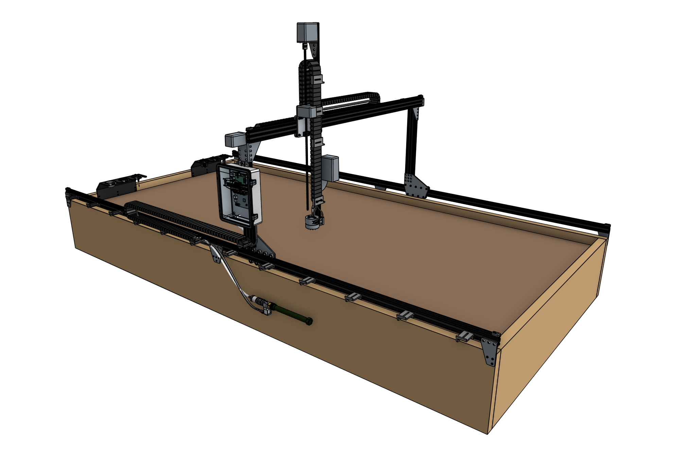
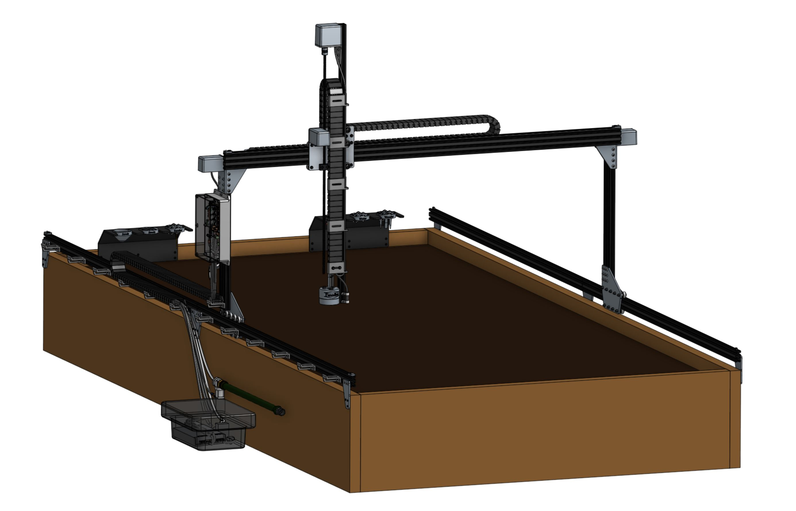
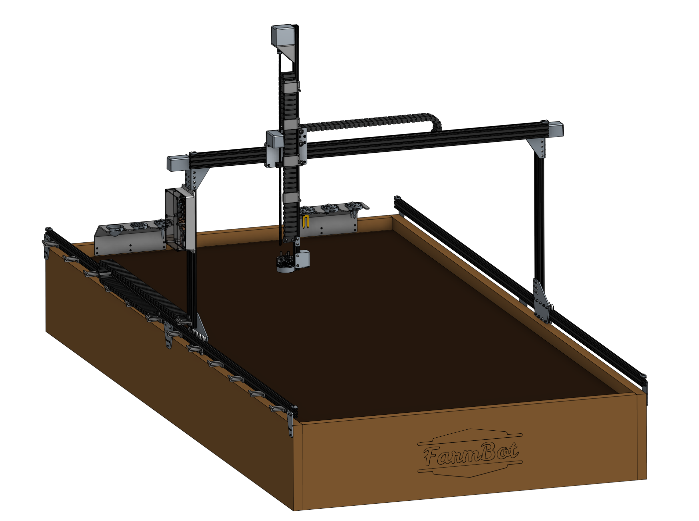
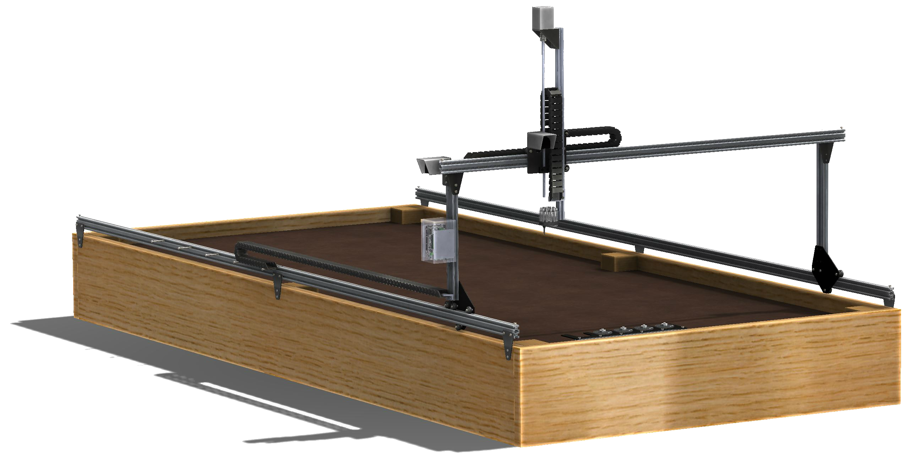
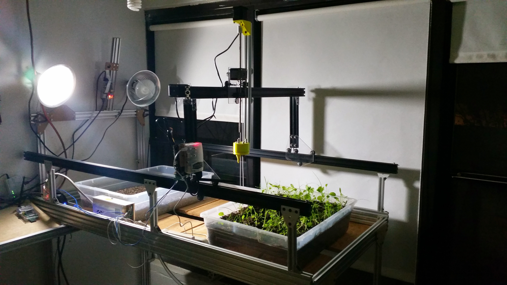
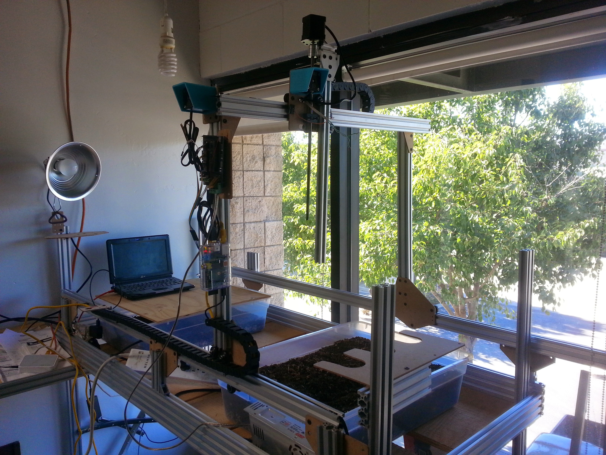
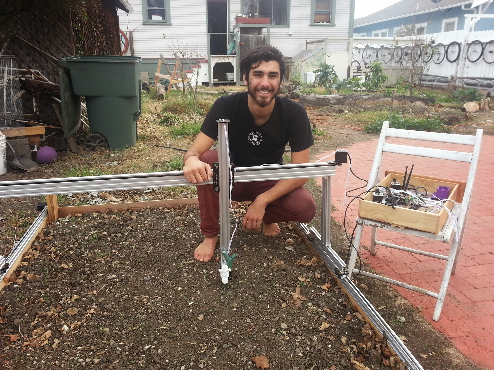

* toc
{:toc}



# [V1.3](http://genesis.farm.bot/v1.3)
Major changes: Introduced the Farmduino electronics board to replace the Arduino MEGA and RAMPS shield with a board optimized for FarmBot and its motor and peripheral needs; injection molded a custom-designed electronics box featuring two latches for easy access; improved the cables and connectors for the motors, encoders, UTM cable, peripherals, and power; widened the cable carriers by 10mm and optimized their lengths; dimensional changes to the cross-slide, z-axis motor mount, cable carriers supports, and other components to accommodate the widened cable carriers; relocated the vacuum pump to the z-axis extrusion to improve suction at the needle; introduced z-axis hardstops; added white LED strips to the kits; sourced an IP67 rated universal input waterproof power supply, eliminating the need for the sockit box; replaced the weeder spikes with new sizes of the weeder blades; injection molded many new components including the cable carrier supports, tools, seed trays, camera mounts, and cable carrier spacer block, and and vacuum pump cover; reduced the final main carton volume by 40%.

We manufactured 300 v1.3 kits and shipped them to customers between October of 2017 and May of 2018.

# [V1.2](https://genesis.farm.bot/docs/v1.2)
Major changes: New surface treatments on all metal plates, tighter M5 hole tolerances all-around, improved UTM, machined aluminum/plastic components (instead of 3D printing or bent metal), improved cable carrier supports, added CC spacer block, machined z-axis motor mount (instead of bent/welded metal), black anodized toolbays with laser engraved FarmBot logo, back to using a borescope camera with custom 1m focal distance, developed a 2-piece watering nozzle, developed the luer-lock needle style seed injector, made the weeder customizable with various implements, switched to jumper "links" instead of wires on all tools, developed packaging for complete kits. We manufactured 350 v1.2 kits and shipped them to customers in March and April of 2017.

# [V1.1](https://genesis.farm.bot/docs/v1.1)
Major changes: Removed the driveshaft in favor of dual x-axis motors, redesigned cable carrier supports, experimentation with the Raspberry Pi camera, new tool bay is a single bent component, new gantry corner brackets are single bent pieces, metal belt clips and cable clips, updated cross-slide, all metal z-axis motor mount, new z-axis drag chain guides, encoders and motors now have removable cables, standoffs between the electronics and the mounting plate, switched back to using the A4988 stepper drivers, improved watering nozzle design for SLA printing, switched the entire CAD workflow from Solidworks to Onshape.

# [V1.0](https://genesis.farm.bot/docs/v1.0)
Major changes: track plate improvements, new seed injector design, larger z cable carrier, new motor housings and z motor mount, larger cross-slide and gantry plates with more v-wheels, new tool bay, new seed bin, stronger cable carrier supports, introduced cable management clips, introduced belt clip plates, significant modifications to the UTM and UTM cover, switched to button head M5 screws.

# [V0.9](https://genesis.farm.bot/docs/v0.9)
Major changes: larger plates, more v-wheels, larger gantry extrusions for added rigidity, introduced the weed suppressor tool

# [V0.8](https://genesis.farm.bot/docs/v0.8)
Major changes: all corrosion resistant design; upgrade to 5mm thick plates; improvements to the UTM, cable carrier brackets, and electronics enclosure

# [V0.7](https://genesis.farm.bot/docs/v0.7)
Major changes: removal of endstops, stronger z-axis motor mount, added z-axis cable carrier, track plates and gantry corner plates redesign, upgraded universal tool mount to support 6 liquid lines and 12 electrical connections, quick access electronics enclosure, larger cable carriers

# [V0.6](https://genesis.farm.bot/docs/v0.6)
Major changes: reliability improvements to the universal tool mount

# [V0.5](https://genesis.farm.bot/docs/v0.5)
Major changes: rotary encoders on motors, integrated water, vacuum, and liquid amendments into universal tool mount, part simplification

# [V0.4](https://genesis.farm.bot/docs/v0.4)
Major changes: electronics enclosures/housings, cable carrier cable management, magnetic universal tool mount design

# [V0.3](https://genesis.farm.bot/docs/v0.3)
Major changes: wire and trolley cable management, part simplification

# [V0.2](https://genesis.farm.bot/docs/v0.2)
Major changes: endstop integration, custom brackets and plates, universal tool mount

# [V0.1](https://genesis.farm.bot/docs/v0.1)
Focused on being a quick and easy first prototype, V0.1 was constructed from all off-the-shelf components

# V0.0
The very first physical FarmBot prototype was made from welded steel square stock, C-channel, angle iron, garage door wheels, and a trowel. It served primarily as a visual aid.

# What's next?

 * [Tracks](../../FarmBot-Genesis-V1.4/tracks.md)
