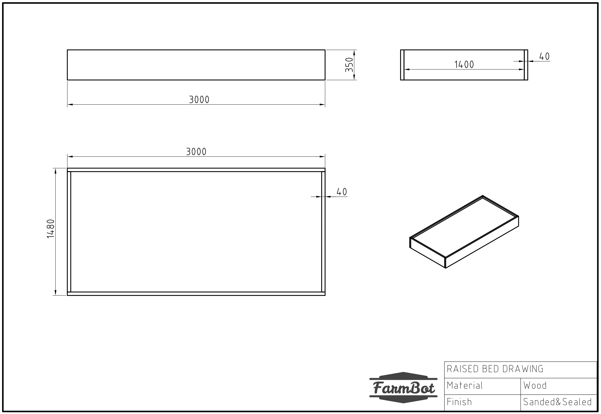
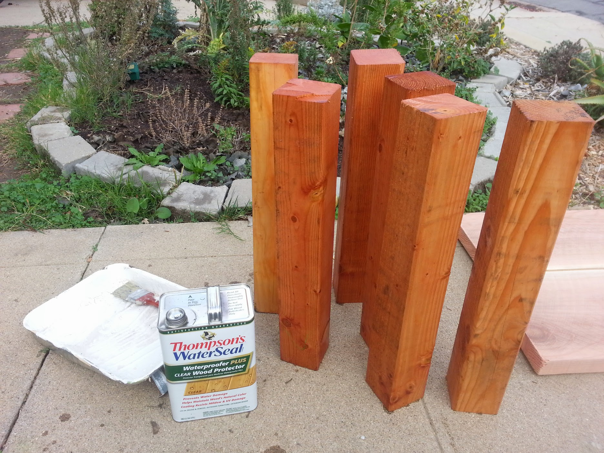
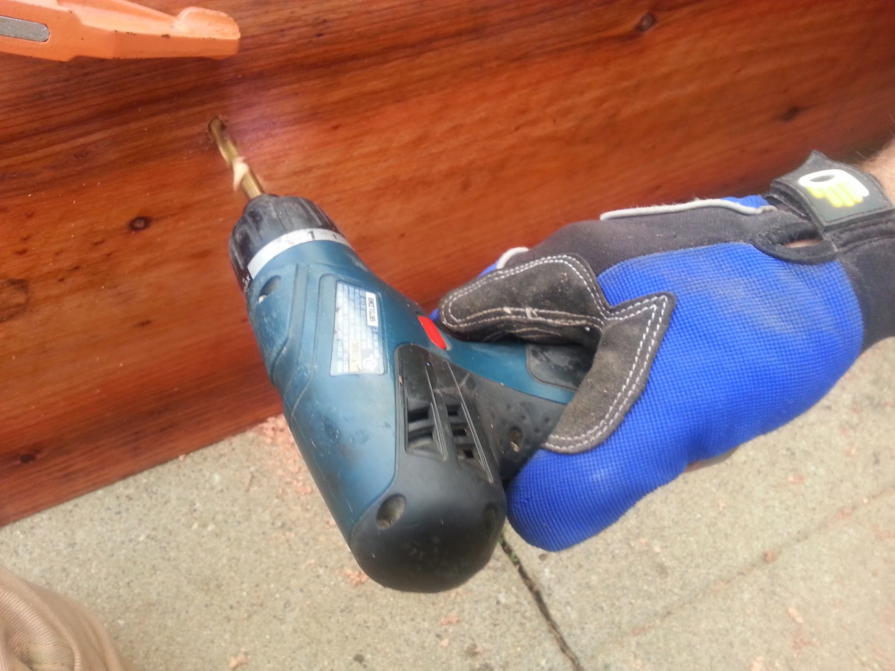

* toc
{:toc}

Building a fixed raised bed is the recommended method for installing a FarmBot **outdoors**. In these instructions we show you how to build a simple but sturdy bed suited for FarmBot Genesis or Genesis XL. This design will fit into most yards, look great, and last a lifetime.

<iframe width="100%" height="480" src="https://sketchfab.com/models/5002768ae94f4013a7dad664bdfc42ad/embed?ui_controls=0&amp;ui_infos=0&amp;ui_related=0" frameborder="0" allowfullscreen mozallowfullscreen="true" webkitallowfullscreen="true" onmousewheel=""></iframe>

## Maximum raised bed size
We recommend building your raised bed as large as possible to get the most value out of your FarmBot. See the [economies of scale](../intro/high-level-overview.md#economies-of-scale) section for more information on maximizing FarmBot value.

Use the dimension guidelines in the table below to plan your raised bed design.

|Model                         |Outer Bed Width               |Outer Bed Length              |
|------------------------------|------------------------------|------------------------------|
|Genesis                       |1.48m max                     |3m recommended
|Genesis XL                    |2.98m max                     |6m recommended





## Raised bed recommendations
* Prevent bowing and warping of your bed and your tracks by **reinforcing** the bed walls every 1.5m with a sturdy post buried in the ground.
* Use **heavy duty** 35 to 90mm thick (1.5 to 3.5 inch) walls so that your bed will last a lifetime and resist bowing under soil expansion pressures.
* **Fill** your bed to the brim with rich, soft soil and compost. Leave out rocks and branches.

_Dimensions are in mm and represent the maximum length and width a raised bed should be for FarmBot Genesis. Posts and hardware not shown._



# Step 1: Acquire materials
  * Purchase some high quality wood from your local lumber yard. Preferably you will use thicker wood (1-2 inches thick) so that it does not warp easily. This is important because your tracks will need to be very straight for FarmBot to work reliably, and your tracks will be directly attached to the raised bed. When soil becomes wet and when plants grow, this can cause tremendous force on the wood walls of the bed, forcing them outwards. Thicker wood and extra posts are preferred. This example uses 2 x 12" nominal redwood (40 x 300mm), and 4 x 4" nominal wood posts (90 x 90mm) spaced roughly every 5 feet, or one 1.5m extrusion length.
  * You'll also need to pick up some hardware for fastening your raised bed together. For example, 3/8" x 4" lag bolts (M10 x 100mm) and some large washers.
  * Depending on your climate, you'll likely want to put some type of sealer, stain, or polyurethane on your wood to protect its color and water resistance like Thompson's water sealer.

# Step 2: Dig post holes
Position the lumber roughly where your bed will be so that you may find out where to dig your post holes.



Dig the post holes. A post hole digger and pick axe can help greatly.

# Step 3: Prepare the materials
Sand the wood to remove any weird markings and splinters.

If desired, stain the wood or apply a protective coating of your choice.

Setup the lumber upside down on a flat surface. We'll drill holes and screw together the bed in this orientation and then flip it over and position it in our holes.

# Step 4: Assemble the raised bed
Measure out and mark where the posts will be. Remember this must correspond to where you dug your post holes!

Clamp the posts into place, making sure they are square with the bed sides.

Mark locations where you will drill holes and fasten the boards to the posts. This example uses 2 lag bolts and washers per board/post interface.



Pre-drill the holes for the lag bolts.

Use a ratcheting socket wrench to quickly screw in the lag bolts.



Notice how the corner bolts are staggered so that they do not hit each other, and the washers are oriented the same way.

# Step 5: Install the raised bed



Once the bed is fully assembled, flip it over and position it in the holes. You may need to pull it out and dig out some of the holes a little more in order for the bed to sit properly. Use a level to make sure the bed is level.

# Step 6: Install tensioning cables (optional)
With larger raised beds, especially those for XL sized bots and larger, it is possible that expansion and contraction of the soil will cause the sides of the raised bed to bend outwards, causing track misalignment. If you think that your bed will not be sturdy enough to resist bending, consider adding tensioning cables every ~1.5m to prevent the sides of the bed from being pushed away from each other. The cables should be positioned in the lower half of the bed so as to not interfere with the FarmBot's tools once buried in the soil.

|Qty                           |Part                          |
|------------------------------|------------------------------|
|4                             |4m long cables (1/4" or 6mm diameter or larger)
|1                             |7m long cable (1/4" or 6mm diameter or larger)
|20                            |[Wire rope clamps](https://www.mcmaster.com/wire-rope-clamps) for the cable diameter chosen
|5                             |[Hook to eye turnbuckles](https://www.mcmaster.com/hook-to-eye-turnbuckles)
|10                            |[Eye nuts](https://www.mcmaster.com/eye-nuts-for-lifting), bolts, and washers

All components should be stainless steel or galvanized (zinc plated) to resist corrosion.

# Step 7: Fill the bed
Use a mix of soil and compost, and keep out large rocks and branches.

.jpg)



# What's next?

 * [Assemble the Tracks](../tracks.md)
