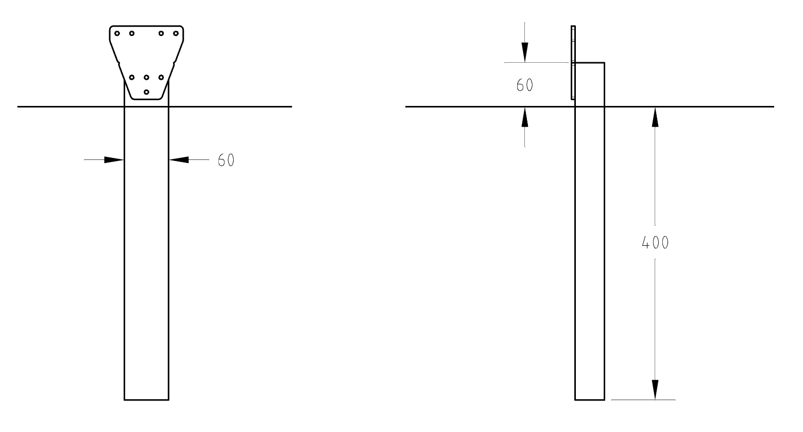

* toc
{:toc}

As an alternative to [building a full raised bed](../supporting-infrastructure/building-a-raised-bed.md), you may consider mounting your FarmBot to wooden posts only. However, this will make track alignment trickier and the structure may be less stable without the additional support of the bed boards. Care will need to be exercised to install posts in a sturdy fashion.



# Step 1: Dig post holes
Dig your post holes. A post hole digger and pick axe can help greatly. Your post holes should be roughly 1.5m apart as discussed further in the next steps. **Keep in mind that the outer dimensions of your supporting infrastructure must be in accordance with [the guidelines](../supporting-infrastructure/building-a-raised-bed.md#maximum-raised-bed-size)**.



# Step 2: Install the first track's posts
Install short (500mm) wood posts for the first track. The top of the posts should protrude at least 60mm from the ground, with at least 60mm of mounting width in the direction of the planned track. Space the posts 1500mm apart, center to center, unless you are using shorter track extrusions, in which case space the posts that far apart.



Once you have positioned your posts, bury or secure them however you like, though it is critical to ensure that the posts will not significantly move once installed.

# Step 3: Install the second track's posts
Depending on the planned width of your FarmBot, space the second track’s posts the appropriate distance away from the first track’s. **Keep in mind that the outer dimensions of your supporting infrastructure must be in accordance with [the guidelines](../supporting-infrastructure/building-a-raised-bed.md#maximum-raised-bed-size)**.



Once you have positioned the second track's posts, bury or secure them however you like, again ensuring that they will not significantly move once installed.



# What's next?

 * [Assemble the Tracks](../../FarmBot-Genesis-V1.4/tracks.md)
