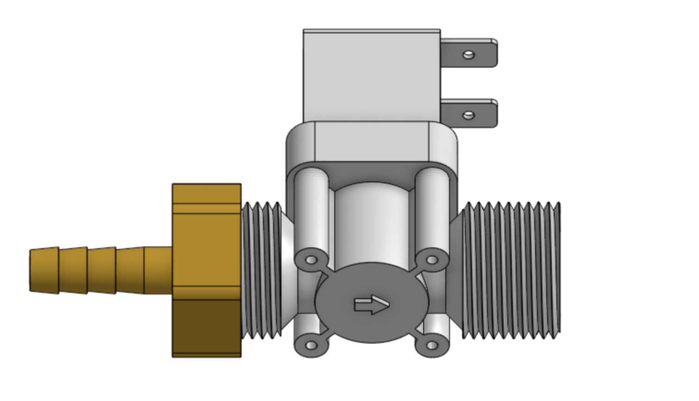

The watering nozzle accepts a concentrated stream of water coming from the UTM and turns it into a gentle shower for your plants.

<iframe class="embedly-embed" src="//cdn.embedly.com/widgets/media.html?src=https%3A%2F%2Fwww.youtube.com%2Fembed%2Fxh7imhENpLQ%3Ffeature%3Doembed&url=http%3A%2F%2Fwww.youtube.com%2Fwatch%3Fv%3Dxh7imhENpLQ&image=https%3A%2F%2Fi.ytimg.com%2Fvi%2Fxh7imhENpLQ%2Fhqdefault.jpg&key=02466f963b9b4bb8845a05b53d3235d7&type=text%2Fhtml&schema=youtube" width="854" height="480" scrolling="no" frameborder="0" allowfullscreen></iframe>



# Component list

|Qty.                          |Component                     |
|------------------------------|------------------------------|
|1                             |[Watering Nozzle Bottom](../../Extras/bom/plastic-parts.md#watering-nozzle)
|1                             |[Watering Nozzle Top](../../Extras/bom/plastic-parts.md#watering-nozzle)
|2                             |[M3 x 10mm Screws](../../Extras/bom/fasteners-and-hardware.md#m3-x-12mm-screws)
|2                             |[M3 Locknuts](../../Extras/bom/fasteners-and-hardware.md#m3-locknuts)
|3                             |[M5 x 30mm Screws](../../Extras/bom/fasteners-and-hardware.md#m5-x-30mm-screws)
|3                             |[M5 Washers](../../Extras/bom/fasteners-and-hardware.md#m5-washers)
|3                             |[M5 Locknuts](../../Extras/bom/fasteners-and-hardware.md#m5-locknuts)
|3                             |[Ring Magnets](../../Extras/bom/miscellaneous.md#ring-magnets)
|1                             |[Jumper Link](../../Extras/bom/electronics-and-wiring.md#jumper-links)
|1                             |[Pressure Regulator](../../Extras/bom/tubing.md#pressure-regulator)
|1                             |Garden Hose (not supplied with FarmBot kits)
|1                             |[Garden Hose Adapter](../../Extras/bom/tubing.md#garden-hose-adapter)
|1                             |[Solenoid Valve](../../Extras/bom/electronics-and-wiring.md#solenoid-valve)
|1                             |[Barbed Adapter](../../Extras/bom/tubing.md#barbed-adapter)
|1                             |[Coupler](../../Extras/bom/tubing.md#barbs)

# Step 1: Assemble the watering nozzle

Press the **watering nozzle bottom** into the **watering nozzle top**. The two pieces only fit together in one orientation.

# Step 2: Install the basic tool hardware

Install the **magnets** and tool verification **jumper link** using **M5 x 30mm screws** and **M3 x 10mm screws** and the instructions in the [basic tool hardware reference guide](../../Extras/reference/basic-tool-hardware.md). The M5 screws will secure the **watering nozzle bottom** and the **watering nozzle top** together.



# Step 3: Assemble the solenoid valve and pressure regulator

Screw one of the **barbed adapters** onto the **solenoid valve** inlet.

Screw the **pressure regulator** onto the **solenoid valve** outlet. Use **teflon tape** to seal the threads according to the [reference guide](../../Extras/reference/using-teflon-tape.md).

Screw one of the **barbed adapters** onto the **pressure regulator**.

# Step 4: Mount the solenoid valve and pressure regulator

Attach one of the **peripheral mount plates** to the left **gantry column** using three **M5 x 16mm screws** and **tee nuts**.

Attach the **solenoid valve assembly** to the **peripheral mount plate** using two **200mm zip ties**. The **pressure regulator** should be on top of the **solenoid valve** when mounted.

# Step 5: Wire up the solenoid valve

Connect the **solenoid valve cable** to the **solenoid valve's** terminals. Note: in a few steps from now, you will connect the other end of the cable to the Farmduino.

# Step 6: Connect the tubing

Push the **water tube** coming from the **y-axis cable carrier** onto the top **barbed adapter**.

Push the **water tube** coming from the **x-axis cable carrier** (where it is mounted to the gantry) onto the bottom **barbed adapter**.

# Step 7: Connect FarmBot to the water source

Screw the **garden hose adapter** onto the **garden hose**. *Note that you will need to provide a garden hose of the appropriate length to connect FarmBot to your municipal water source - one is not provided with the FarmBot kits.*

Screw the final **barbed adapter** onto the **garden hose adapter**.

Push the **water tube** coming from the **x-axis cable carrier** (where it is mounted to the tracks) onto the **barbed adapter** connected to the hose.

# What's next?

 * [Weeder](weeder.md)
