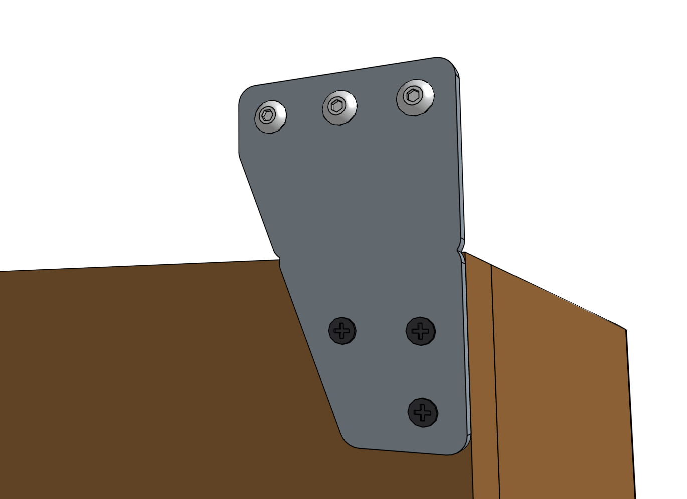
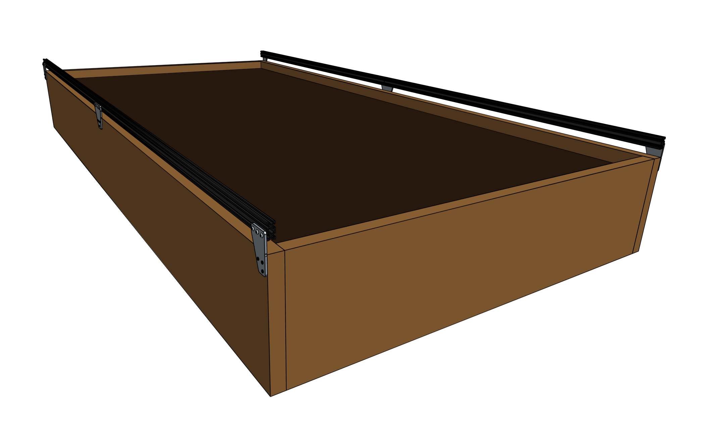

* toc
{:toc}

FarmBot's tracks allow the gantry to move precisely along the x-axis. They are designed to attach to a raised bed or similar [supporting infrastructure](supporting-infrastructure.md).

The tracks are composed of two 1.5m long aluminum extrusions butted up against each other end-to-end for a total track length of 3m on Genesis models, and four extrusions end-to-end for a total track length of 6m on Genesis XL models. The two tracks must be a parallel distance apart between 0.5m and 1.5m for Genesis, and 1.5m and 3m for Genesis XL so that the gantry may span the distance between them. If you position your tracks closer together than the maximum, you may consider cutting the gantry main beam so that it does not inconveniently extend beyond your tracks very far.

## Shortening the tracks
The easiest way to shorten your tracks is to remove extrusions. Should you want an overall track length different than the 1.5m increments the extrusions afford, then you will need to use a hacksaw or horizontal bandsaw to cut the extrusions to your desired length. You can shorten your tracks to a minimum length of around 0.5m.

## Lengthening the tracks
If you would like to extend your tracks, you will need additional extrusions, connecting plates, cable carrier supports, and hardware, as well as longer x-axis cable carrier, belt, wiring, and tubing.

{%
include callout.html
type="warning"
title="For serious hackers and DIYers only"
content="We do not currently sell extension hardware, offer kits with tracks longer than 6m, or provide support for kits that are modified in this way.

Lengthening the tracks beyond 6m may introduce significant unforeseen problems to your FarmBot. If you decide to extend your tracks you will need to purchase and/or make the additional components on your own and troubleshoot any problems you run into. You may seek support in the [community forum](http://forum.farmbot.org)."
%}

## Component list

|Component                     |Genesis Qty                   |XL Qty                        |
|------------------------------|------------------------------|------------------------------|
|[Track Extrusions](../Extras/bom/extrusions.md#track-extrusions) (20 x 40 x 1500mm)|4                             |8
|[Track End Plates](../Extras/bom/plates-and-brackets.md#track-end-plates)|4                             |4
|[Track Joining Plates](../Extras/bom/plates-and-brackets.md#track-joining-plates)|2                             |6
|[Dowel Pins](../Extras/bom/fasteners-and-hardware.md#dowel-pins)|4                             |12
|[25mm Wood Screws](../Extras/bom/fasteners-and-hardware.md#wood-screws)|20                            |36
|[M5 x 10mm Screws](../Extras/bom/fasteners-and-hardware.md#m5-x-10mm-screws)|42                            |82
|[M5 Tee Nuts](../Extras/bom/fasteners-and-hardware.md#m5-tee-nuts)|42                            |82
|[Horizontal Cable Carrier Supports](../Extras/bom/plastic-parts.md#horizontal-cable-carrier-supports)|11                            |23



# Step 1: Lay out the track extrusions



Lay out all of the **track extrusions** in the location that you want to attach them to your **supporting infrastructure**. Make sure that extrusions are fully butted against each other. This will help you attach the plates in the correct location.



# Step 2: Attach a track end plate

Position a **track end plate** as shown below and screw it into the **supporting infrastructure** with three **wood screws**.

{%
include callout.html
type="success"
title="Vertically aligned"
content="All of the track extrusions must be the same height and aligned along their length so that the gantry can move across the tracks smoothly. This means that all of the track end plates and track joining plates need to be **vertically aligned**.

We've added small **notches** into the track end plates and track joining plates so that you can position the plates with perfect vertical alignment with respect to your supporting infrastructure and each other. *You should only use these notches if the top edge of your supporting infrastructure is level and straight.*

If the top edge of your supporting infrastructure is *not* level or straight, then you will need to manually ensure that your track plates are vertically aligned with other means. Because the gantry has wheels that ride on the bottom face of the track extrusions, you need to ensure that the bottom of the track extrusion will be at least 25mm away from the top of the supporting infrastructure so that the wheels have adequate clearance."
%}

Lightly screw three **M5 x 10mm screws** and **tee nuts** to the **track end plate**.

Orient the tee nuts horizontally.

# Step 3: Attach a track joining plate
Position a **track joining plate** such that one half of it will be able to attach to each **track extrusion** and so that it is vertically aligned with the first **track end plate**. Screw the plate into the **supporting infrastructure** with four **wood screws**.

Lightly screw four **M5 x 10mm** screws and **tee nuts** to the **track joining plate**. Orient the tee nuts horizontally.

# Step 4: Attach the first track extrusion
Lift the **track extrusion** and position the *lower* V-slot onto the **tee nuts** of the **track end plate**. Lightly tighten one of the **M5 x 10mm screws** using the **3mm hex driver** to prevent the extrusion from falling off, while still allowing it to move loosely.

{%
include callout.html
type="info"
title="Ensure the tee nuts are rotating"
content="In order for the tee nuts to fasten the extrusion to the plate, the tee nuts must *rotate 90 degrees* when you begin tightening the screw so that the tee nut's flanges can grip the inside faces of the extrusion slot. You can see how this works by looking in the end of the extrusion slot when you tighten a screw and tee nut. If the nut doesn't grip the slot the first time, simply loosen the screw and try again.

Note: The tee nuts are designed to only rotate 90 degrees, so in most cases you can simply begin tightening the screw and the tee nut will orient itself correctly without any intervention."
%}

_This image shows a tee nut that has correctly rotated 90 degree and is gripping the inside faces of the extrusion slot._

Lift the other end of the **track extrusion** and position the *lower* V-slot onto two of the **tee nuts** in the **track joining plate**. Verify that the track extrusion is positioned correctly, and then fully tighten all five of the **M5 x 10mm screws** that fasten the extrusion to the two plates.

# Step 5: Insert dowel pins
Insert the slightly larger diameter half of a **dowel pin** half-way into a hole in the **track extrusion**. The pin should fit snugly, and require a small amount of force to be put in. If the pin is loose, try inserting it into the second hole in the extrusion. Be careful to not lose the pin inside the extrusion.

Insert the slightly larger diameter half of another **dowel pin** half-way into a hole in another **track extrusion**. Again, the pin should fit snugly and you may need to try the other hole to find the best fit.

# Step 6: Attach the next extrusion
Lift the **track extrusion** that you just inserted a dowel pin into and position the *lower* V-slot onto the **tee nuts** of the **track joining plate**. The dowel pins should be in opposite positions of each other. Rotate the second extrusion upside down if needed.

Slide the **extrusion** so the exposed **dowel pins** from both extrusions are inserted into the other.



Lightly tighten the **M5 x 10mm screws** using the **3mm hex driver** to prevent the extrusion from falling off, while still allowing it to move loosely.

# Step 7: Attach the next track joining plate (XL kits only)



Position another **track joining plate** such that one half of it will be able to attach to the free end of the **track extrusion** that was just put in place, and so that it is vertically aligned with the other track mounting plates. Screw the plate into the **supporting infrastructure** with four **wood screws**.

Lightly screw four **M5 x 10mm** screws and **tee nuts** to the **track joining plate**. Orient the tee nuts horizontally.

Lift the free end of the loose **track extrusion** and position the *lower* V-slot onto two of the **tee nuts** in the **track joining plate**.

Verify that the track extrusion is positioned correctly, and butted up against the previous extrusion. Then fully tighten all of the **M5 x 10mm screws** that fasten the extrusion to the two plates.



_Perfectly aligned track extrusions are key to smooth gantry movements!_



_Sanding away any minor bumps will help the movements of the FarmBot and improve motor longevity._

Repeat Steps 5, 6, and 7 one time to install the third **track extrusion** and third **track joining plate**. Then follow Steps 5 and 6 to install the fourth track extrusion.

# Step 8: Attach the second track end plate
Follow the instructions in Step 2 to attach the second **track end plate** and final **track extrusion**. Securely tighten all screws.

# Step 9: Install the other track
Repeat steps 2 through 8 for the track on the other side of the bed.



# Step 10: Add the horizontal cable carrier supports
Insert two **M5 x 10mm screws** into a **horizontal cable carrier support** and lightly screw on two **M5 tee nuts**. Place the assembly into the lower slot of the left side **track**, near the end of the track. Use the **3mm driver** to tighten the screws.

For Genesis kits, add 10 more **horizontal cable carrier supports** evenly along the left side track so that there are 11 total installed. There should be five to six supports per **track extrusion**. For XL kits, add 22 more for a total of 23 installed.



# What's next?

 * [Gantry](gantry.md)
