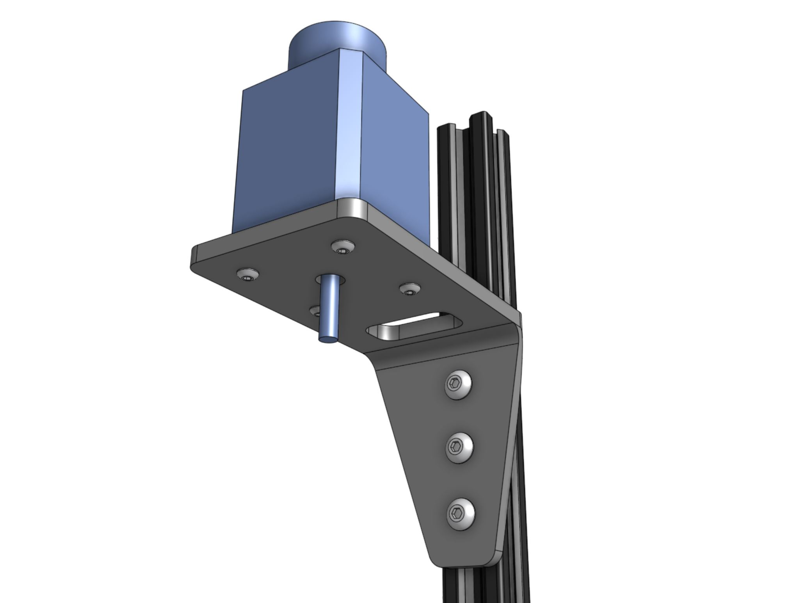
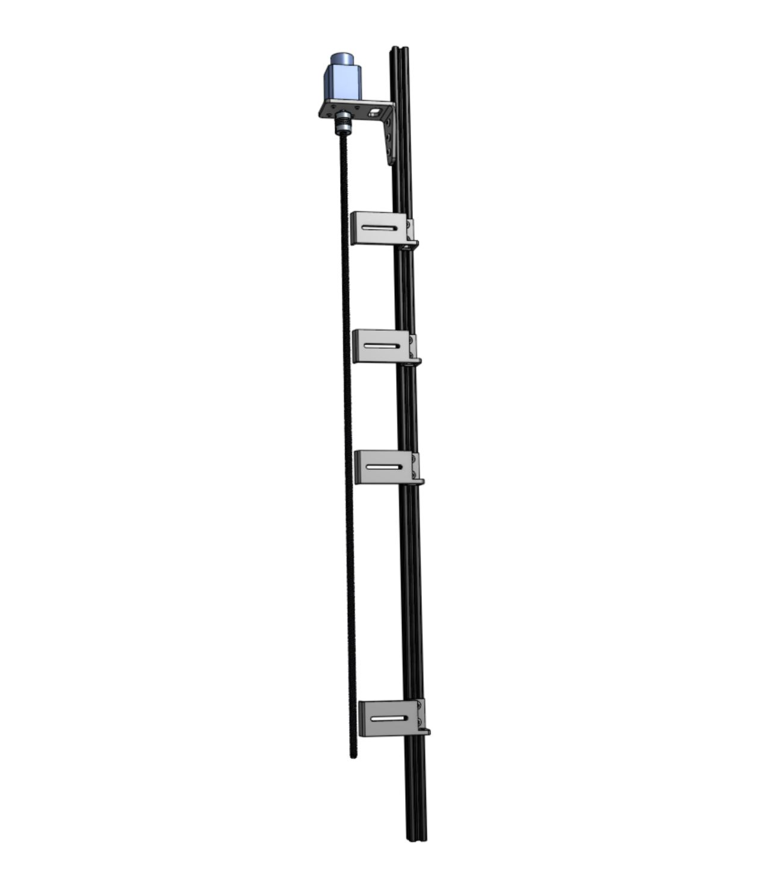
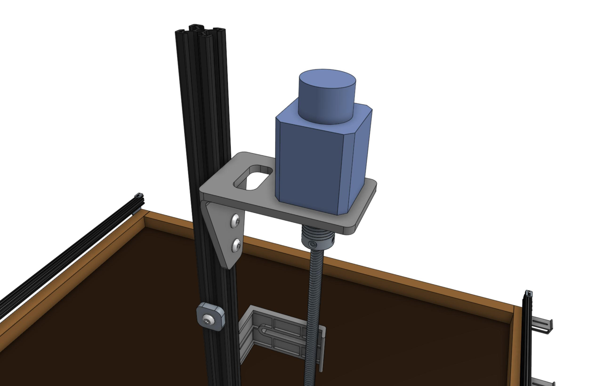

* toc
{:toc}

# Component List

|Qty.                          |Component                     |
|------------------------------|------------------------------|
|1                             |[Z-Axis Extrusion](../Extras/bom/extrusions.md#z-axis-extrusion) (20 x 20 x 1000mm)
|4                             |[M3 x 12mm Screws](../Extras/bom/fasteners-and-hardware.md#m3-x-12mm-screws)
|15                            |[M5 x 10mm Screws](../Extras/bom/fasteners-and-hardware.md#m5-x-10mm-screws)
|3                             |[M5 x 16mm Screws](../Extras/bom/fasteners-and-hardware.md#m5-x-16mm-screws)
|18                            |[M5 Tee Nuts](../Extras/bom/fasteners-and-hardware.md#m5-tee-nuts)
|4                             |[Vertical Cable Carrier Supports](../Extras/bom/plates-and-brackets.md#vertical-cable-carrier-supports)
|1                             |[Z-Axis Motor Mount](../Extras/bom/plates-and-brackets.md#z-axis-motor-mount)
|1                             |[NEMA 17 Stepper Motor with Rotary Encoder](../Extras/bom/electronics-and-wiring.md#nema-17-stepper-motors-with-rotary-encoders)
|1                             |[Vertical Motor Housing](../Extras/bom/plastic-parts.md#vertical-motor-housing)
|1                             |[5mm to 8mm Flex Coupling](../Extras/bom/drivetrain.md#5mm-to-8mm-flex-coupling)
|1                             |[8 x 800mm Leadscrew](../Extras/bom/drivetrain.md#8mm-acme-leadscrew)
|1                             |[Vacuum Pump Mount](../Extras/bom/plates-and-brackets.md#vacuum-pump-mount)
|1                             |[Vacuum Pump](../FarmBot-Genesis-V1.4/electronics.md#vacuum-pump)
|1                             |[Vacuum Pump Housing](../Extras/bom/plastic-parts.md#vacuum-pump-Housing)
|2                             |[200mm Zip Ties](../Extras/bom/miscellaneous.md#200mm-zip-ties)



# Step 1: Attach the stepper motor to the Z-axis motor mount
Attach the **stepper motor** to the **z-axis motor mount** using four **M3 x 12mm screws**. The motor and encoder connectors should be facing the back flange of the mount.

# Step 2: Attach the motor mount to the Z-axis extrusion



Partially screw three **M5 x 10mm screws** and **M5 tee nuts** into the **z-axis motor mount**. Position the motor mount onto the **z-axis extrusion** as shown and tighten. Note that you will need to adjust the position of the motor mount once the cables have been connected and it is time to put the vertical motor housing on.

# Step 3: Attach the flex coupling
Slide the **5mm to 8mm flex coupling** onto the **motor shaft** and tighten the two setscrews with the **2mm hex driver**. Ensure that the setscrews are positioned onto the flat parts of the motor shaft.

# Step 4: Attach the leadscrew
Slide the **leadscrew** into the **flex coupling** and tighten the two setscrews.



# Step 5: Attach the vertical cable carrier supports
Use two **M5 x 10mm screws** and **M5 tee nuts** to attach each of the four **vertical cable carrier supports** to the **z-axis extrusion**. Space the supports along the extrusion as shown.

# Step 6: Attach the vacuum pump
Use three **M5 x 16mm screws** and **M5 tee nuts** to attach the **vacuum pump mount** to the **z-axis extrusion**.

Fasten the **vacuum pump** to the **vacuum pump mount** using two **200mm zip ties**.

Attach the **vacuum pump housing** to the **z-axis extrusion** using two **M5 x 10mm screws** and **M5 tee nuts**.

# Step 7: Attach the z-axis to the cross-slide

Slide the **z-axis extrusion** through the v-wheels on the **cross-slide** until the **leadscrew** is resting on the **leadscrew block**.



# Step 8: Screw the screw

Hand rotate the **leadscrew** clockwise so that it threads into the **leadscrew block**. Continue to hand rotate the leadscrew until the z-axis is halfway down.

# Step 9: Install the hard stops

Attach a **z-axis hardstop** onto the backside of the **z-axis extrusion** approximately 200mm from the top of the extrusion using an **M5 x 10mm screw** and **tee nut**. Later, you can quickly adjust this to physically prevent FarmBot from ever moving too low within its working space, which could damage something.

Attach the other **z-axis hardstop** onto the backside of the **z-axis extrusion** approximately 100mm from the bottom of the extrusion. This prevents the z-axis from moving too high.

