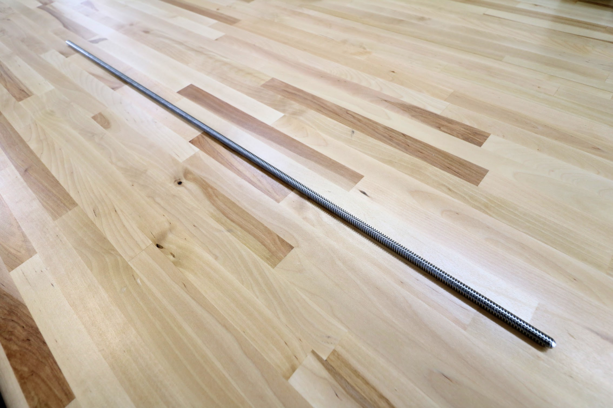
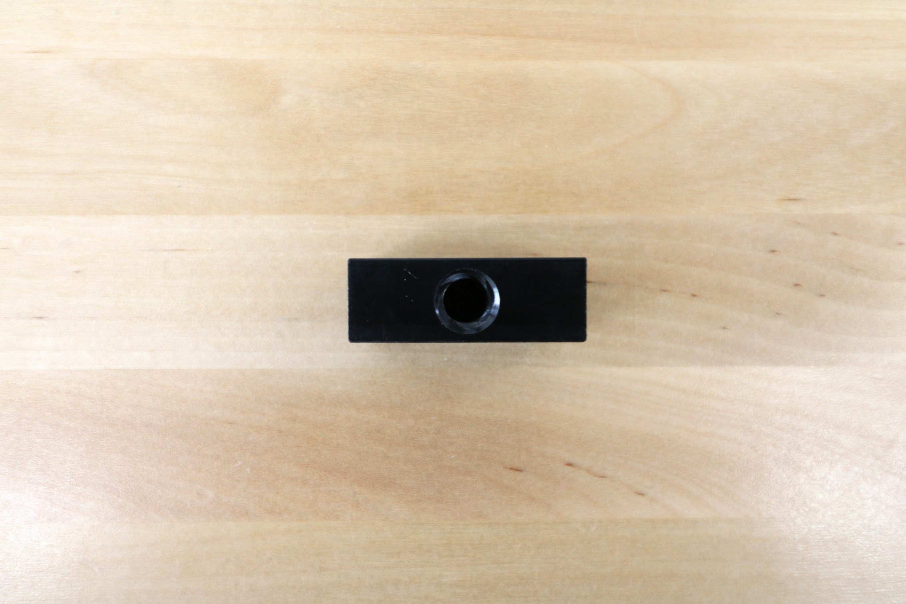

* toc
{:toc}

|Component|$/Unit|Genesis Qty|Genesis Subtotal|XL Qty|XL Subtotal|MAX Qty|MAX Subtotal|
|---------|------|-----------|----------------|------|-----------|-------|--------|
|[V-Wheel](#v-wheel)|$6.00|30|$180.00|30|$180.00|30|$180.00
|[X-Axis GT2 Timing Belt](#gt2-timing-belt)|$40.00 to $180.00|2|$80.00|2|$140.00|2|$360.00
|[Y-Axis GT2 Timing Belt](#gt2-timing-belt)|$20.00 to $30.00|1|$20.00|1|$30.00|1|$30.00
|[Belt Sleeve](#belt-sleeve)|$0.50|6|$3.00|6|$3.00|6|$3.00
|[20 Tooth GT2 Pulley](#gt2-pulley)|$6.00|3|$18.00|3|$18.00|3|$18.00
|[5mm to 8mm Shaft Coupling](#5mm-to-8mm-shaft-coupling)|$6.00|1|$6.00|1|$6.00|1|$6.00
|[Leadscrew](#leadscrew)|$35.00|1|$35.00|1|$35.00|1|$35.00
|[Leadscrew Block](#leadscrew-block)|$7.00|1|$7.00|1|$7.00|1|$7.00
|**TOTALS**| |**39**|**$346.00**|**39**|**$416.00**|**39**|**$646.00**

# V-Wheel

These polycarbonate V-wheels are precision machined to allow FarmBot to move in the X, Y, and Z directions smoothly and precisely. Each wheel comes pre-assembled with two stainless steel rubber-sealed ball bearings and one M5 precision shim.

|                              |                              |
|------------------------------|------------------------------|
|**Wheel Material**            |Clear polycarbonate
|**Wheel Dimensions**          |23.9mm OD, 16mm ID, 10.23mm thickness
|**Bearing Trade Name**        |SS-625-2RS (SS = stainless steel, 625 = bearing size, 2RS = two rubber seals)
|**Bearing Material**          |Stainless steel
|**Bearing Dimensions**        |16mm OD, 5mm ID, 5mm thickness
|**Bearing Seal**              |Rubber sealed
|**Precision Shim Material**   |Stainless steel
|**Precision Shim Dimensions** |10mm OD, 5mm ID, 1mm thickness
|**Price**                     |$6.00
|**Quantity**                  |30
|**Internal Part Name**        |`V-Wheels (pre-assembled w/ SS M5 precision shim and SS bearings)`

<iframe class="embedly-embed" src="//cdn.embedly.com/widgets/media.html?src=https%3A%2F%2Fwww.youtube.com%2Fembed%2FR4hbZb2wRmY%3Ffeature%3Doembed&url=http%3A%2F%2Fwww.youtube.com%2Fwatch%3Fv%3DR4hbZb2wRmY&image=https%3A%2F%2Fi.ytimg.com%2Fvi%2FR4hbZb2wRmY%2Fhqdefault.jpg&key=02466f963b9b4bb8845a05b53d3235d7&type=text%2Fhtml&schema=youtube" width="854" height="480" scrolling="no" frameborder="0" allowfullscreen></iframe>

# GT2 Timing Belt

|                              |                              |
|------------------------------|------------------------------|
|**Material**                  |Neoprene with fiberglass cords
|**Lengths**                   |2m, 3.5m, 4.5m, 7.5m, 19.5m
|**Width**                     |5mm
|**Thickness**                 |0.75mm
|**Pitch**                     |GT2 (2mm)
|**Color**                     |Black (no markings)
|**Price**                     |2m - $20.00 3.5m - $30.00 4.5m - $40.00 7.5m - $70.00 19.5m - $180.00
|**Quantity**                  |**Genesis** 2m - 1 4.5m - 2  **Genesis XL** 3.5m - 1 7.5m - 2  **Genesis MAX** 3.5m - 1 19.5m - 2
|**Internal Part Name**        |`GT2 Timing Belt - [length]`

<iframe class="embedly-embed" src="//cdn.embedly.com/widgets/media.html?src=https%3A%2F%2Fwww.youtube.com%2Fembed%2FDu2sdMXKPEw%3Ffeature%3Doembed&url=http%3A%2F%2Fwww.youtube.com%2Fwatch%3Fv%3DDu2sdMXKPEw&image=https%3A%2F%2Fi.ytimg.com%2Fvi%2FDu2sdMXKPEw%2Fhqdefault.jpg&key=02466f963b9b4bb8845a05b53d3235d7&type=text%2Fhtml&schema=youtube" width="854" height="480" scrolling="no" frameborder="0" allowfullscreen></iframe>

# Belt Sleeve

These sleeves secure the loose end of a belt to itself.

|                              |                              |
|------------------------------|------------------------------|
|**Material**                  |Aluminum
|**Surface Finish**            |Sand blasted and clear anodized
|**Price**                     |$0.50
|**Quantity**                  |6
|**Internal Part Name**        |`Belt Sleeve`

# GT2 Pulley

These pulleys are attached directly to NEMA 17 stepper motor shafts or onto the driveshaft. They transfer power from the motor to the belt such that FarmBot can move in the X and Y directions.

|                              |                              |
|------------------------------|------------------------------|
|**Material**                  |Aluminum
|**Number of Teeth**           |20
|**Inner Diameter**            |5mm
|**Outer Diameter**            |15mm
|**Height**                    |14mm
|**Setscrews**                 |Two, stainless steel, with 2mm hex drive
|**Max Belt Width**            |7mm
|**Pitch**                     |GT2 (2mm)
|**Price**                     |$6.00
|**Quantity**                  |3
|**Internal Part Name**        |`20 Tooth GT2 Pulleys w/ SS Setscrews w/ 2mm drive`

# 5mm to 8mm Shaft Coupling

This aluminum coupling connects the Z-axis stepper motor to the leadscrew to allow FarmBot to move in the Z direction.

|                              |                              |
|------------------------------|------------------------------|
|**Material**                  |Aluminum
|**Length**                    |25mm
|**Outer Diameter**            |18mm
|**Inner Diameters**           |5mm and 8mm
|**Screws**                    |Stainless steel with 2mm hex drive
|**Price**                     |$6.00
|**Quantity**                  |1
|**Internal Part Name**        |`5mm to 8mm Shaft Coupler w/ SS Setscrews w/ 2mm drive`



# Leadscrew

This stainless steel leadscrew allows FarmBot to move in the Z direction.

|                              |                              |
|------------------------------|------------------------------|
|**Material**                  |Stainless Steel
|**Length**                    |800mm
|**Diameter**                  |8mm
|**Threads**                   |Tr8*8-2p (4 starts)
|**Pitch**                     |2mm
|**Lead**                      |8mm
|**Price**                     |$35.00
|**Quantity**                  |1
|**Internal Part Name**        |`8mm x 800mm SS ACME Leadscrew`

<iframe class="embedly-embed" src="//cdn.embedly.com/widgets/media.html?src=https%3A%2F%2Fwww.youtube.com%2Fembed%2F2GPDnuH1k9o%3Ffeature%3Doembed&url=http%3A%2F%2Fwww.youtube.com%2Fwatch%3Fv%3D2GPDnuH1k9o&image=https%3A%2F%2Fi.ytimg.com%2Fvi%2F2GPDnuH1k9o%2Fhqdefault.jpg&key=02466f963b9b4bb8845a05b53d3235d7&type=text%2Fhtml&schema=youtube" width="854" height="480" scrolling="no" frameborder="0" allowfullscreen></iframe>



# Leadscrew Block

This delrin block attaches to the cross-slide plate so that the leadscrew can move through it, allowing FarmBot to move in the Z direction.

|                              |                              |
|------------------------------|------------------------------|
|**Material**                  |Black delrin
|**Threads**                   |Tr8*8-2p (4 starts)
|**Pitch**                     |2mm
|**Lead**                      |8mm
|**Mounting Holes**            |M5, 20mm apart
|**Length**                    |34mm
|**Width**                     |20mm
|**Thickness**                 |12mm
|**Price**                     |$7.00
|**Quantity**                  |1
|**Internal Part Name**        |`Leadscrew Block`


