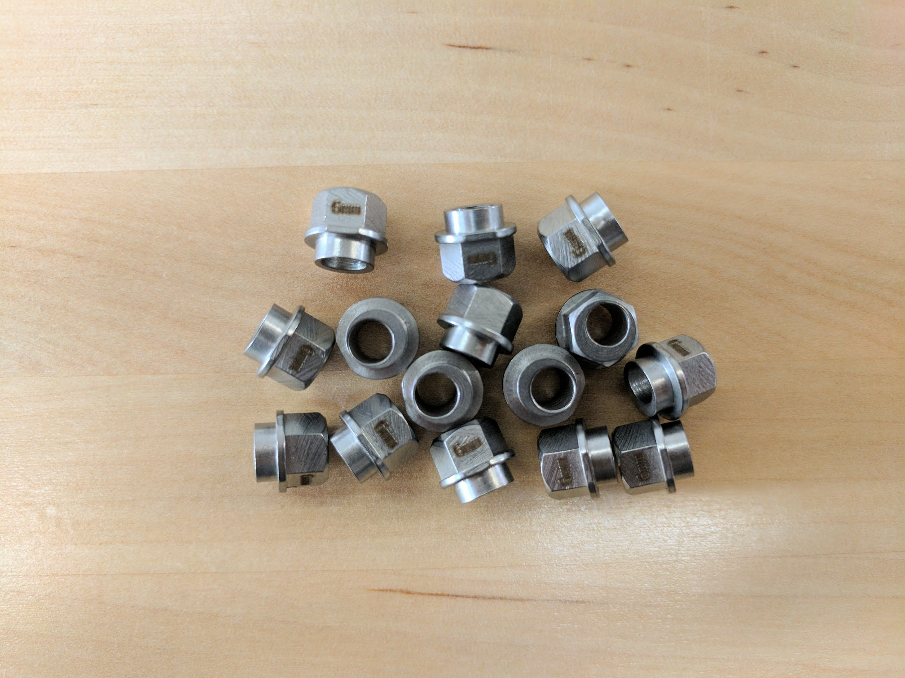
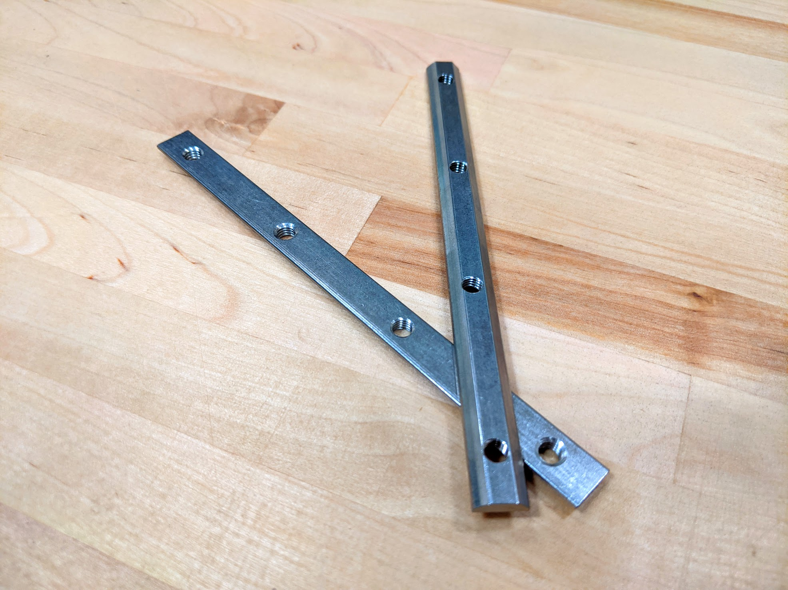
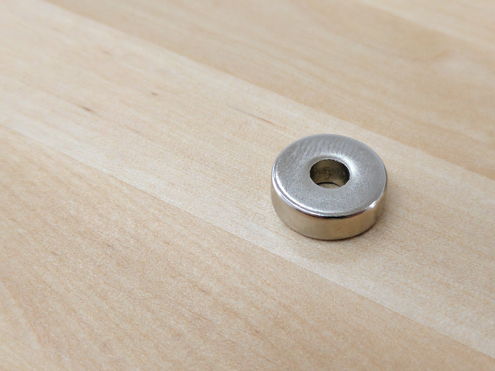
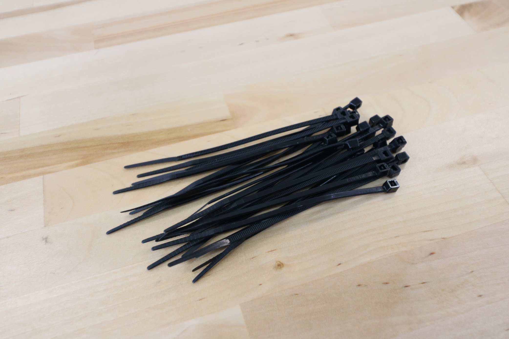
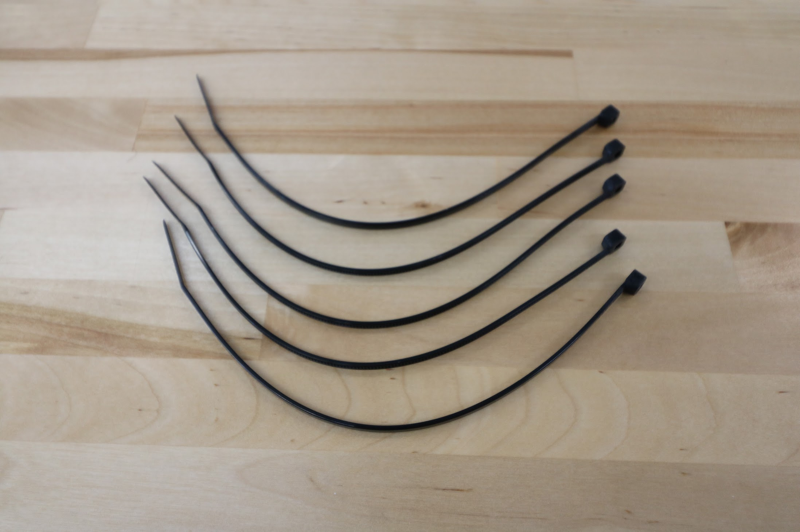
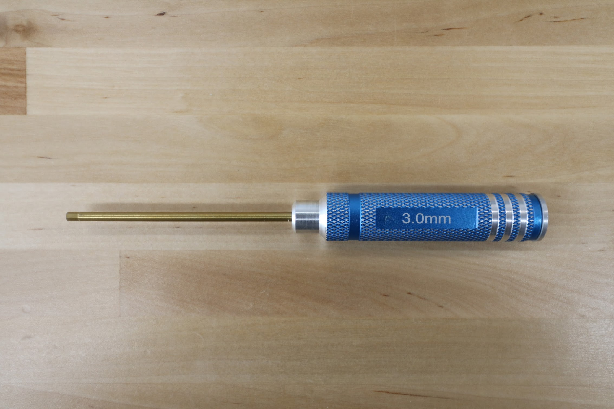
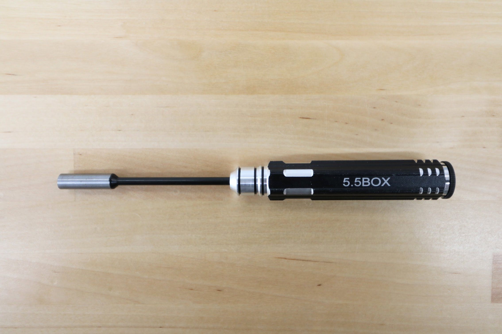
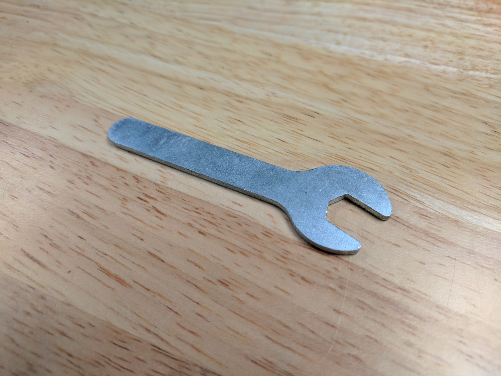

* toc
{:toc}

|Component|$/Unit|Genesis Qty|Genesis Subtotal|XL Qty|XL Subtotal|MAX Qty|MAX Subtotal|
|---------|------|-----------|----------------|------|-----------|-------|------------|
|[M2.5 x 4mm Screws](#m25-x-4mm-screws)|$0.15|8|$1.20|8|$1.20|8|$1.20
|[M2.5 x 16mm M/F Standoffs](#standoffs) **\***|$0.50|4|$2.00|4|$2.00|4|$2.00
|[M3 x 6mm Screws](#m3-x-6mm-screws)|$0.10|10|$1.00|10|$1.00|10|$1.00
|[M3 x 12mm Screws](#m3-x-12mm-screws)|$0.15|40|$6.00|40|$6.00|40|$6.00
|[M3 x 35mm Screws](#m3-x-35mm-screws)|$0.20|4|$0.80|4|$0.80|4|$0.80
|[M3 Locknuts](#m3-locknuts)|$0.10|20|$2.00|20|$2.00|20|$2.00
|[M5 x 10mm Screws](#m5-x-10mm-screws)|$0.15|150|$22.50|225|$33.75|400|$60.00
|[M5 x 16mm Screws](#m5-x-16mm-screws)|$0.20|40|$8.00|40|$8.00|40|$8.00
|[M5 x 30mm Screws](#m5-x-30mm-screws)|$0.30|45|$13.50|45|$13.50|45|$13.50
|[M5 Flange Locknuts](#m5-flange-locknuts)|$0.10|70|$7.00|70|$7.00|70|$7.00
|[M5 x 6mm Spacers](#m5-x-6mm-spacers)|$0.20|30|$6.00|30|$6.00|30|$6.00
|[M5 x 6mm Eccentric Spacers](#m5-x-6mm-eccentric-spacers)|$2.00|15|$30.00|15|$30.00|15|$30.00
|[M5 Tee Nuts](#tee-nuts)|$0.40|20|$8.00|20|$8.00|20|$8.00
|[20mm Nut Bar](#20mm-nut-bar)|$1.50|6|$9.00|6|$9.00|6|$9.00
|[40mm Nut Bar](#40mm-nut-bar)|$1.75|28|$49.00|54|$94.50|134|$234.50
|[60mm Nut Bar](#60mm-nut-bar)|$2.00|20|$40.00|24|$48.00|24|$48.00
|[100mm Nut Bar](#60mm-nut-bar) **\***|$2.50|2|$5.00|6|$15.00|-|-
|[140mm Nut Bar](#60mm-nut-bar) **\***|$3.00|-|-|2|$6.00|-|-
|[25mm Wood Screws](#wood-screws)|$0.05|35|$1.75|60|$3.00|124|$6.20
|[Dowel Pins](#dowel-pins) **\***|$2.00|6|$12.00|20|$40.00|52|$104.00
|[15 x 5 x 5mm Ring Magnets](#ring-magnets)|$3.00|21|$63.00|21|$63.00|21|$63.00
|[Zip Ties](#zip-ties) **\***|$0.05 to $0.10|85|$5.25|85|$5.25|85|$5.25
|[Assembly Tools](#tools)|$1.00 to $5.00|8|$32.00|8|$32.00|8|$32.00
|**TOTALS**||**665**|**$252.20**|**809**|**$415.20**|**1,160**|**$648.65**

**\*** See special note in BOM listing

<iframe class="embedly-embed" src="//cdn.embedly.com/widgets/media.html?src=https%3A%2F%2Fwww.youtube.com%2Fembed%2FlX4OaLqChOg%3Ffeature%3Doembed&url=http%3A%2F%2Fwww.youtube.com%2Fwatch%3Fv%3DlX4OaLqChOg&image=https%3A%2F%2Fi.ytimg.com%2Fvi%2FlX4OaLqChOg%2Fhqdefault.jpg&key=f2aa6fc3595946d0afc3d76cbbd25dc3&type=text%2Fhtml&schema=youtube" width="854" height="480" scrolling="no" frameborder="0" allow="autoplay; fullscreen" allowfullscreen="true"></iframe>

# M2.5 x 4mm Screws

These screws are used to mount the electronics boards into the electronics box with the M2.5 M/F standoffs as an intermediary component.

|                              |                              |
|------------------------------|------------------------------|
|**Threads**                   |M2.5
|**Length**                    |4mm
|**Drive Size**                |2mm hex
|**Material**                  |Stainless steel
|**Price**                     |$0.15
|**Quantity**                  |8 (pre-assembled in the electronics box)

|                              |                              |
|------------------------------|------------------------------|
|**Internal Part Name**        |`M2.5 x 4mm Screw (2mm Hex Drive)`
|**Vendor**                    |
|**$/pc**                      |$0.009
|**Component Tests**           |[Fasteners and hardware tests](../../manufacturing/component-tests/fasteners-and-hardware.md)
|**Notes**                     |
{:.internal}

# M3 Screws

M3 screws are used throughout FarmBot for mounting motors and other small electronic components on the tools.

|                              |                              |
|------------------------------|------------------------------|
|**Threads**                   |M3 x 0.5mm
|**Lengths**                   |6mm, 12mm, 35mm
|**Trade Name**                |M3 Low-Profile Socket Head Cap Screw
|**Material**                  |Stainless Steel
|**Head Height**               |2mm
|**Head Diameter**             |5.5mm
|**Drive Size**                |2mm hex
|**Price**                     |6mm - $0.10 12mm - $0.15 35mm - $0.20
|**Quantity**                  |6mm - 10 12mm - 40 35mm - 4 (pre-assembled in the electronics box)

|                              |                              |
|------------------------------|------------------------------|
|**Internal Part Name**        |`M3 x 6mm Screw` `M3 x 12mm Screw` `M3 x 35mm Screw`
|**Vendor**                    |
|**$/pc**                      |6mm - $0.008 12mm - $0.012 35mm - $0.032
|**Component Tests**           |[Fasteners and hardware tests](../../manufacturing/component-tests/fasteners-and-hardware.md)
|**Notes**                     |
{:.internal}

## M3 x 6mm Screws

## M3 x 12mm Screws

## M3 x 35mm Screws

Image coming soon

# M5 Screws

M5 button-head screws of various lengths are used throughout FarmBot to attach plates and 3D printed parts to extrusions, V-wheels to plates, and other components together. They are usually used in combination with M5 washers, and terminated with an M5 tee nut or locknut. The button head provides a wide bearing surface, a low-profile head, and a finished appearance. Length is measured from under the head.

|                              |                              |
|------------------------------|------------------------------|
|**Threads**                   |M5 x 0.8mm
|**Lengths**                   |10, 16, and 30mm
|**Trade Name**                |Button-Head Socket Cap Screw
|**Material**                  |Stainless Steel
|**Head Height**               |2.75mm
|**Head Diameter**             |9.5mm
|**Drive Size**                |3mm hex
|**Price**                     |10mm - $0.15 16mm - $0.20 30mm - $0.30
|**Quantity**                  |10mm - Genesis: 150, Genesis XL: 225, Genesis MAX: 400 16mm - 40 30mm - 45

|                              |                              |
|------------------------------|------------------------------|
|**Internal Part Name**        |`M5 x 10mm Screw` `M5 x 16mm Screw` `M5 x 30mm Screw`
|**Vendor**                    |
|**$/pc**                      |10mm - $0.023 16mm - $0.029 30mm - $0.049
|**Component Tests**           |[Fasteners and hardware tests](../../manufacturing/component-tests/fasteners-and-hardware.md)
|**Notes**                     |
{:.internal}

## M5 x 10mm Screws

## M5 x 16mm Screws

## M5 x 30mm Screws

# Locknuts

Locknuts are used throughout FarmBot to secure M3 and M5 screws in place. The nylon insert allows the locknut to resist loosening when subjected to vibration.

|                              |                              |
|------------------------------|------------------------------|
|**Trade Name**                |Nylon-Insert Locknut
|**Threads**                   |M3 x 0.5mm M5 x 0.8mm
|**Height**                    |M3 - 4mm M5 - 5mm
|**Width**                     |M3 - 5.5mm M5 - 8mm
|**Material**                  |Stainless Steel
|**Price**                     |M3 - $0.10 M5 - $0.15
|**Quantity**                  |M3 - 20 (4 pieces pre-assembled in electronics box, 16 pieces packed in bag) M5 - 70

|                              |                              |
|------------------------------|------------------------------|
|**Internal Part Name**        |`M3 Locknut` `M5 Flange Locknut`
|**Vendor**                    |
|**$/pc**                      |M3 - $0.014 M5 - $0.08
|**Component Tests**           |[Fasteners and hardware tests](../../manufacturing/component-tests/fasteners-and-hardware.md)
|**Notes**                     |
{:.internal}

## M3 Locknuts

## M5 Flange Locknuts

# Spacers

These spacers are used to offset V-wheels from plates so that they may engage extrusions.

|                              |                              |
|------------------------------|------------------------------|
|**Material**                  |Aluminum
|**Outer Diameter**            |10mm
|**Inner Diameter**            |5.1mm
|**Length**                    |6mm
|**Price**                     |$0.20
|**Quantity**                  |30 (12 extra)

|                              |                              |
|------------------------------|------------------------------|
|**Internal Part Name**        |`M5 x 6mm Spacer`
|**Vendor**                    |
|**$/pc**                      |$0.10
|**Component Tests**           |[Fasteners and hardware tests](../../manufacturing/component-tests/fasteners-and-hardware.md)
|**Notes**                     |
{:.internal}

## M5 x 6mm Spacers

# Eccentric Spacers

When rotated, eccentric spacers accurately position V-wheels on a plate such that they can firmly engage V-slot aluminum extrusions. They are only used on wheels on one side of an extrusion. Adjustments are made by using a 8mm wrench on the spacer itself.

|                              |                              |
|------------------------------|------------------------------|
|**Material**                  |Stainless Steel
|**Height**                    |6mm (not including rim)
|**Bore**                      |5mm
|**Rim Diameter**              |Fits into a 7.12mm hole
|**Hex Size**                  |8mm
|**Divot**                     |Indicates shortest distance from rim to bore
|**Price**                     |$2.00
|**Quantity**                  |15

|                              |                              |
|------------------------------|------------------------------|
|**Internal Part Name**        |`M5 x 6mm Eccentric Spacer`
|**Vendor**                    |
|**$/pc**                      |$0.30
|**Component Tests**           |[Fasteners and hardware tests](../../manufacturing/component-tests/fasteners-and-hardware.md)
|**Notes**                     |
{:.internal}

## M5 x 6mm Eccentric Spacers

# Standoffs

These M/F standoffs are used to offset the Raspberry Pi from the electronics box mounting bosses. They come pre-assembled in the electronics box.



|                              |                              |
|------------------------------|------------------------------|
|**Material**                  |Stainless steel
|**Lengths**                   |16mm
|**Male Threads**              |M2.5
|**Female Threads**            |M2.5, 4mm length
|**Price**                     |$0.50
|**Quantity**                  |4 or 0 (see note above)

# Tee Nuts

Combined with screws, these drop-in style tee nuts allow components such as plates and 3D printed parts to be attached quickly and securely anywhere on a V-slot aluminum extrusion.

|                              |                              |
|------------------------------|------------------------------|
|**Trade Name**                |Drop-in Tee Nut
|**Material**                  |Stainless Steel
|**Threads**                   |M5 x 0.8mm
|**Fits Slot Size**            |6
|**Price**                     |$0.40
|**Quantity**                  |20

|                              |                              |
|------------------------------|------------------------------|
|**Internal Part Name**        |`M5 SS Drop-in Tee Nuts`
|**Vendor**                    |
|**$/pc**                      |$0.16
|**Component Tests**           |[Fasteners and hardware tests](../../manufacturing/component-tests/fasteners-and-hardware.md)
|**Notes**                     |
{:.internal}

# Nut Bars

These stainless steel bars act as long tee nuts allowing M5 screws to securely hold plates, brackets, and other components to a v-slot extrusion.



|                              |                              |
|------------------------------|------------------------------|
|**Material**                  |Stainless steel
|**Overall Lengths**           |20mm, 40mm, 60mm, 100mm, 140mm
|**Threads**                   |M5 x 0.8mm
|**Fits Slot Size**            |6
|**Price**                     |20mm - $1.50 40mm - $1.75 60mm - $2.00 100mm - $2.50 140mm - $3.00
|**Quantity**                  |**Genesis** 20mm - 6 40mm - 28 60mm - 20 100mm - 2 or 0 (see note above)  **Genesis XL** 20mm - 6 40mm - 54 60mm - 24 100mm - 6 or 0 (see note above) 140mm - 2 or 0 (see note above)  **Genesis MAX** 20mm - 6 40mm - 134 60mm - 24

|                              |                              |
|------------------------------|------------------------------|
|**Internal Part Name**        |`20mm Nut Bar` `40mm Nut Bar` `60mm Nut Bar` `100mm Nut Bar` `140mm Nut Bar`
|**Vendor**                    |
|**$/pc**                      |20mm - $0.39 40mm - $0.49 60mm - $0.59 100mm - $0.89 140mm - $0.95
|**Component Tests**           |[Fasteners and hardware tests](../../manufacturing/component-tests/fasteners-and-hardware.md)
|**Notes**                     |
{:.internal}

## 20mm Nut Bar

## 40mm Nut Bar

## 60mm Nut Bar

## 100mm Nut Bar

## 140mm Nut Bar

# Wood Screws

These are used to attach the track end plates and track joining plates to supporting infrastructure such as a raised.

|                              |                              |
|------------------------------|------------------------------|
|**Material**                  |Steel
|**Finish**                    |Black Oxide
|**Length**                    |25mm
|**Head Diameter**             |12mm
|**Price**                     |$0.05
|**Quantity**                  |Genesis - 35 Genesis XL - 60 Genesis MAX - 124

|                              |                              |
|------------------------------|------------------------------|
|**Internal Part Name**        |`25mm Wood Screw`
|**Vendor**                    |
|**$/pc**                      |$0.006
|**Component Tests**           |[Fasteners and hardware tests](../../manufacturing/component-tests/fasteners-and-hardware.md)
|**Notes**                     |
{:.internal}

# Dowel Pins

These pins are used to help align track extrusions and the gantry main beams.



|                              |                              |
|------------------------------|------------------------------|
|**Material**                  |Stainless steel
|**Length**                    |40mm
|**Diameter 1**                |4.2mm
|**Diameter 2**                |4.25mm
|**Price**                     |$2.00
|**Quantity**                  |Genesis: 6 or 0 (see note above) Genesis XL: 20 or 0 (see note above) Genesis MAX: 52

# Ring Magnets

These magnets keep tools attached to the UTM.

|                              |                              |
|------------------------------|------------------------------|
|**Material**                  |Neodymium (NdFeB)
|**Coating**                   |Nickle (Ni)
|**Magnetization**             |Through ring
|**Outer Diameter**            |15mm
|**Inner Diameter**            |5mm
|**Thickness**                 |5mm
|**Price**                     |$3.00
|**Quantity**                  |21 (6 extras included, 3 come pre-mounted to the UTM)

|                              |                              |
|------------------------------|------------------------------|
|**Internal Part Name**        |`15 x 5 x 5mm Ring Magnet`
|**Vendor**                    |
|**$/pc**                      |$0.36
|**Component Tests**           |[Fasteners and hardware tests](../../manufacturing/component-tests/fasteners-and-hardware.md)
|**Notes**                     |
{:.internal}



# Zip Ties

Zip ties are used to fasten the vacuum pump and solenoid valve to their mounts, and for cable management throughout FarmBot.



|                              |                              |
|------------------------------|------------------------------|
|**Material**                  |Nylon
|**Color**                     |Black
|**Length**                    |60mm, 100mm, and 200mm
|**Price**                     |60mm - $0.05 100mm - $0.07 200mm - $0.10
|**Quantity**                  |60mm - 50 or 0 (see note above) 100mm - 25 200mm - 10

|                              |                              |
|------------------------------|------------------------------|
|**Internal Part Name**        |`100mm Zip Tie` `200mm Zip Tie`
|**Vendor**                    |
|**$/pc**                      |100mm - $0.006 200mm - $0.015
|**Component Tests**           |[Fasteners and hardware tests](../../manufacturing/component-tests/fasteners-and-hardware.md)
|**Notes**                     |
{:.internal}

## 60mm Zip Ties

## 100mm Zip Ties

## 200mm Zip Ties

# Tools

FarmBot Genesis kits include all of the tools required to complete assembly.

<iframe class="embedly-embed" src="//cdn.embedly.com/widgets/media.html?src=https%3A%2F%2Fwww.youtube.com%2Fembed%2F-RoldWV-ut4%3Ffeature%3Doembed&url=http%3A%2F%2Fwww.youtube.com%2Fwatch%3Fv%3D-RoldWV-ut4&image=https%3A%2F%2Fi.ytimg.com%2Fvi%2F-RoldWV-ut4%2Fhqdefault.jpg&key=02466f963b9b4bb8845a05b53d3235d7&type=text%2Fhtml&schema=youtube" width="854" height="480" scrolling="no" frameborder="0" allowfullscreen></iframe>

## 3mm Hex Driver

This hex (allen) driver is used to tighten all of the M5 screws on FarmBot.

|                              |                              |
|------------------------------|------------------------------|
|**Hex Size**                  |3mm
|**Bit**                       |Hardened steel with a titanium nitride coating
|**Handle**                    |Blue anodized aluminum
|**Label**                     |`3.0mm`
|**Price**                     |$5.00
|**Quantity**                  |1

|                              |                              |
|------------------------------|------------------------------|
|**Internal Part Name**        |`3mm Hex Driver`
|**Vendor**                    |
|**$/pc**                      |$1.80
|**Component Tests**           |[Fasteners and hardware tests](../../manufacturing/component-tests/fasteners-and-hardware.md)
|**Notes**                     |
{:.internal}

## 2mm Hex Driver

This hex (allen) driver is used to tighten all of the M3 screws and setscrews on FarmBot.

|                              |                              |
|------------------------------|------------------------------|
|**Hex Size**                  |2mm
|**Bit**                       |Hardened steel with a titanium nitride coating
|**Handle**                    |Blue anodized aluminum
|**Label**                     |`2.0mm`
|**Price**                     |$5.00
|**Quantity**                  |1

|                              |                              |
|------------------------------|------------------------------|
|**Internal Part Name**        |`2mm Hex Driver`
|**Vendor**                    |
|**$/pc**                      |$1.80
|**Component Tests**           |[Fasteners and hardware tests](../../manufacturing/component-tests/fasteners-and-hardware.md)
|**Notes**                     |
{:.internal}

## 8mm Box Wrench

This box wrench is used to tighten all of the M5 screws on FarmBot.

|                              |                              |
|------------------------------|------------------------------|
|**Box Size**                  |8mm
|**Handle**                    |Black anodized aluminum
|**Label**                     |`8.0 BOX`
|**Price**                     |$5.00
|**Quantity**                  |1

|                              |                              |
|------------------------------|------------------------------|
|**Internal Part Name**        |`8mm Nut Driver`
|**Vendor**                    |
|**$/pc**                      |$1.90
|**Component Tests**           |[Fasteners and hardware tests](../../manufacturing/component-tests/fasteners-and-hardware.md)
|**Notes**                     |
{:.internal}

## 5.5mm Box Wrench

This box wrench is used to tighten all of the M3 locknuts on FarmBot.

|                              |                              |
|------------------------------|------------------------------|
|**Box Size**                  |5.5mm
|**Handle**                    |Black anodized aluminum
|**Label**                     |`5.5 BOX`
|**Price**                     |$5.00
|**Quantity**                  |1

|                              |                              |
|------------------------------|------------------------------|
|**Internal Part Name**        |`5.5mm Nut Driver`
|**Vendor**                    |
|**$/pc**                      |$1.90
|**Component Tests**           |[Fasteners and hardware tests](../../manufacturing/component-tests/fasteners-and-hardware.md)
|**Notes**                     |
{:.internal}

## 8mm Wrench

The wrench is for tightening M5 locknuts and adjusting eccentric spacers throughout FarmBot.

|                              |                              |
|------------------------------|------------------------------|
|**Size**                      |8mm
|**Label**                     |`8mm`
|**Price**                     |$3.00
|**Quantity**                  |1

|                              |                              |
|------------------------------|------------------------------|
|**Internal Part Name**        |`8mm Thin Wrench`
|**Vendor**                    |
|**$/pc**                      |$0.10
|**Component Tests**           |[Fasteners and hardware tests](../../manufacturing/component-tests/fasteners-and-hardware.md)
|**Notes**                     |
{:.internal}

## 5.5mm Wrench

|                              |                              |
|------------------------------|------------------------------|
|**Size**                      |5.5mm
|**Label**                     |`5.5mm`
|**Price**                     |$3.00
|**Quantity**                  |1

|                              |                              |
|------------------------------|------------------------------|
|**Internal Part Name**        |`5.5mm Thin Wrench`
|**Vendor**                    |
|**$/pc**                      |$0.20
|**Component Tests**           |[Fasteners and hardware tests](../../manufacturing/component-tests/fasteners-and-hardware.md)
|**Notes**                     |
{:.internal}

## Phillips Screwdriver

Use this screwdriver to mount your track end plates, track joining plates, and toolbays.

|                              |                              |
|------------------------------|------------------------------|
|**Bit**                       |6mm phillips
|**Handle**                    |Clear plastic
|**Label**                     |`6mm phillips`
|**Price**                     |$5.00
|**Quantity**                  |1

|                              |                              |
|------------------------------|------------------------------|
|**Internal Part Name**        |`Phillips Screwdriver (6mm bit size)`
|**Vendor**                    |
|**$/pc**                      |$1.30
|**Component Tests**           |[Fasteners and hardware tests](../../manufacturing/component-tests/fasteners-and-hardware.md)
|**Notes**                     |
{:.internal}

## 2mm Allen Key

Use this tool to tighten the bits in the handles of the other drivers.

|                              |                              |
|------------------------------|------------------------------|
|**Size**                      |2mm
|**Price**                     |$1.00
|**Quantity**                  |1

|                              |                              |
|------------------------------|------------------------------|
|**Internal Part Name**        |`2mm Allen Key`
|**Vendor**                    |
|**$/pc**                      |$0.05
|**Component Tests**           |[Fasteners and hardware tests](../../manufacturing/component-tests/fasteners-and-hardware.md)
|**Notes**                     |
{:.internal}

