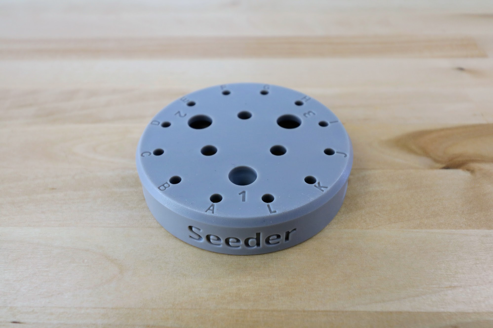
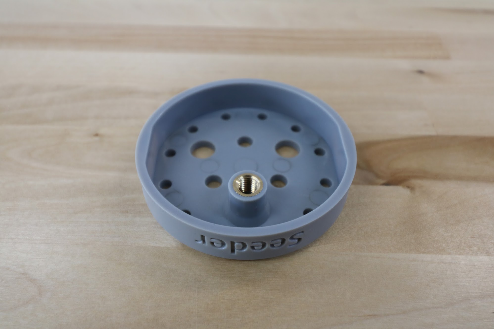
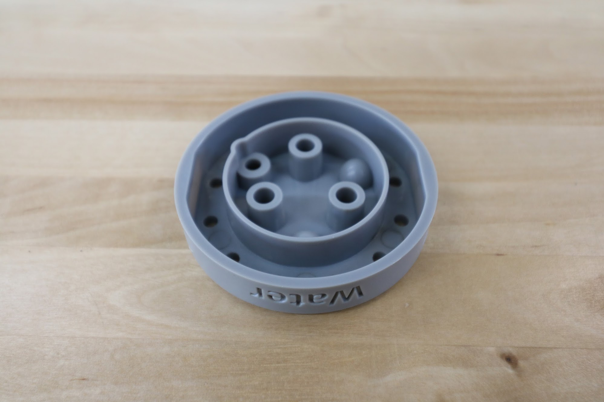
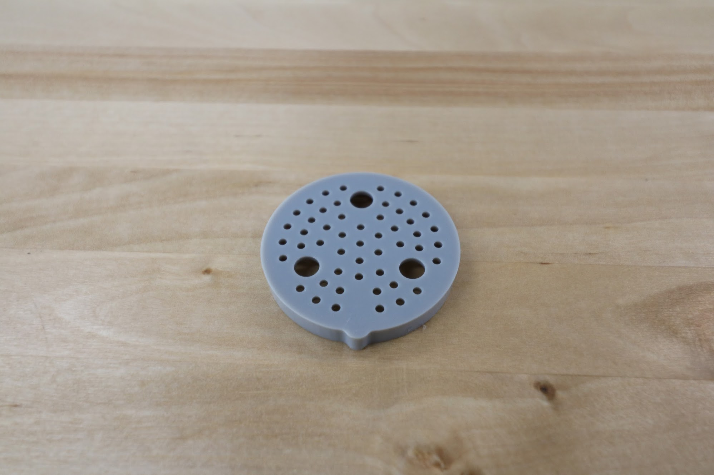
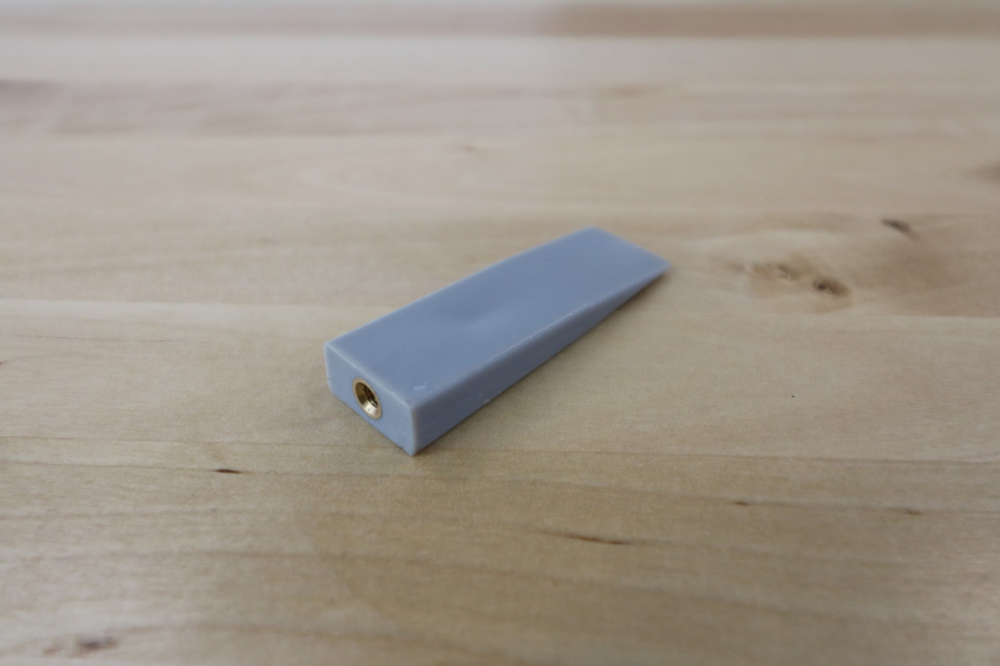

* toc
{:toc}

|Component                     |$/Unit                        |Genesis Qty                   |Genesis Subtotal              |XL Qty                        |XL Subtotal                   |MAX Qty                       |MAX Subtotal                  |
|------------------------------|------------------------------|------------------------------|------------------------------|------------------------------|------------------------------|------------------------------|------------------------------|
|[40mm Horizontal Cable Carrier Support](#40mm-horizontal-cable-carrier-support)|$3.00                         |12                            |$36.00                        |24                            |$72.00                        |72                            |$216.00
|[60mm Horizontal Cable Carrier Support](#60mm-horizontal-cable-carrier-support)|$3.00                         |6                             |$18.00                        |12                            |$36.00                        |12                            |$36.00
|[60mm Vertical Cable Carrier Support](#60mm-vertical-cable-carrier-support)|$3.00                         |4                             |$12.00                        |4                             |$12.00                        |4                             |$12.00
|[60mm Cable Carrier Spacer Block](#60mm-cable-carrier-spacer-block)|$3.00                         |1                             |$3.00                         |1                             |$3.00                         |1                             |$3.00
|[Solenoid Valve Mount](#solenoid-valve-mount)|$6.00                         |1                             |$6.00                         |1                             |$6.00                         |1                             |$6.00
|[Vacuum Pump Mount](#vacuum-pump-mount)|$6.00                         |1                             |$6.00                         |1                             |$6.00                         |1                             |$6.00
|[75mm Horizontal Motor Housing](#75mm-horizontal-motor-housing)|$10.00                        |3                             |$30.00                        |3                             |$30.00                        |3                             |$30.00
|[80mm Vertical Motor Housing](#80mm-vertical-motor-housing)|$12.00                        |1                             |$12.00                        |1                             |$12.00                        |1                             |$12.00
|[Vacuum Pump Housing](#vacuum-pump-housing)|$15.00                        |1                             |$15.00                        |1                             |$15.00                        |1                             |$15.00
|[Universal Tool Mount](#universal-tool-mount)|$30.00                        |1                             |$30.00                        |1                             |$30.00                        |1                             |$30.00
|[Seeder](#seeder)     |$7.00                         |1                             |$7.00                         |1                             |$7.00                         |1                             |$7.00
|[Watering Nozzle Top](#watering-nozzle-top)|$7.00                         |1                             |$7.00                         |1                             |$7.00                         |1                             |$7.00
|[Watering Nozzle Bottom](#watering-nozzle-bottom)|$5.00                         |1                             |$5.00                         |1                             |$5.00                         |1                             |$5.00
|[Weeder](#weeder)     |$7.00                         |1                             |$7.00                         |1                             |$7.00                         |1                             |$7.00
|[Weeder Blades](#weeder-blades)|$2.00                         |12                            |$24.00                        |12                            |$24.00                        |12                            |$24.00
|[Soil Sensor](#soil-sensor)|$7.00                         |1                             |$7.00                         |1                             |$7.00                         |1                             |$7.00
|[Seed Bin](#seed-bin) |$7.00                         |1                             |$7.00                         |1                             |$7.00                         |1                             |$7.00
|[Seed Tray](#seed-tray)|$7.00                         |2                             |$14.00                        |2                             |$14.00                        |2                             |$14.00
|[Seed Trough Holder](#seed-trough-holder)|$8.00                         |1                             |$8.00                         |1                             |$8.00                         |1                             |$8.00
|[Seed Trough](#seed-trough)|$3.00                         |2                             |$6.00                         |2                             |$6.00                         |2                             |$6.00
|[Camera Mount Half](#camera-mount-half)|$3.00                         |2                             |$6.00                         |2                             |$6.00                         |2                             |$6.00
|**TOTALS**                    |                              |**53**                        |**$246.00**                   |**71**                        |**$300.00**                   |**119**                       |**$444.00**

<iframe class="embedly-embed" src="//cdn.embedly.com/widgets/media.html?src=https%3A%2F%2Fwww.youtube.com%2Fembed%2FODUmjM1LhTA%3Ffeature%3Doembed&url=http%3A%2F%2Fwww.youtube.com%2Fwatch%3Fv%3DODUmjM1LhTA&image=https%3A%2F%2Fi.ytimg.com%2Fvi%2FODUmjM1LhTA%2Fhqdefault.jpg&key=f2aa6fc3595946d0afc3d76cbbd25dc3&type=text%2Fhtml&schema=youtube" width="854" height="480" scrolling="no" frameborder="0" allow="autoplay; fullscreen" allowfullscreen="true"></iframe>

# 40mm Horizontal Cable Carrier Support
These parts are used to mount and support the x-axis cable carrier. The gusset also functions as an area for cables, tubes, and LED light strips to be routed through.

|                              |                              |
|------------------------------|------------------------------|
|**Material**                  |Gray UV stabilized ABS
|**Price**                     |$3.00
|**Quantity**                  |Genesis - 12 Genesis XL - 24 Genesis MAX - 72
|**Recommended Supplier**      |[The FarmBot Shop](http://shop.farm.bot)

# 60mm Horizontal Cable Carrier Support
These parts are used to mount and support the y-axis cable carrier. The gusset also functions as an area for cables, tubes, and LED light strips to be routed through.

|                              |                              |
|------------------------------|------------------------------|
|**Material**                  |Gray UV stabilized ABS
|**Price**                     |$3.00
|**Quantity**                  |Genesis - 6 Genesis XL and MAX - 12
|**Recommended Supplier**      |[The FarmBot Shop](http://shop.farm.bot)



# 60mm Vertical Cable Carrier Support
These parts are used to guide and support the z-axis cable carrier. The gusset also functions as an area for the z-axis motor's cables to be routed through.

|                              |                              |
|------------------------------|------------------------------|
|**Material**                  |Gray UV stabilized ABS
|**Price**                     |$3.00
|**Quantity**                  |4
|**Recommended Supplier**      |[The FarmBot Shop](http://shop.farm.bot)

# 60mm Cable Carrier Spacer Block
This component offsets the z-axis cable carrier from the cross-slide plate.

|                              |                              |
|------------------------------|------------------------------|
|**Material**                  |Gray UV stabilized ABS
|**Price**                     |$3.00
|**Quantity**                  |1
|**Recommended Supplier**      |[The FarmBot Shop](http://shop.farm.bot)

# Solenoid Valve Mount
This component features slots for the solenoid valve to be mounted with zip ties. It also doubles as a cable management part for routing cables behind the electronics box.

|                              |                              |
|------------------------------|------------------------------|
|**Material**                  |Gray UV stabilized ABS
|**Price**                     |$6.00
|**Quantity**                  |1
|**Recommended Supplier**      |[The FarmBot Shop](http://shop.farm.bot)

# Vacuum Pump Mount
The vacuum pump mount features slots for zip ties to secure the vacuum pump to the z-axis extrusion.

|                              |                              |
|------------------------------|------------------------------|
|**Material**                  |Gray UV stabilized ABS
|**Price**                     |$6.00
|**Quantity**                  |1
|**Recommended Supplier**      |[The FarmBot Shop](http://shop.farm.bot)

# 75mm Horizontal Motor Housing
These housings protect the gantry and cross-slide motors and encoders from rain.

|                              |                              |
|------------------------------|------------------------------|
|**Material**                  |Gray UV stabilized ABS
|**Price**                     |$10.00
|**Quantity**                  |3
|**Recommended Supplier**      |[The FarmBot Shop](http://shop.farm.bot)

<iframe class="embedly-embed" src="//cdn.embedly.com/widgets/media.html?src=https%3A%2F%2Fwww.youtube.com%2Fembed%2FCQfkuFBVsek%3Ffeature%3Doembed&url=http%3A%2F%2Fwww.youtube.com%2Fwatch%3Fv%3DCQfkuFBVsek&image=https%3A%2F%2Fi.ytimg.com%2Fvi%2FCQfkuFBVsek%2Fhqdefault.jpg&key=02466f963b9b4bb8845a05b53d3235d7&type=text%2Fhtml&schema=youtube" width="854" height="480" scrolling="no" frameborder="0" allowfullscreen></iframe>

# 80mm Vertical Motor Housing
This component protects the z-axis motor from rain.

|                              |                              |
|------------------------------|------------------------------|
|**Material**                  |Gray UV stabilized ABS
|**Price**                     |$12.00
|**Quantity**                  |1
|**Recommended Supplier**      |[The FarmBot Shop](http://shop.farm.bot)

# Vacuum Pump Housing
This housing protects the vacuum pump from rain. It is mounted on the z-axis extrusion.

|                              |                              |
|------------------------------|------------------------------|
|**Material**                  |Gray UV stabilized ABS
|**Price**                     |$15.00
|**Quantity**                  |1
|**Recommended Supplier**      |[The FarmBot Shop](http://shop.farm.bot)

# Universal Tool Mount
The UTM allows FarmBot to automatically switch tools for the task at hand. It features 12 electrical connections, three liquid/gas lines, and magnetic coupling.

|                              |                              |
|------------------------------|------------------------------|
|**Material**                  |Gray UV stabilized ABS
|**Price**                     |$30.00
|**Quantity**                  |1
|**Recommended Supplier**      |[The FarmBot Shop](http://shop.farm.bot)

<iframe class="embedly-embed" src="//cdn.embedly.com/widgets/media.html?src=https%3A%2F%2Fwww.youtube.com%2Fembed%2Fq8xjCBq32C8%3Ffeature%3Doembed&url=http%3A%2F%2Fwww.youtube.com%2Fwatch%3Fv%3Dq8xjCBq32C8&image=https%3A%2F%2Fi.ytimg.com%2Fvi%2Fq8xjCBq32C8%2Fhqdefault.jpg&key=02466f963b9b4bb8845a05b53d3235d7&type=text%2Fhtml&schema=youtube" width="854" height="480" scrolling="no" frameborder="0" allowfullscreen></iframe>



# Seeder
The seeder, combined with the vacuum pump, allows FarmBot to pick up seeds and deposit them precisely in the ground.

|                              |                              |
|------------------------------|------------------------------|
|**Material**                  |Gray UV stabilized ABS
|**Brass Insert**              |M5 threads
|**Price**                     |$7.00
|**Quantity**                  |1
|**Recommended Supplier**      |[The FarmBot Shop](http://shop.farm.bot)

<iframe class="embedly-embed" src="//cdn.embedly.com/widgets/media.html?src=https%3A%2F%2Fwww.youtube.com%2Fembed%2FnXFdJIQaQB4%3Ffeature%3Doembed&url=http%3A%2F%2Fwww.youtube.com%2Fwatch%3Fv%3DnXFdJIQaQB4&image=https%3A%2F%2Fi.ytimg.com%2Fvi%2FnXFdJIQaQB4%2Fhqdefault.jpg&key=02466f963b9b4bb8845a05b53d3235d7&type=text%2Fhtml&schema=youtube" width="854" height="480" scrolling="no" frameborder="0" allowfullscreen></iframe>

# Watering Nozzle
This two-part tool distributes the stream of water coming from the UTM into a gentle shower for your plants.

|                              |                              |
|------------------------------|------------------------------|
|**Material**                  |Gray UV stabilized ABS
|**Price**                     |Top - $7.00 Bottom - $5.00
|**Quantity**                  |Top - 1 Bottom - 1
|**Recommended Supplier**      |[The FarmBot Shop](http://shop.farm.bot)

<iframe class="embedly-embed" src="//cdn.embedly.com/widgets/media.html?src=https%3A%2F%2Fwww.youtube.com%2Fembed%2Fxh7imhENpLQ%3Ffeature%3Doembed&url=http%3A%2F%2Fwww.youtube.com%2Fwatch%3Fv%3Dxh7imhENpLQ&image=https%3A%2F%2Fi.ytimg.com%2Fvi%2Fxh7imhENpLQ%2Fhqdefault.jpg&key=f2aa6fc3595946d0afc3d76cbbd25dc3&type=text%2Fhtml&schema=youtube" width="854" height="480" scrolling="no" frameborder="0" allowfullscreen></iframe>

## Watering Nozzle Top

## Watering Nozzle Bottom

# Weeder
The weeding tool allows FarmBot to smash weeds into the ground, thereby killing them via mechanical disruption. The tool consists of a base component and interchangeable implements that allow you to customize the tool for your soil conditions and types of weeds.

|                              |                              |
|------------------------------|------------------------------|
|**Material**                  |Gray UV stabilized ABS
|**Brass Inserts**             |M3 inserts on all blades
|**Price**                     |Weeder - $7.00 Blades - $2.00
|**Quantity**                  |Weeder - 1 Blades - 4 of each size
|**Recommended Supplier**      |[The FarmBot Shop](http://shop.farm.bot)

<iframe class="embedly-embed" src="//cdn.embedly.com/widgets/media.html?src=https%3A%2F%2Fwww.youtube.com%2Fembed%2FNsEdALh3ZYY%3Ffeature%3Doembed&url=http%3A%2F%2Fwww.youtube.com%2Fwatch%3Fv%3DNsEdALh3ZYY&image=https%3A%2F%2Fi.ytimg.com%2Fvi%2FNsEdALh3ZYY%2Fhqdefault.jpg&key=02466f963b9b4bb8845a05b53d3235d7&type=text%2Fhtml&schema=youtube" width="854" height="480" scrolling="no" frameborder="0" allowfullscreen></iframe>

# Weeder Blades
## Wide Weeder Blade

## Medium Weeder Blade

## Narrow Weeder Blade

# Soil Sensor
This tool acts as a mount for the soil sensor circuit board.

|                              |                              |
|------------------------------|------------------------------|
|**Material**                  |Gray UV stabilized ABS
|**Price**                     |$7.00
|**Quantity**                  |1
|**Recommended Supplier**      |[The FarmBot Shop](http://shop.farm.bot)

<iframe class="embedly-embed" src="//cdn.embedly.com/widgets/media.html?src=https%3A%2F%2Fwww.youtube.com%2Fembed%2Fp6CPnJoHf8E%3Ffeature%3Doembed&url=http%3A%2F%2Fwww.youtube.com%2Fwatch%3Fv%3Dp6CPnJoHf8E&image=https%3A%2F%2Fi.ytimg.com%2Fvi%2Fp6CPnJoHf8E%2Fhqdefault.jpg&key=02466f963b9b4bb8845a05b53d3235d7&type=text%2Fhtml&schema=youtube" width="854" height="480" scrolling="no" frameborder="0" allowfullscreen></iframe>

# Seed Bin
This plastic bin allows you to load many seeds of the same type into your FarmBot.

|                              |                              |
|------------------------------|------------------------------|
|**Material**                  |Gray UV stabilized ABS
|**Price**                     |$7.00
|**Quantity**                  |1
|**Recommended Supplier**      |[The FarmBot Shop](http://shop.farm.bot)

<iframe class="embedly-embed" src="//cdn.embedly.com/widgets/media.html?src=https%3A%2F%2Fwww.youtube.com%2Fembed%2FguJK9498ZA4%3Ffeature%3Doembed&url=http%3A%2F%2Fwww.youtube.com%2Fwatch%3Fv%3DguJK9498ZA4&image=https%3A%2F%2Fi.ytimg.com%2Fvi%2FguJK9498ZA4%2Fhqdefault.jpg&key=02466f963b9b4bb8845a05b53d3235d7&type=text%2Fhtml&schema=youtube" width="854" height="480" scrolling="no" frameborder="0" allowfullscreen></iframe>

# Seed Tray
The seed trays feature 16 small bins allowing you to load 16 precise quantities/types of seeds into your FarmBot.

|                              |                              |
|------------------------------|------------------------------|
|**Material**                  |Gray UV stabilized ABS
|**Price**                     |$7.00
|**Quantity**                  |2
|**Recommended Supplier**      |[The FarmBot Shop](http://shop.farm.bot)

# Seed Trough Holder
This gantry-mounted seed trough holder allows FarmBot to bring seeds with it while traveling along the x-axis, shortening the time needed for seed injection.

|                              |                              |
|------------------------------|------------------------------|
|**Material**                  |Gray UV stabilized ABS
|**Price**                     |$8.00
|**Quantity**                  |1
|**Recommended Supplier**      |[The FarmBot Shop](http://shop.farm.bot)

# Seed Trough
These troughs fit into the seed trough holder, allowing FarmBot to bring seeds with it while traveling along the x-axis.

|                              |                              |
|------------------------------|------------------------------|
|**Material**                  |Gray UV stabilized ABS
|**Price**                     |$3.00
|**Quantity**                  |2
|**Recommended Supplier**      |[The FarmBot Shop](http://shop.farm.bot)

# Camera Mount Half
These small plastic components fasten the borescope camera to the z-axis extrusion.

|                              |                              |
|------------------------------|------------------------------|
|**Material**                  |Gray UV stabilized ABS
|**Price**                     |$3.00
|**Quantity**                  |2
|**Recommended Supplier**      |[The FarmBot Shop](http://shop.farm.bot)

