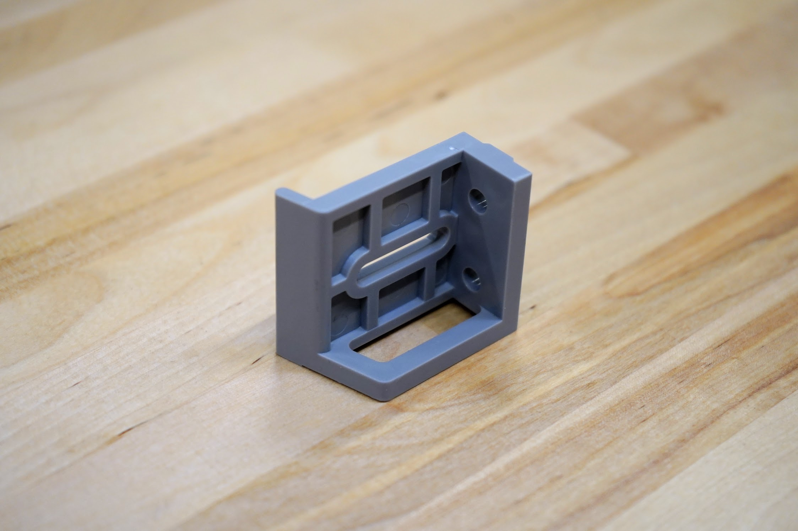
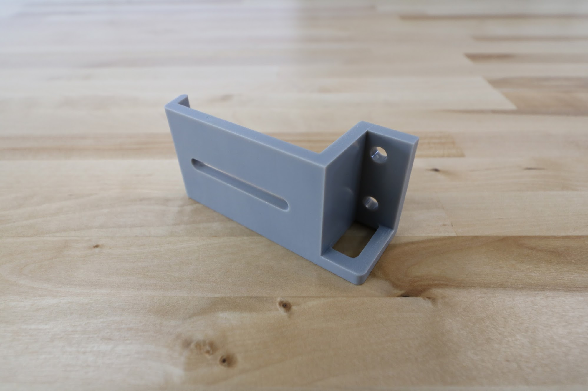
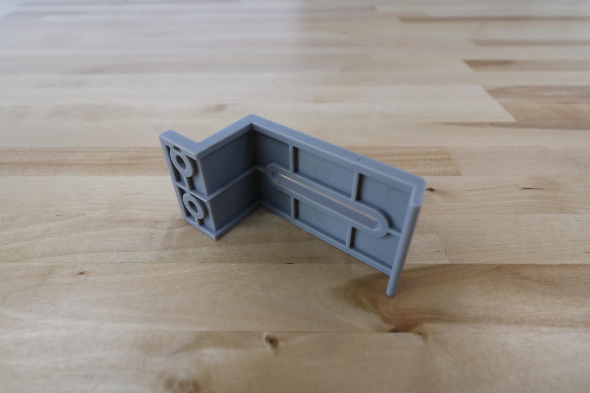
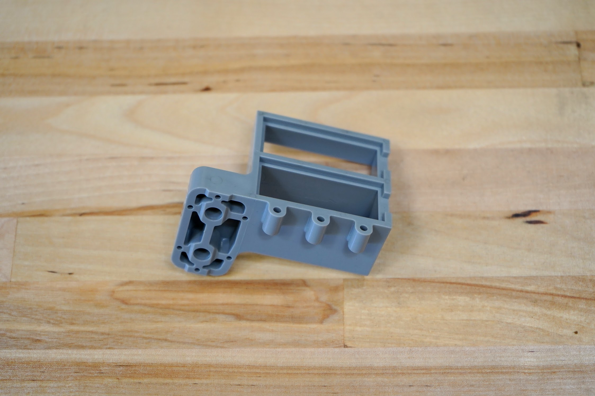
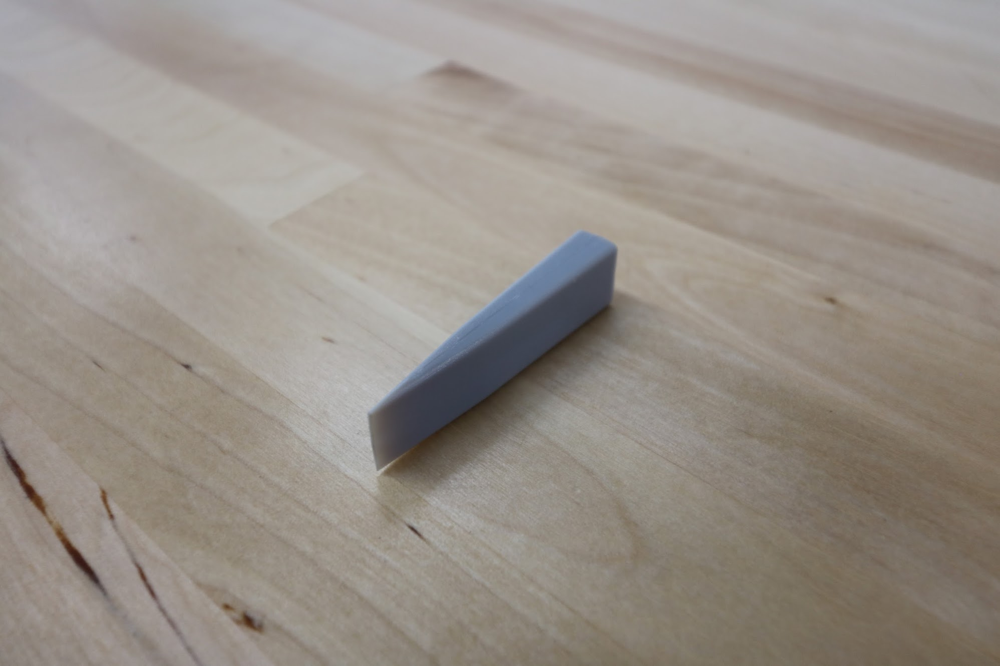

* toc
{:toc}

|Component|$/Unit|Genesis Qty|Genesis Subtotal|XL Qty|XL Subtotal|MAX Qty|MAX Subtotal|
|---------|------|-----------|----------------|------|-----------|-------|------------|
|[40mm Horizontal Cable Carrier Support](#40mm-horizontal-cable-carrier-support)|$3.00|12|$36.00|24|$72.00|72|$216.00
|[60mm Horizontal Cable Carrier Support](#60mm-horizontal-cable-carrier-support)|$3.00|6|$18.00|12|$36.00|12|$36.00
|[60mm Vertical Cable Carrier Support](#60mm-vertical-cable-carrier-support)|$3.00|4|$12.00|4|$12.00|4|$12.00
|[60mm Cable Carrier Spacer Block](#60mm-cable-carrier-spacer-block)|$3.00|1|$3.00|1|$3.00|1|$3.00
|[75mm Horizontal Motor Housing](#75mm-horizontal-motor-housing)|$10.00|3|$30.00|3|$30.00|3|$30.00
|[80mm Vertical Motor Housing](#80mm-vertical-motor-housing)|$12.00|1|$12.00|1|$12.00|1|$12.00
|[Camera Mount Half](#camera-mount-half)|$3.00|2|$6.00|2|$6.00|2|$6.00
|[Seeder](#seeder)|$7.00|1|$7.00|1|$7.00|1|$7.00
|[Seed Bin](#seed-bin)|$7.00|1|$7.00|1|$7.00|1|$7.00
|[Seed Tray](#seed-tray)|$7.00|2|$14.00|2|$14.00|2|$14.00
|[Seed Trough](#seed-trough)|$3.00|2|$6.00|2|$6.00|2|$6.00
|[Seed Trough Holder](#seed-trough-holder)|$8.00|1|$8.00|1|$8.00|1|$8.00
|[Soil Sensor](#soil-sensor)|$7.00|1|$7.00|1|$7.00|1|$7.00
|[Solenoid Valve Mount](#solenoid-valve-mount)|$6.00|1|$6.00|1|$6.00|1|$6.00
|[Universal Tool Mount](#universal-tool-mount)|$30.00|1|$30.00|1|$30.00|1|$30.00
|[Vacuum Pump Housing](#vacuum-pump-housing)|$15.00|1|$15.00|1|$15.00|1|$15.00
|[Vacuum Pump Mount](#vacuum-pump-mount)|$6.00|1|$6.00|1|$6.00|1|$6.00
|[Watering Nozzle Top](#watering-nozzle)|$7.00|1|$7.00|1|$7.00|1|$7.00
|[Watering Nozzle Bottom](#watering-nozzle)|$5.00|1|$5.00|1|$5.00|1|$5.00
|[Weeder](#weeder)|$7.00|1|$7.00|1|$7.00|1|$7.00
|[Weeder Blades](#weeder)|$2.00|12|$24.00|12|$24.00|12|$24.00
|**TOTALS**||**53**|**$246.00**|**71**|**$300.00**|**119**|**$444.00**

<iframe width="854" height="480" src="https://www.youtube.com/embed/ODUmjM1LhTA" frameborder="0" allow="accelerometer; autoplay; clipboard-write; encrypted-media; gyroscope; picture-in-picture" allowfullscreen></iframe>

# 40mm Horizontal Cable Carrier Support

These parts are used to mount and support the x-axis cable carrier. The gusset also functions as an area for cables, tubes, and LED light strips to be routed through.

|                              |                              |
|------------------------------|------------------------------|
|**Material**                  |Gray UV stabilized ABS
|**Price**                     |$3.00
|**Quantity**                  |Genesis - 12 Genesis XL - 24 Genesis MAX - 72
|**Recommended Supplier**      |[The FarmBot Shop](http://shop.farm.bot)

|                              |                              |
|------------------------------|------------------------------|
|**Internal Part Name**        |`40mm Horizontal CC Support Rev B`
|**Vendor**                    |LDO
|**$/pc**                      |$0.82
|**Component Tests**           |[Plastic Part Tests](../../manufacturing/component-tests/plastic-parts.md)
|**Notes**                     |
{:.internal}



# 60mm Horizontal Cable Carrier Support

These parts are used to mount and support the y-axis cable carrier. The gusset also functions as an area for cables, tubes, and LED light strips to be routed through.

|                              |                              |
|------------------------------|------------------------------|
|**Material**                  |Gray UV stabilized ABS
|**Price**                     |$3.00
|**Quantity**                  |Genesis - 6 Genesis XL and MAX - 12
|**Recommended Supplier**      |[The FarmBot Shop](http://shop.farm.bot)

|                              |                              |
|------------------------------|------------------------------|
|**Internal Part Name**        |`60mm Horizontal CC Support Rev A`
|**Vendor**                    |LDO
|**$/pc**                      |$0.92
|**Component Tests**           |[Plastic Part Tests](../../manufacturing/component-tests/plastic-parts.md)
|**Notes**                     |
{:.internal}



# 60mm Vertical Cable Carrier Support

These parts are used to guide and support the z-axis cable carrier. The gusset also functions as an area for the z-axis motor's cables to be routed through.

|                              |                              |
|------------------------------|------------------------------|
|**Material**                  |Gray UV stabilized ABS
|**Price**                     |$3.00
|**Quantity**                  |4
|**Recommended Supplier**      |[The FarmBot Shop](http://shop.farm.bot)

|                              |                              |
|------------------------------|------------------------------|
|**Internal Part Name**        |`60mm Vertical CC Support Rev A`
|**Vendor**                    |LDO
|**$/pc**                      |$.95
|**Component Tests**           |[Plastic Part Tests](../../manufacturing/component-tests/plastic-parts.md)
|**Notes**                     |
{:.internal}



# 60mm Cable Carrier Spacer Block

This component offsets the z-axis cable carrier from the cross-slide plate.

|                              |                              |
|------------------------------|------------------------------|
|**Material**                  |Gray UV stabilized ABS
|**Price**                     |$3.00
|**Quantity**                  |1
|**Recommended Supplier**      |[The FarmBot Shop](http://shop.farm.bot)



# Solenoid Valve Mount

This component features slots for the solenoid valve to be mounted with zip ties. It also doubles as a cable management part for routing cables behind the electronics box.

|                              |                              |
|------------------------------|------------------------------|
|**Internal Part Name**        |`60mm CC Spacer Block Rev A`
|**Vendor**                    |LDO
|**$/pc**                      |$1.20
|**Component Tests**           |[Plastic Part Tests](../../manufacturing/component-tests/plastic-parts.md)
|**Notes**                     |
{:.internal}



# Vacuum Pump Mount

The vacuum pump mount features slots for zip ties to secure the vacuum pump to the z-axis extrusion.

|                              |                              |
|------------------------------|------------------------------|
|**Material**                  |Gray UV stabilized ABS
|**Price**                     |$6.00
|**Quantity**                  |1
|**Recommended Supplier**      |[The FarmBot Shop](http://shop.farm.bot)



# 75mm Horizontal Motor Housing

These housings protect the gantry and cross-slide motors and encoders from rain.

|                              |                              |
|------------------------------|------------------------------|
|**Material**                  |Gray UV stabilized ABS
|**Price**                     |$10.00
|**Quantity**                  |3
|**Recommended Supplier**      |[The FarmBot Shop](http://shop.farm.bot)

|                              |                              |
|------------------------------|------------------------------|
|**Internal Part Name**        |`75mm Horizontal Motor Housing Rev A`
|**Vendor**                    |LDO
|**$/pc**                      |$1.38
|**Component Tests**           |[Plastic Part Tests](../../manufacturing/component-tests/plastic-parts.md)
|**Notes**                     |
{:.internal}



# 80mm Vertical Motor Housing

This component protects the z-axis motor from rain.

|                              |                              |
|------------------------------|------------------------------|
|**Material**                  |Gray UV stabilized ABS
|**Price**                     |$12.00
|**Quantity**                  |1
|**Recommended Supplier**      |[The FarmBot Shop](http://shop.farm.bot)

|                              |                              |
|------------------------------|------------------------------|
|**Internal Part Name**        |`80mm Vertical Motor Housing Rev A`
|**Vendor**                    |LDO
|**$/pc**                      |$1.93
|**Component Tests**           |[Plastic Part Tests](../../manufacturing/component-tests/plastic-parts.md)
|**Notes**                     |
{:.internal}



# Camera Mount Half

These small plastic components fasten the borescope camera to the z-axis extrusion.

|                              |                              |
|------------------------------|------------------------------|
|**Material**                  |Gray UV stabilized ABS
|**Price**                     |$3.00
|**Quantity**                  |2
|**Recommended Supplier**      |[The FarmBot Shop](http://shop.farm.bot)

|                              |                              |
|------------------------------|------------------------------|
|**Internal Part Name**        |`Camera Mount Half Rev A`
|**Vendor**                    |LDO
|**$/pc**                      |$0.95
|**Component Tests**           |[Plastic Part Tests](../../manufacturing/component-tests/plastic-parts.md)
|**Notes**                     |
{:.internal}

# Seeder

The seeder, combined with the vacuum pump, allows FarmBot to pick up seeds and deposit them precisely in the ground.

|                              |                              |
|------------------------------|------------------------------|
|**Material**                  |Gray UV stabilized ABS
|**Brass Insert**              |M5 threads
|**Price**                     |$7.00
|**Quantity**                  |1
|**Recommended Supplier**      |[The FarmBot Shop](http://shop.farm.bot)

|                              |                              |
|------------------------------|------------------------------|
|**Internal Part Name**        |`Seeder Rev A`
|**Vendor**                    |LDO
|**$/pc**                      |$1.35
|**Component Tests**           |[Plastic Part Tests](../../manufacturing/component-tests/plastic-parts.md)
|**Notes**                     |Include ONLY **M5** brass inserts
{:.internal}



# Seed Bin

This plastic bin allows you to load many seeds of the same type into your FarmBot.

|                              |                              |
|------------------------------|------------------------------|
|**Material**                  |Gray UV stabilized ABS
|**Price**                     |$7.00
|**Quantity**                  |1
|**Recommended Supplier**      |[The FarmBot Shop](http://shop.farm.bot)

|                              |                              |
|------------------------------|------------------------------|
|**Internal Part Name**        |`Seed Bin Rev A`
|**Vendor**                    |LDO
|**$/pc**                      |$1.25
|**Component Tests**           |[Plastic Part Tests](../../manufacturing/component-tests/plastic-parts.md)
|**Notes**                     |
{:.internal}



# Seed Tray

The seed trays feature 16 small bins allowing you to load 16 precise quantities/types of seeds into your FarmBot.

|                              |                              |
|------------------------------|------------------------------|
|**Material**                  |Gray UV stabilized ABS
|**Price**                     |$7.00
|**Quantity**                  |2
|**Recommended Supplier**      |[The FarmBot Shop](http://shop.farm.bot)

|                              |                              |
|------------------------------|------------------------------|
|**Internal Part Name**        |`Seed Tray Rev A`
|**Vendor**                    |LDO
|**$/pc**                      |$1.35
|**Component Tests**           |[Plastic Part Tests](../../manufacturing/component-tests/plastic-parts.md)
|**Notes**                     |
{:.internal}



# Seed Trough

These troughs fit into the seed trough holder, allowing FarmBot to bring seeds with it while traveling along the x-axis.

|                              |                              |
|------------------------------|------------------------------|
|**Material**                  |Gray UV stabilized ABS
|**Price**                     |$3.00
|**Quantity**                  |2
|**Recommended Supplier**      |[The FarmBot Shop](http://shop.farm.bot)

|                              |                              |
|------------------------------|------------------------------|
|**Internal Part Name**        |`Seed Trough Rev A`
|**Vendor**                    |LDO
|**$/pc**                      |$1.00
|**Component Tests**           |[Plastic Part Tests](../../manufacturing/component-tests/plastic-parts.md)
|**Notes**                     |
{:.internal}

# Seed Trough Holder

This gantry-mounted seed trough holder allows FarmBot to bring seeds with it while traveling along the x-axis, shortening the time needed for seed injection.

|                              |                              |
|------------------------------|------------------------------|
|**Material**                  |Gray UV stabilized ABS
|**Price**                     |$8.00
|**Quantity**                  |1
|**Recommended Supplier**      |[The FarmBot Shop](http://shop.farm.bot)
=======

|                              |                              |
|------------------------------|------------------------------|
|**Internal Part Name**        |`Seed Trough Holder Rev B`
|**Vendor**                    |LDO
|**$/pc**                      |$1.60
|**Component Tests**           |[Plastic Part Tests](../../manufacturing/component-tests/plastic-parts.md)
|**Notes**                     |
{:.internal}

# Soil Sensor

This tool acts as a mount for the soil sensor circuit board.

|                              |                              |
|------------------------------|------------------------------|
|**Material**                  |Gray UV stabilized ABS
|**Price**                     |$7.00
|**Quantity**                  |1
|**Recommended Supplier**      |[The FarmBot Shop](http://shop.farm.bot)

|                              |                              |
|------------------------------|------------------------------|
|**Internal Part Name**        |`Soil Sensor Rev A`
|**Vendor**                    |LDO
|**$/pc**                      |$1.50
|**Component Tests**           |[Plastic Part Tests](../../manufacturing/component-tests/plastic-parts.md)
|**Notes**                     |
{:.internal}



# Solenoid Valve Mount

This component features slots for the solenoid valve to be mounted with zip ties. It also doubles as a cable management part for routing cables behind the electronics box.

|                              |                              |
|------------------------------|------------------------------|
|**Material**                  |Gray UV stabilized ABS
|**Price**                     |$6.00
|**Quantity**                  |1
|**Recommended Supplier**      |[The FarmBot Shop](http://shop.farm.bot)

|                              |                              |
|------------------------------|------------------------------|
|**Internal Part Name**        |`Solenoid Valve Mount Rev A`
|**Vendor**                    |LDO
|**$/pc**                      |$1.30
|**Component Tests**           |[Plastic Part Tests](../../manufacturing/component-tests/plastic-parts.md)
|**Notes**                     |
{:.internal}



# Universal Tool Mount

The UTM allows FarmBot to automatically switch tools for the task at hand. It features 12 electrical connections, three liquid/gas lines, and magnetic coupling.

|                              |                              |
|------------------------------|------------------------------|
|**Material**                  |Gray UV stabilized ABS
|**Price**                     |$30.00
|**Quantity**                  |1
|**Recommended Supplier**      |[The FarmBot Shop](http://shop.farm.bot)

|                              |                              |
|------------------------------|------------------------------|
|**Internal Part Name**        |`UTM Rev B`
|**Vendor**                    |LDO
|**$/pc**                      |$2.10
|**Component Tests**           |[Plastic Part Tests](../../manufacturing/component-tests/plastic-parts.md)
|**Notes**                     |
{:.internal}



# Vacuum Pump Housing

This housing protects the vacuum pump from rain. It is mounted on the z-axis extrusion.

|                              |                              |
|------------------------------|------------------------------|
|**Material**                  |Gray UV stabilized ABS
|**Price**                     |$15.00
|**Quantity**                  |1
|**Recommended Supplier**      |[The FarmBot Shop](http://shop.farm.bot)

|                              |                              |
|------------------------------|------------------------------|
|**Internal Part Name**        |`Vacuum Pump Housing Rev A`
|**Vendor**                    |LDO
|**$/pc**                      |$3.50
|**Component Tests**           |[Plastic Part Tests](../../manufacturing/component-tests/plastic-parts.md)
|**Notes**                     |
{:.internal}



# Vacuum Pump Mount

The vacuum pump mount features slots for zip ties to secure the vacuum pump to the z-axis extrusion.

|                              |                              |
|------------------------------|------------------------------|
|**Material**                  |Gray UV stabilized ABS
|**Price**                     |$6.00
|**Quantity**                  |1
|**Recommended Supplier**      |[The FarmBot Shop](http://shop.farm.bot)

|                              |                              |
|------------------------------|------------------------------|
|**Internal Part Name**        |`Vacuum Pump Mount Rev B`
|**Vendor**                    |LDO
|**$/pc**                      |$1.90
|**Component Tests**           |[Plastic Part Tests](../../manufacturing/component-tests/plastic-parts.md)
|**Notes**                     |
{:.internal}



# Watering Nozzle

This two-part tool distributes the stream of water coming from the UTM into a gentle shower for your plants.

|                              |                              |
|------------------------------|------------------------------|
|**Material**                  |Gray UV stabilized ABS
|**Price**                     |Top - $7.00 Bottom - $5.00
|**Quantity**                  |Top - 1 Bottom - 1
|**Recommended Supplier**      |[The FarmBot Shop](http://shop.farm.bot)

|                              |                              |
|------------------------------|------------------------------|
|**Internal Part Name**        |`Watering Nozzle Top Rev A` `Watering Nozzle Bottom Rev A`
|**Vendor**                    |LDO
|**$/pc**                      |Top - $1.30 Bottom - $1.00
|**Component Tests**           |[Plastic Part Tests](../../manufacturing/component-tests/plastic-parts.md)
|**Notes**                     |
{:.internal}



# Weeder

The weeding tool allows FarmBot to smash weeds into the ground, thereby killing them via mechanical disruption. The tool consists of a base component and interchangeable implements that allow you to customize the tool for your soil conditions and types of weeds.

|                              |                              |
|------------------------------|------------------------------|
|**Material**                  |Gray UV stabilized ABS
|**Brass Inserts**             |M3 inserts on all blades
|**Price**                     |Weeder - $7.00 Blades - $2.00
|**Quantity**                  |Weeder - 1 Blades - 4 of each size
|**Recommended Supplier**      |[The FarmBot Shop](http://shop.farm.bot)

|                              |                              |
|------------------------------|------------------------------|
|**Internal Part Name**        |`Weeder Rev A` `Weeder Blades (Wide) Rev A` `Weeder Blades (Medium) Rev A` `Weeder Blades (Medium) Rev A`
|**Vendor**                    |LDO
|**$/pc**                      |Weeder - $1.45 Blades - $1.00
|**Component Tests**           |[Plastic Part Tests](../../manufacturing/component-tests/plastic-parts.md)
|**Notes**                     |`Weeder Rev A` injection mold needs work: Remove ejector pin artifacts on bottom inside of part.
{:.internal}


