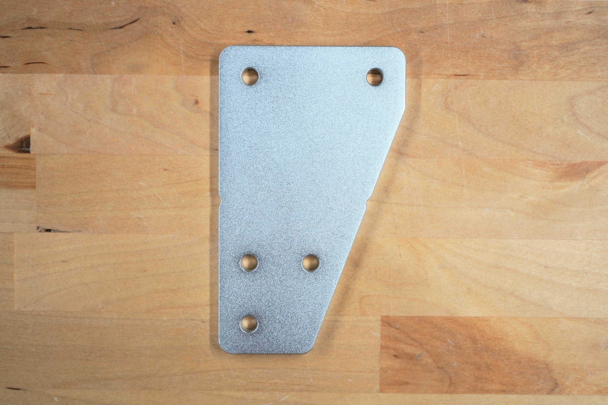
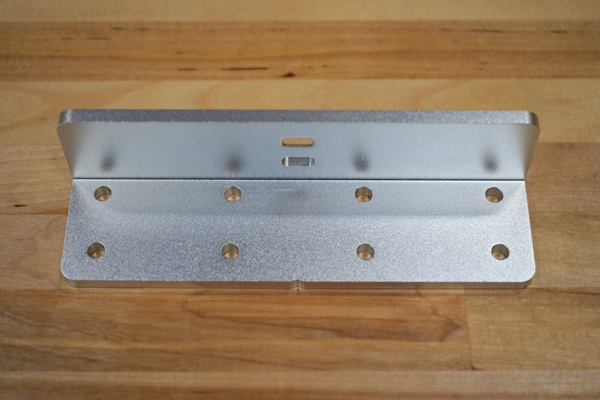
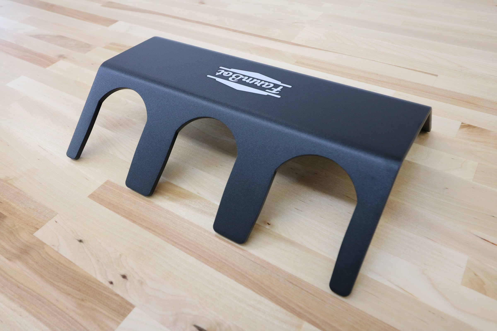
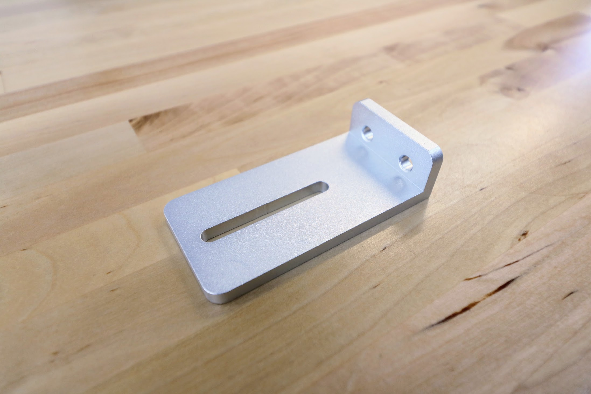
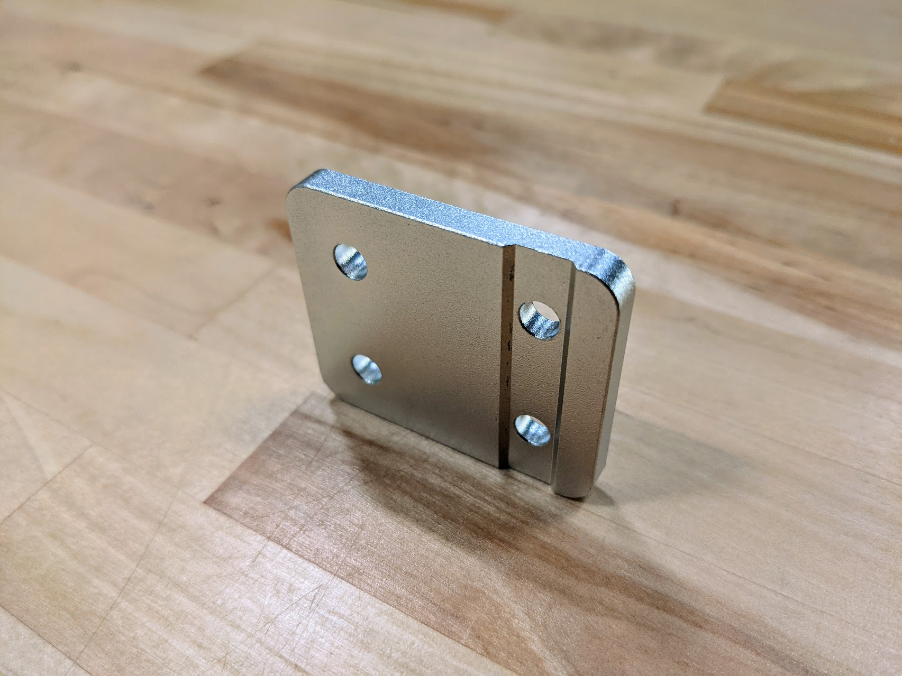

* toc
{:toc}

|Component|$/Unit|Genesis Qty|Genesis Subtotal|XL Qty|XL Subtotal|MAX Qty|MAX Subtotal|
|---------|------|-----------|----------------|------|-----------|-------|------------|
|[Track End Plate](#track-end-plate)|$12.00|4|$48.00|4|$48.00|4|$48.00
|[Track Joining Plate](#track-joining-plate)|$15.00|2|$30.00|6|$90.00|22|$330.00
|[Gantry Wheel Plate](#gantry-wheel-plate)|$25.00|2|$50.00|2|$50.00|2|$50.00
|[Gantry Corner Bracket](#gantry-corner-bracket)|$30.00|2|$60.00|2|$60.00|2|$60.00
|[Gantry Joining Bracket](#gantry-joining-bracket)|$35.00|-|-|1|$35.00|1|$35.00
|[Cross-Slide Plate](#cross-slide-plate)|$25.00|1|$25.00|1|$25.00|1|$25.00
|[Z-Axis Motor Mount](#z-axis-motor-mount)|$20.00|1|$20.00|1|$20.00|1|$20.00
|[1-Slot Toolbay](#1-slot-toolbay)|$25.00|-|-|3|$75.00|3|$75.00
|[3-Slot Toolbay](#3-slot-toolbay)|$40.00|2|$80.00|2|$80.00|2|$80.00
|[50mm Cable Carrier Mount](#50mm-cable-carrier-mount)|$8.00|1|$8.00|1|$8.00|1|$8.00
|[80mm Cable Carrier Mount](#80mm-cable-carrier-mount)|$10.00|1|$10.00|1|$10.00|1|$10.00
|[Belt Clip](#belt-clip)|$3.00|6|$18.00|6|$18.00|6|$18.00
|[Z-Axis Hardstop](#z-axis-hardstop)|$3.00|2|$6.00|2|$6.00|2|$6.00
|[Seed Trough Holder Mount](#seed-trough-holder-mount)|$5.00|1|$5.00|1|$5.00|1|$6.00
|**TOTALS**||**24**|**$355.00**|**32**|**$525.00**|**48**|**$765.00**

<iframe class="embedly-embed" src="//cdn.embedly.com/widgets/media.html?src=https%3A%2F%2Fwww.youtube.com%2Fembed%2FpoZNFG8F3Jo%3Ffeature%3Doembed&url=http%3A%2F%2Fwww.youtube.com%2Fwatch%3Fv%3DpoZNFG8F3Jo&image=https%3A%2F%2Fi.ytimg.com%2Fvi%2FpoZNFG8F3Jo%2Fhqdefault.jpg&key=f2aa6fc3595946d0afc3d76cbbd25dc3&type=text%2Fhtml&schema=youtube" width="854" height="480" scrolling="no" frameborder="0" allow="autoplay; fullscreen" allowfullscreen="true"></iframe>

# Track End Plate

|                              |                              |
|------------------------------|------------------------------|
|**Thickness**                 |5mm
|**Material**                  |6061 Aluminum
|**Surface Treatments**        |Tumble polished Sand blasted Clear anodized
|**Price**                     |$12.00
|**Quantity**                  |4
|**Recommended Supplier**      |[The FarmBot Shop](http://shop.farm.bot)



# Track Joining Plate

|                              |                              |
|------------------------------|------------------------------|
|**Thickness**                 |5mm
|**Material**                  |6061 Aluminum
|**Surface Treatments**        |Tumble polished Sand blasted Clear anodized
|**Price**                     |$15.00
|**Quantity**                  |Genesis - 2 Genesis XL - 6 Genesis MAX - 22
|**Recommended Supplier**      |[The FarmBot Shop](http://shop.farm.bot)

# Gantry Wheel Plate

|                              |                              |
|------------------------------|------------------------------|
|**Thickness**                 |5mm
|**Material**                  |6061 Aluminum
|**Surface Treatments**        |Tumble polished Sand blasted Clear anodized
|**Price**                     |$25.00
|**Quantity**                  |2
|**Recommended Supplier**      |[The FarmBot Shop](http://shop.farm.bot)

# Gantry Corner Bracket

|                              |                              |
|------------------------------|------------------------------|
|**Thickness**                 |5mm
|**Material**                  |5052 Aluminum
|**Surface Treatments**        |Tumble polished Sand blasted Clear anodized
|**Price**                     |$30.00
|**Quantity**                  |2 (1 left-hand and 1 right-hand version) :raised_hands:
|**Recommended Supplier**      |[The FarmBot Shop](http://shop.farm.bot)



# Gantry Joining Bracket

|                              |                              |
|------------------------------|------------------------------|
|**Thickness**                 |5mm
|**Material**                  |6061 Aluminum
|**Surface Treatments**        |Tumble polished Sand blasted Clear anodized
|**Price**                     |$35.00
|**Quantity**                  |1 (Genesis XL and MAX only)
|**Recommended Supplier**      |[The FarmBot Shop](http://shop.farm.bot)



# Cross-Slide Plate

|                              |                              |
|------------------------------|------------------------------|
|**Thickness**                 |5mm
|**Material**                  |6061 Aluminum
|**Surface Treatments**        |Tumble polished Sand blasted Clear anodized
|**Price**                     |$25.00
|**Quantity**                  |1
|**Recommended Supplier**      |[The FarmBot Shop](http://shop.farm.bot)

# Z-Axis Motor Mount
This component securely attached the z-axis motor to the z-axis extrusion.

|                              |                              |
|------------------------------|------------------------------|
|**Material**                  |Machined 6061 Aluminum
|**Surface Treatments**        |Tumble polished Sandblasted Clear anodized
|**Price**                     |$20.00
|**Quantity**                  |1
|**Recommended Supplier**      |[The FarmBot Shop](http://shop.farm.bot)

# Toolbays

Toolbays are available in both 1-slot and 3-slot versions.

|                              |                              |
|------------------------------|------------------------------|
|**Thickness**                 |5mm
|**Material**                  |5052 Aluminum
|**Surface Treatments**        |Tumble polished Sand blasted Black anodized Laser engraved logo
|**Price**                     |1-slot: $25.00 3-slot: $40.00
|**Quantity**                  |**Genesis** 1-slot: 0 3-slot: 2  **Genesis XL and MAX** 1-slot: 3 3-slot: 2
|**Recommended Supplier**      |[The FarmBot Shop](http://shop.farm.bot)

<iframe class="embedly-embed" src="//cdn.embedly.com/widgets/media.html?src=https%3A%2F%2Fwww.youtube.com%2Fembed%2FvjvIB5wXmRo%3Ffeature%3Doembed&url=http%3A%2F%2Fwww.youtube.com%2Fwatch%3Fv%3DvjvIB5wXmRo&image=https%3A%2F%2Fi.ytimg.com%2Fvi%2FvjvIB5wXmRo%2Fhqdefault.jpg&key=02466f963b9b4bb8845a05b53d3235d7&type=text%2Fhtml&schema=youtube" width="854" height="480" scrolling="no" frameborder="0" allowfullscreen></iframe>

## 1-Slot Toolbay

## 3-Slot Toolbay



# 50mm Cable Carrier Mount
This part allows the x-axis cable carrier to be mounted to the gantry column.

|                              |                              |
|------------------------------|------------------------------|
|**Material**                  |Machined 6061 Aluminum
|**Surface Treatments**        |Tumble polished Sandblasted Clear anodized
|**Price**                     |$8.00
|**Quantity**                  |1
|**Recommended Supplier**      |[The FarmBot Shop](http://shop.farm.bot)

# 80mm Cable Carrier Mount
This part allows the y-axis cable carrier to be mounted to the cross-slide plate.

|                              |                              |
|------------------------------|------------------------------|
|**Material**                  |Machined 6061 Aluminum
|**Surface Treatments**        |Tumble polished Sandblasted Clear anodized
|**Price**                     |$10.00
|**Quantity**                  |1
|**Recommended Supplier**      |[The FarmBot Shop](http://shop.farm.bot)

# Belt Clip

|                              |                              |
|------------------------------|------------------------------|
|**Thickness**                 |5mm
|**Material**                  |6061 Aluminum
|**Surface Treatments**        |Tumble polished Sand blasted Clear anodized
|**Price**                     |$3.00
|**Quantity**                  |6
|**Recommended Supplier**      |[The FarmBot Shop](http://shop.farm.bot)



# Z-Axis Hardstop
These components mount on the z-axis extrusion and physically limit how low and high FarmBot can move the z-axis.

|                              |                              |
|------------------------------|------------------------------|
|**Thickness**                 |5mm
|**Material**                  |6061 Aluminum
|**Surface Treatments**        |Tumble polished Sand blasted Clear anodized
|**Price**                     |$3.00
|**Quantity**                  |2
|**Recommended Supplier**      |[The FarmBot Shop](http://shop.farm.bot)

# Seed Trough Holder Mount
This component allows for the seed trough holder to be mounted offset from the gantry column so that the seeder may reach the troughs.

|                              |                              |
|------------------------------|------------------------------|
|**Thickness**                 |5mm
|**Material**                  |6061 Aluminum
|**Surface Treatments**        |Tumble polished Sand blasted Clear anodized
|**Price**                     |$5.00
|**Quantity**                  |1
|**Recommended Supplier**      |[The FarmBot Shop](http://shop.farm.bot)


