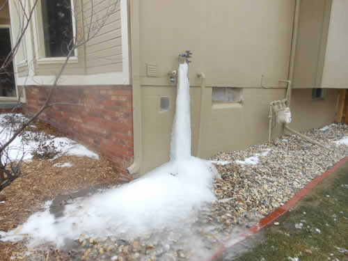
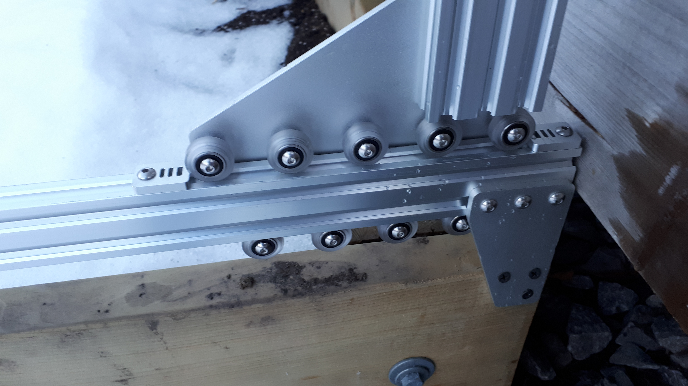

* toc
{:toc}

FarmBot has been designed to operate in challenging environments including in hot weather conditions and in greenhouses. FarmBot is also able to withstand cold weather conditions provided that proper care has been taken to winterize the machine.

# Checking the temperature
In all FarmBot kits, there is a built-in temperature sensor located on the Raspberry Pi computer. It is important to protect the CPU and other electronics from excessively high temperatures, so we recommend monitoring the temperature using the real-time **CPU temperature** information located in the **connectivity popup**.

In addition to providing the exact temperature of the CPU, the indicator circle will change color based on the temperature, according to the following table.

|Color                         |Meaning                       |
|------------------------------|------------------------------|
| Blue|The CPU temperature is colder than the desired range (0°C and below)
| Green|The CPU temperature is within the desired range (between 0°C and 75°C)
| Red|The CPU temperature is hotter than the desired range (75°C and above)
| Gray|The CPU temperature is unknown because FarmBot is offline.



# Acceptable temperature range
Manage your FarmBot's temperature so that it always operates within the acceptable temperature ranges of all components.

## Component temperature ratings

|Component                     |Rated Temperature Range       |
|------------------------------|------------------------------|
|Raspberry Pi                  |0°C to 70°C  (32°F to 158°F)
|Farmduino                     |-20°C to 85°C  (-4°F to 185°F)
|Stepper Drivers               |-20°C to 85°C  (-4°F to 185°F)
|NEMA 17 Motors                |-40°C to 80°C  (-40°F to 176°F)
|Rotary Encoders               |-20°C to 85°C  (-4°F to 185°F)
|Solenoid Valve (with water)   |0°C to 60°C  (32°F to 140°F)
|Pressure Regulator (with water)|0°C to 60°C  (32°F to 140°F)
|Brass Adapters (with water)   |0°C to 85°C  (32°F to 185°F)
|Silicon Tubing                |-45°C to 176°C  (-50°F to 350°F)

## Raspberry Pi 3 official statement on operating temperature

According to raspberry.org:

> *The Raspberry Pi is built from commercial chips which are qualified to different temperature ranges; the LAN9514 (LAN9512 on older models with 2 USB ports) is specified by the manufacturers as being qualified from 0°C to 70°C, while the SoC is qualified from -40°C to 85°C. You may well find that the board will work outside those temperatures, but we're not qualifying the board itself to these extremes.*

## Optimal gardening temperatures

The ideal or optimal soil temperature for planting and growing most vegetables is between 18°C (65°F) and 24°C (75°F).  To state the obvious, garden plants and vegetables will die as temperatures approach 0°C (32°F) and they will wilt and die due to heat exposure as temperatures approach 43 °C (110°F).

# Hot weather management

## Provide shade
Keep your FarmBot and plants cooler by adding a shade structure that provides partial shade to the garden. Keeping the sun off the electronics box is by far the easiest thing you can do to manage hot temperatures and prevent thermal cycling from occurring. If possible, configure the FarmBot's home position to be in the shade.

## Add heatsinks
If you know that your FarmBot is operating in a particularly hot location it may be a good idea to place a **heatsink** squarely and directly on the **Broadcom BCM2837B0 chip** in the vertical orientation. The heatsink will allow the chip to remain cooler and better withstand hot environments.

# Cold weather management
## Disconnecting and draining water



If sustained freezing weather is around the corner, it is important to turn off the water supply and disconnect the water hose from your FarmBot and completely drain the FarmBot system of water. If you forget to drain the water, freezing damage could occur at the water hose fitting and the solenoid valve in the FarmBot. The water in the hose will freeze to ice. Then the ice will expand and break the garden hose connector fitting and potentially the plastic solenoid components. It will also cause a water leak and if the water source is pressurized it could cause flooding around the FarmBot. An unsafe condition will exist and other components of the FarmBot could get damaged.

This photo is an example of a frozen outdoor faucet and it is causing a leak because the valve is frozen open. In this case the owner was lucky and they were able to catch the leak before more property damage could happen.

Provided that you winterize the FarmBot, it will be fine outside in the winter time in cold climates. Wrapping the FarmBot in a tarp may also be good to protect the components and prevent wear.

## Locking FarmBot in place
You may also consider locking the FarmBot in place with the belt clips. This will prevent the FarmBot from being blown around in high winter winds.

_Using the belt clips to lock the gantry into place over the winter time._

