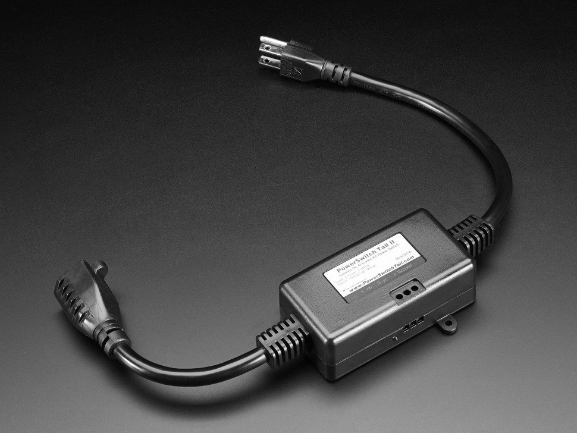

* toc
{:toc}

You can use a **relay** in combination with your FarmBot's **Arduino** or **Farmduino** electronics board to turn on or off high-powered peripherals or devices that plug into a standard wall outlet. Example devices you could control with a relay include fans, window opening mechanisms, grow lights, heating elements, even :coffee: makers!

We recommend purchasing a 110V relay such as the [Tails PowerSwitch 2](https://www.adafruit.com/product/268) (pictured below) and then:
1. Plugging the relay into a power source such as an extension cord,
2. Connecting the peripheral to the relay's output, and
3. Wiring the relay up to spare digital I/O pins on your electronics board.

You can then control the peripheral from sequences with the [write pin command](https://software.farm.bot/docs/sequences#sequence-commands-aka-steps) or by adding it to the [peripherals widget](https://software.farm.bot/docs/controls#peripherals).



