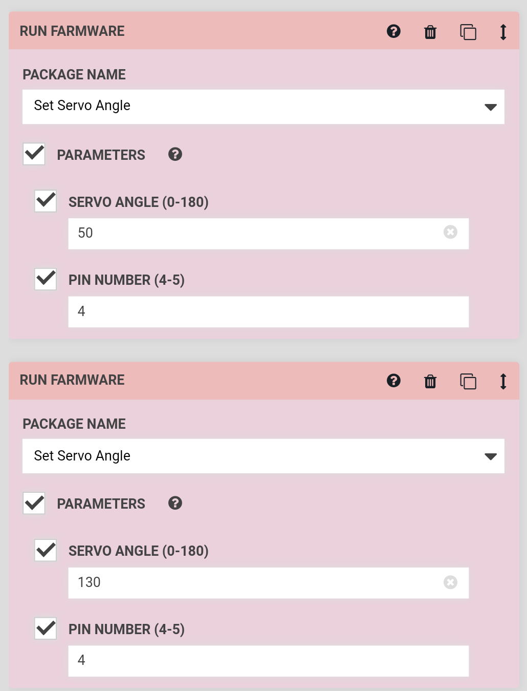
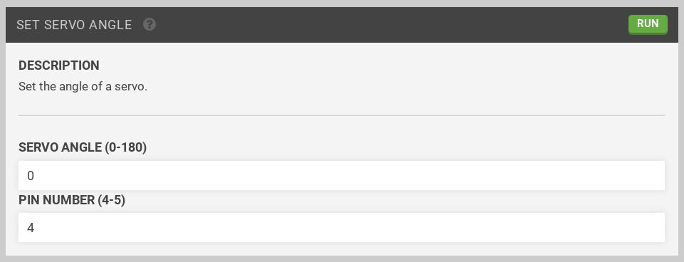

* toc
{:toc}

Interested in making your own servo powered tool or peripheral? You can easily control PWM servo motors by using the [Set Servo Angle Farmware](https://github.com/FarmBot-Labs/set-servo-angle). Simply [install the farmware](https://software.farm.bot/docs/farmware#installing-farmware) onto your FarmBot, and then use the Run Farmware command in your sequences to programmatically control servos.

You can also set the servo angle from the farmware page.

Make sure to let us know what you make in [the forum](https://forum.farmbot.org)!
