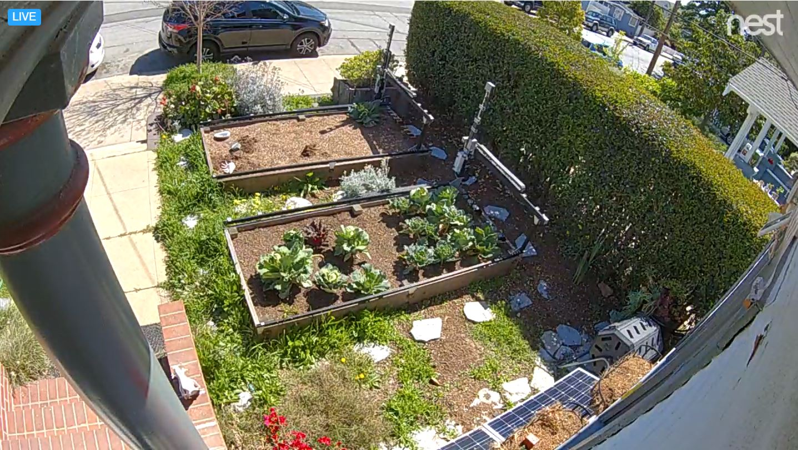
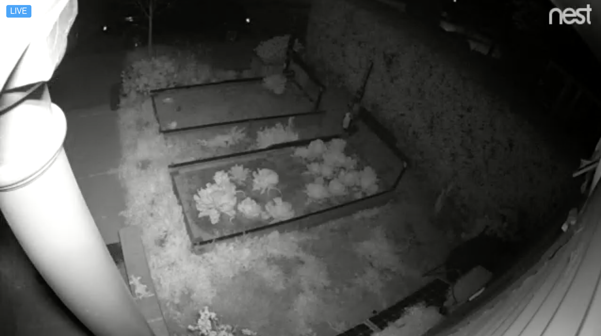

There are many reasons you might want to add a webcam to your FarmBot. Here are a few:
* To watch FarmBot move from work, inside your house, or across the world
* To show FarmBot off to your friends
* To take photos each day for timelapse photography of your plants growing
* To supplement a security system against vandals or animals
* To make sure FarmBot doesn't slack off or sleep on the job

Below we offer two ways for setting up a webcam for your FarmBot.

# Using a web connected security camera (easy)

There are many web connected security cameras on the market that you can purchase and install pointed at your FarmBot. We recommend using a high quality camera that has low lag and built-in infrared LEDs for a night vision ability. Depending on your local weather and where you plan to install your camera, you might need to purchase a camera that is meant for the outdoors and weatherproof. At FarmBot Inc, we use Nest brand outdoor cameras.

_FarmBot webcam in the day_

_FarmBot webcam at night_

# Setting up a Raspberry Pi camera (advanced)

You can use an additional Raspberry Pi and a **Raspberry Pi Camera Module** to set up a streaming webcam server using [these instructions](https://pimylifeup.com/raspberry-pi-webcam-server/). To do so, you'll need:
* An additional Raspberry Pi. Note, at this time you cannot use the FarmBot's built-in Pi.
* A camera module. There are two types available: one with a [regular camera](https://www.adafruit.com/products/1367), and one with an [infrared camera](https://www.adafruit.com/products/1567) that can be used at night in combination with infrared LEDs for a nice night vision ability.
* A [ribbon cable](https://www.adafruit.com/products/2144) to plug the camera module directly into the Pi's CSI bus.

The Pi and camera module needs to be mounted either on your FarmBot or external to it (on an adjacent building for example) in a rain proof location. This could be done with a [small plastic bracket](https://www.adafruit.com/products/1434) and a 3D printed roof structure, or other materials. How and where you mount your camera is up to you.

