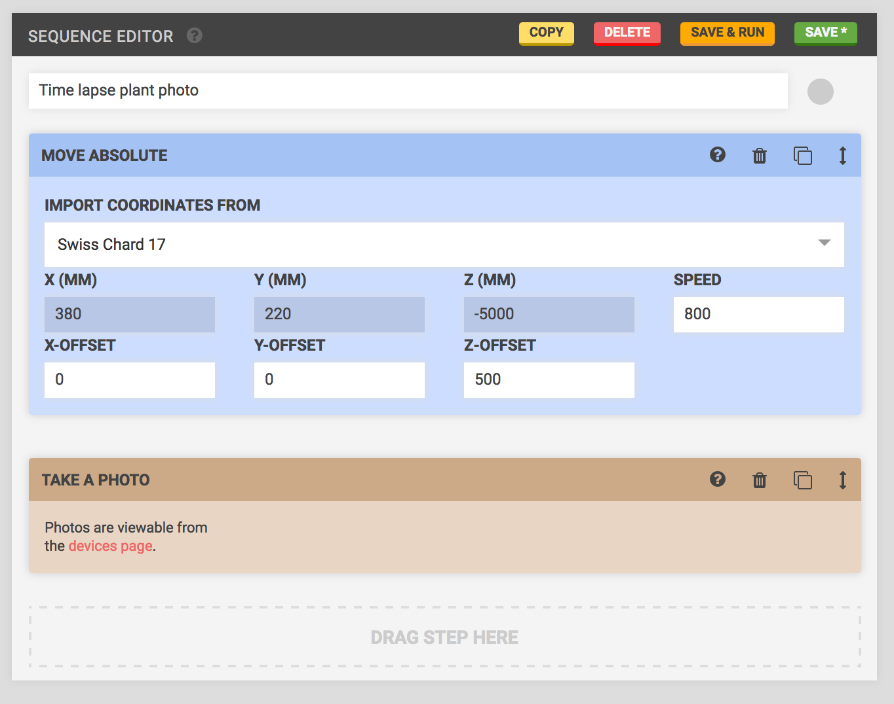

* toc
{:toc}

Want to make cool time lapse videos of your food growing? FarmBot can help you do this in a variety of ways.

# Individual plant time lapse

Plant a seed and then use FarmBot's camera to take a photo from the plant's X and Y coordinates with a sufficient amount of Z-height for the plant to fully grow. Move back to this location every day at the same time to take another photo. You'll end up with a time lapse of that individual plant growing - perfect for Instagram!





# Fly-over time lapse

On day 1, position your camera tool at one end of the tracks, halfway across the gantry, and at the maximum Z-height to snap a photo. The next day, move to the same position but a small distance away from the end of the tracks (maybe 2 to 3cm) and take another photo. Repeat this each day until you reach the end of the tracks. You'll end up with a cool "fly-over" style video of your entire garden growing!
