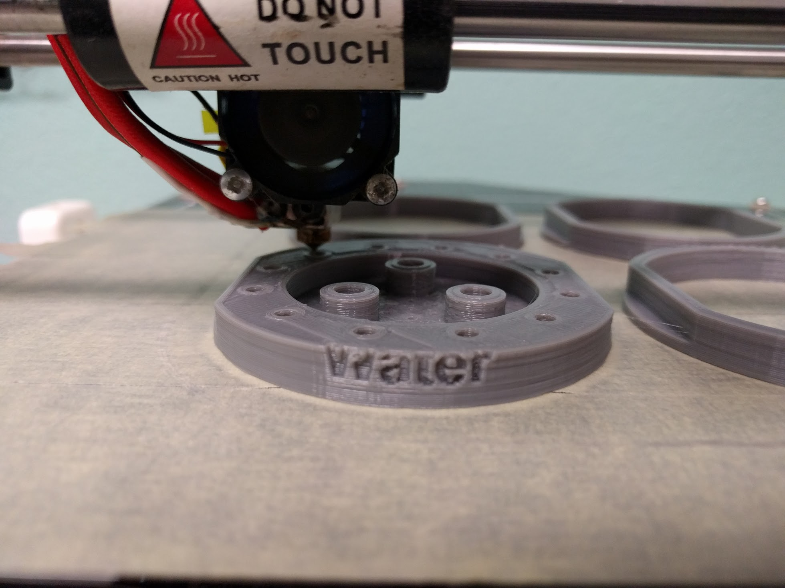

* toc
{:toc}

Want to design and make your own tools for FarmBot? Follow these instructions to ensure compatibility with the universal tool mount (UTM), the tool bay, and your FarmBot's electronics.





# Hardware requirements

Design your tools to meet these hardware specifications to ensure compatibility with FarmBot. Additionally you will need to design your tool so that it can be produced with available tools, processes, and materials; and stand up to the outdoor environment and other expected stresses.

## Required components
* Plastic "tool base"
* Three 15 x 5 x 5 mm ring magnets secured with M5 screws and locknuts
* Two M3 electrical screws and locknuts, and a jumper link used for tool verification

## Specs
* Max weight: 1 kg
* Max height: 200 mm
* Max diameter: 100 mm

## Size, shape, and layout
Tools must have the correct physical dimensions and component layout on the top face so that they can correctly couple and de-couple with the UTM as well as slide in and out of the tool bay.



