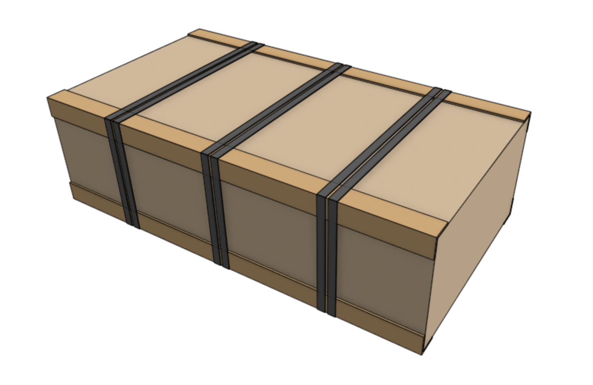

* toc
{:toc}

The tables below show the items that should be packed into the **main carton** for each version of the kit.

# Genesis packing list

|Item                          |Sub-packing                   |Genesis Qty                   |
|------------------------------|------------------------------|------------------------------|
|Hardware Box                  |None                          |1
|Plate Box                     |None                          |1
|Plastic Parts Box             |None                          |1
|Cable and Tubing Box          |None                          |1
|Motor Box                     |None                          |1
|Power Supply Box              |None                          |1
|UTM Box                       |None                          |1
|X-Axis Cable Carrier (15 x 30 x 1700mm)|None (no plastic bag)         |1
|Y-Axis Cable Carrier (15 x 50 x 1700mm)|None (no plastic bag)         |1
|Z-Axis Cable Carrier (15 x 50 x 740mm)|None (no plastic bag)         |1
|Electronics Box               |Thick paper wrapping (no plastic bag or foam)|1

# Genesis XL packing list

|Item                          |Sub-packing                   |Genesis XL Qty                |
|------------------------------|------------------------------|------------------------------|
|`XL` Hardware Box             |None                          |1
|`XL` Plate Box                |None                          |1
|`XL` Plastic Parts Box        |None                          |1
|`XL` Cable and Tubing Box     |None                          |1
|Motor Box                     |None                          |1
|Power Supply Box              |None                          |1
|UTM Box                       |None                          |1
|X-Axis Cable Carrier (15 x 30 x 3200mm)|None (no plastic bag)         |1
|Y-Axis Cable Carrier (15 x 50 x 3200mm)|None (no plastic bag)         |1
|Z-Axis Cable Carrier (15 x 50 x 740mm)|None (no plastic bag)         |1
|Electronics Box               |Thick paper wrapping (no plastic bag or foam)|1

# Edge protectors and straps
Add four cardboard **edge protectors** on the four longest edges of the main carton. Then add three pairs of black polystraps.

# Box specifications

|                              |                              |
|------------------------------|------------------------------|
|**Box style**                 |Standard style box
|**Inner dimensions (L x W x H)**|Genesis: 780 x 410 x 215mm Genesis XL: 900 x 410 x 215mm
|**Outer dimensions (L x W x H)**|Genesis: 790 x 420 x 225mm Genesis XL: 910 x 420 x 225mm
|**Material**                  |Cardboard
|**Color**                     |Brown
|**Printing**                  |Genesis: Genesis Main Carton.pdf Genesis XL: Genesis XL Main Carton.pdf
|**Fill**                      |Recycled kraft paper

