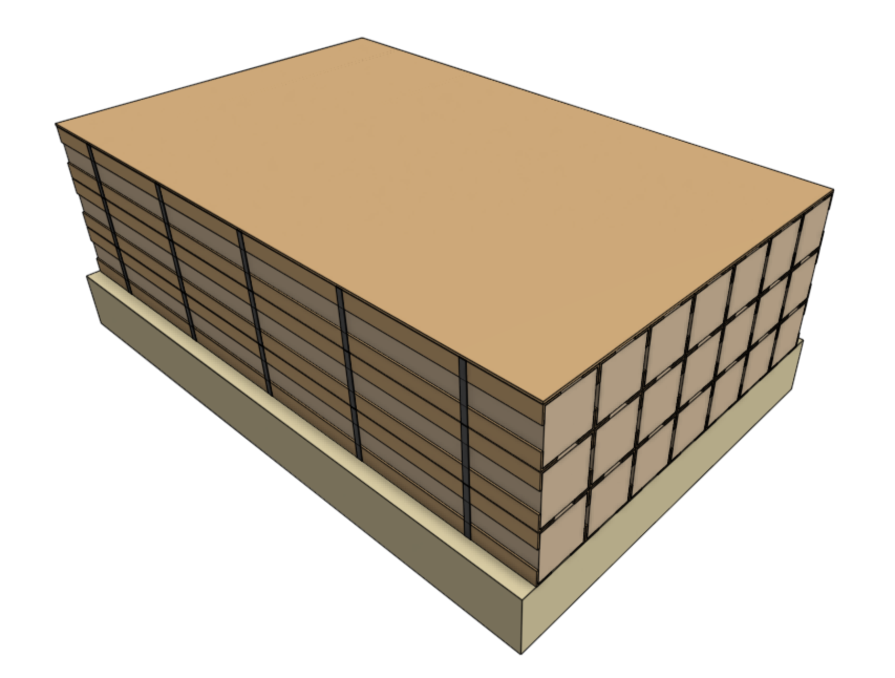

* toc
{:toc}

# Main cartons

## Step 1: First three layers
Stack three layers of **main cartons** onto a **standard sized pallet**.



## Step 2: Cardboard separator
Place a **cardboard separator** on top of the first three layers. This will help stabilize the stack.

## Step 3: Three more layers
Place three more layers of main cartons onto the stack.

## Step 4: Plastic wrap
Wrap the entire stack with clear plastic.

# Extrusion and leadscrew kits

## Step 1: First three layers
Stack three layers of **extrusion and leadscrew kits** onto an **extended-length pallet**. Genesis kits should have 7 boxes per layer, while Genesis XL should have 6 boxes per layer.



_Genesis kits (7 on each layer)_

XL kits must be stacked **horizontally** to provide better stability.

_Genesis XL kits (6 on each layer)_

## Step 2: Cardboard separator
Place a **cardboard separator** on top of the first three layers. This will help stabilize the stack.

## Step 3: Second three layers
Place three more layers of extrusion and leadscrew kits onto the stack.

## Step 5: Plastic wrap
Wrap the entire stack with clear plastic.

# Reference tables
## Stacked pallet specs

|Contents                      |Qty/pallet                    |Dimensions (L x W x H)        |Product Weight                |
|------------------------------|------------------------------|------------------------------|------------------------------|
|Genesis main cartons (19kg)   |18                            |1300 x 1020 x 1570mm          |342kg
|Genesis extrusion and leadscrew kits (10 kg)|42                            |1530 x 1020 x 970mm           |420kg
|Genesis XL main cartons (23 kg)|18                            |1300 x 1020 x 1570mm          |414kg
|Genesis XL extrusion and leadscrew kits (17 kg)|36                            |1530 x 1020 x 970mm           |612kg

## Maximizing pallet efficiency
Kits ordered in multiples of the quantities shown below will maximize pallet stacking efficiency (no partially stacked pallets). However, it is more important to maximize the shipping container packing efficiency (see next section) than pallet packing efficiency.

|FarmBot                       |Kit Quantity                  |Pallet Quantity               |Pallet Length                 |
|------------------------------|------------------------------|------------------------------|------------------------------|
|Genesis                       |126                           |7 (main cartons) 3 (extrusion and leadscrew kits) **10 total**|7 x 1.3m 3 x 1.53m **13.69m total**
|Genesis XL                    |36                            |2 (main cartons) 1 (extrusion and leadscrew kits) **3 total**|2 x 1.3m 1 x 1.53m **4.13m total**

## Maximizing container efficiency
A standard 40' shipping container has just over 12m of internal length and is wide enough for two rows of standard width pallets. This allows for a maximum of 24m of standard-width pallet length to be loaded. Realistically though, pallets will not be perfectly stacked or perfectly loaded into the container, thus an extra meter or two should be reserved as a safe margin.

Below are just some of the many options for maximizing shipping container packing efficiency (minimal unused floor space inside the container).

|Container Quantity            |Contents                      |Pallet Quantity and Length    |Container Efficiency          |
|------------------------------|------------------------------|------------------------------|------------------------------|
|1                             |126 Genesis &nbsp; 72 Genesis XL &nbsp; **198 total**|7 x 1.3m = 9.1m 3 x 1.53m = 4.59m 4 x 1.3m = 5.2m 2 x 1.53m = 3.06m **16 pallets, 21.95m**|21.95m/24m = 91% efficient
|2                             |168 Genesis &nbsp; 216 Genesis XL &nbsp; **384 total**|10 x 1.3m = 13.0m 4 x 1.53m = 6.12m 12 x 1.3m = 15.6m 6 x 1.53m = 9.18m **32 pallets, 43.9m**|43.9m/48m = 91% efficient
|3                             |378 Genesis &nbsp; 252 Genesis XL &nbsp; **630 total**|21 x 1.3m = 27.3m 9 x 1.53m = 13.77m 14 x 1.3m = 18.2m 7 x 1.53m = 10.71m **51 pallets, 69.98m**|69.98m/72m = 97% efficient

