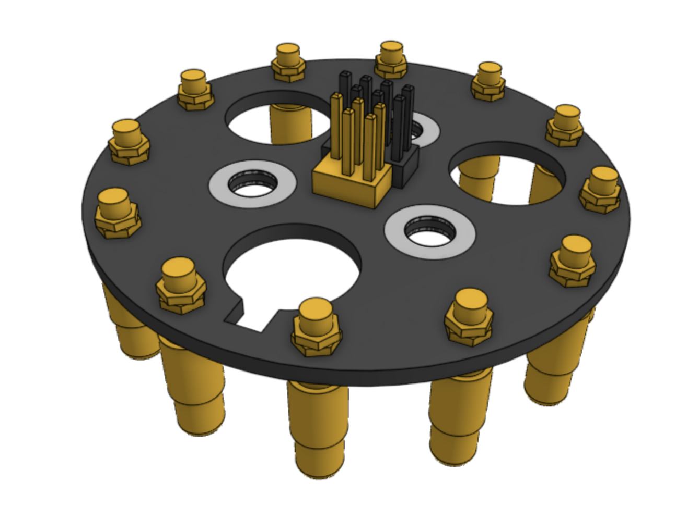
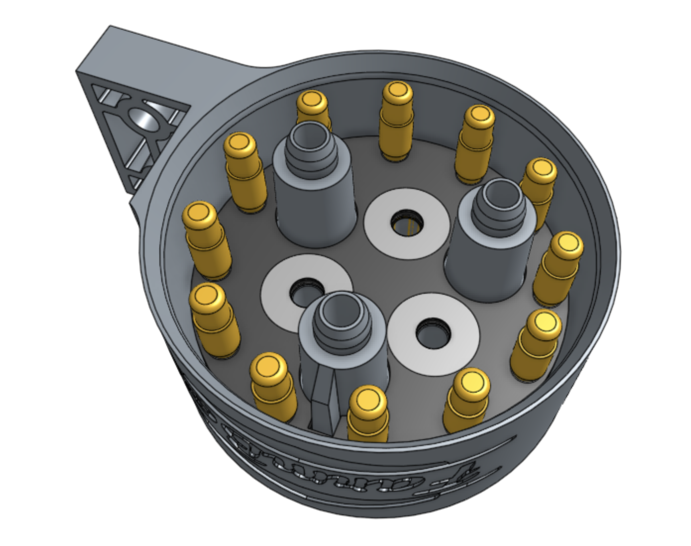
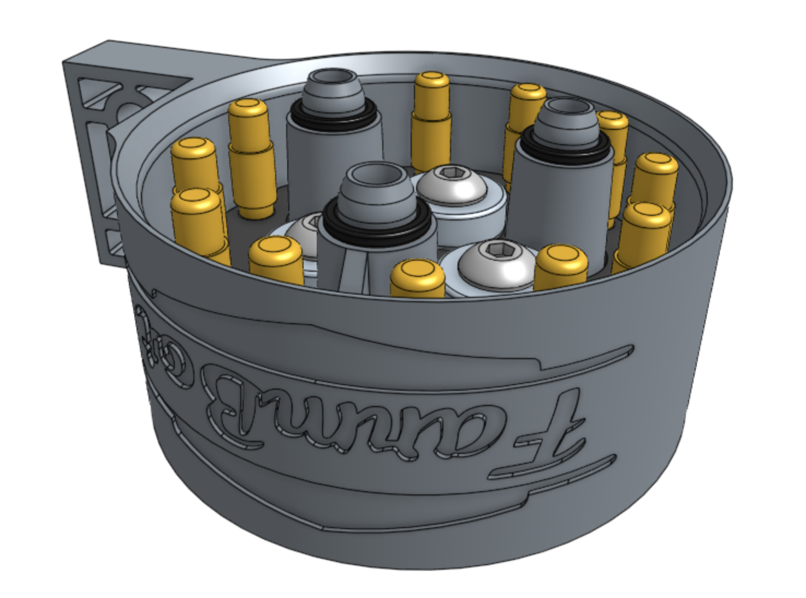
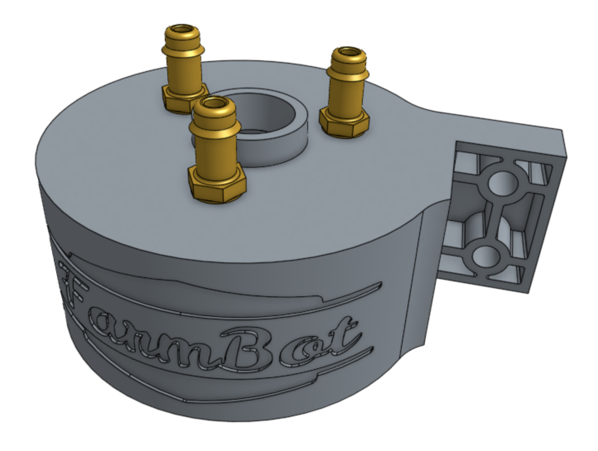

* toc
{:toc}

# Step 1: Attach pogo pins to the PCB

Attach 12 **pogo pins** to the **UTM PCB** using 24 **jam nuts** (2 per pogo pin).

# Step 2: Mount the PCB and magnets

Insert the **UTM PCB** into the **UTM**. It is keyed, and should only fit in one orientation.

Slide a **ring magnet** onto an **M5 x 16mm screw**. The magnet's `South` face should be butted against the screw head.

Fasten the PCB in the UTM with the ring magnet and screw. Repeat with two more magnets and screws.



# Step 3: Add o-rings

Slide three **x-profile o-rings** onto the **UTM**.

# Step 4: Add barbs

Screw three **barbs** into the top of the **UTM**.

