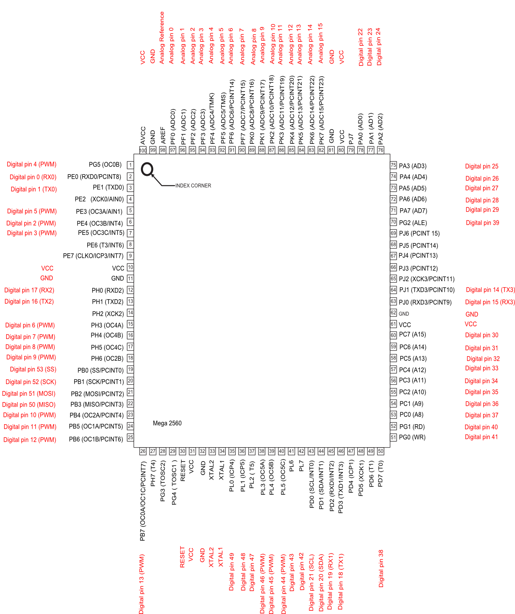

* toc
{:toc}

# Pinout reference table

|Mapped Pin Name               |RAMPS                         |v1.3 Farmduino                |v1.4 Farmduino                |
|------------------------------|------------------------------|------------------------------|------------------------------|
|D0 (RX0)                      |                              |RXD0 (RX0)                    |RXD0 (RX0)
|D1 (TX0)                      |                              |TXD0 (TX0)                    |TXD0 (TX0)
|D2 (PWM)                      |X MAX                         |D2                            |D2
|D3 (PWM)                      |X MIN                         |D3                            |D3
|D4 (PWM)                      |Servo 0                       |Servo 0                       |Servo 0
|D5 (PWM)                      |Servo 1                       |Servo 1                       |Servo 1
|D6 (PWM)                      |                              |Servo 2                       |Servo 2
|D7 (PWM)                      |                              |Lighting                      |Lighting
|D8 (PWM)                      |                              |Water                         |Water
|D9 (PWM)                      |Water                         |Vacuum                        |Vacuum
|D10 (PWM)                     |Vacuum                        |Peripheral 4                  |Peripheral 4
|D11 (PWM)                     |                              |Servo 3                       |Servo 3
|D12 (PWM)                     |                              |Peripheral 5                  |Peripheral 5
|D13 (PWM)                     |LED                           |LED                           |LED
|D14 (TX3)                     |Y MIN                         |X2 EN                         |X2 EN
|D15 (RX3)                     |Y MAX                         |X2 STEP                       |X2 STEP
|D16 (TX2)                     |X1 ENCDR A                    |X1 ENCDR A                    |
|D17 (RX2)                     |X1 ENCDR B                    |X1 ENCDR B                    |
|D18 (TX1)                     |Z MIN                         |D18                           |D18
|D19 (RX1)                     |Z MAX                         |D19                           |D19
|D22                           |                              |X2 ENCDR A                    |SS to STM32
|D23                           |Y ENCDR A                     |Y ENCDR A                     |
|D24                           |X2 EN (E EN)                  |Y ENCDR B                     |
|D25                           |Y ENCDR B                     |X1 EN                         |X1 EN
|D26                           |X2 STEP (E STEP)              |X1 STEP                       |X1 STEP
|D27                           |Z ENCDR A                     |X1 DIR                        |X1 DIR
|D28                           |X2 DIR (E DIR)                |Z ENCDR B                     |
|D29                           |Z ENCDR B                     |Z ENCDR A                     |
|D30                           |                              |X2 DIR                        |X2 DIR
|D31                           |X1 ENCDR AQ                   |Y EN                          |Y EN
|D32                           |                              |Y STEP                        |Y STEP
|D33                           |X1 ENCDR BQ                   |Y DIR                         |Y DIR
|D34                           |                              |Z EN                          |Z EN
|D35                           |Y ENCDR AQ                    |Z STEP                        |Z STEP
|D36                           |                              |Z DIR                         |Z DIR
|D37                           |Y ENCDR BQ                    |AUX EN                        |AUX EN
|D38                           |X1 EN                         |D38                           |D38
|D39                           |Z ENCDR AQ                    |X2 ENCDR B                    |
|D40                           |UTM E                         |AUX STEP                      |AUX STEP
|D41                           |Z ENCDR BQ                    |AUX DIR                       |AUX DIR
|D42                           |UTM G                         |D42                           |D42
|D43                           |                              |D43                           |D43
|D44 (PWM)                     |UTM H                         |D44                           |D44
|D45 (PWM)                     |                              |D45                           |D45
|D46 (PWM)                     |Z STEP                        |D46                           |D46
|D47                           |                              |D47                           |D47
|D48                           |Z DIR                         |D48                           |D48
|D49                           |                              |D49                           |D49
|D50 (MISO)                    |                              |                              |MISO
|D51 (MOSI)                    |                              |                              |MOSI
|D52 (SCK)                     |UTK K                         |                              |SCK
|D53 (SS)                      |UTM L                         |                              |SS
|A0 (D54)                      |X1 STEP                       |A0                            |A0
|A1 (D55)                      |X1 DIR                        |A1                            |A1
|A2 (D56)                      |Y EN                          |A2                            |A2
|A3 (D57)                      |                              |A3                            |A3
|A4 (D58)                      |                              |A4                            |A4
|A5 (D59)                      |UTM D (Soil Sensor)           |UTM D (Soil Sensor)           |UTM D (Soil Sensor)
|A6 (D60)                      |Y STEP                        |A6                            |A6
|A7 (D61)                      |Y DIR                         |A7                            |A7
|A8 (D62)                      |Z EN                          |A8                            |A8
|A9 (D63)                      |UTM C (Tool Verification)     |UTM C (Tool Verification)     |UTM C (Tool Verification)
|A10 (D64)                     |UTM F                         |Z-MAX                         |Z-MAX
|A11 (D65)                     |UTM I                         |Z-MIN                         |Z-MIN
|A12 (D66)                     |UTM J                         |Y-MAX                         |Y-MAX
|A13 (D67)                     |                              |Y-MIN                         |Y-MIN
|A14 (D68)                     |                              |X-MAX                         |X-MAX
|A15 (D69)                     |                              |X-MIN                         |X-MIN

# 2560 chip pinout
## Diagram

_https://www.arduino.cc/en/Hacking/PinMapping2560_

## Table

|Chip Pin #                    |Chip Pin Name                 |Mapped Pin Name               |
|------------------------------|------------------------------|------------------------------|
|1                             |PG5 ( OC0B )                  |D4 (PWM)
|2                             |PE0 ( RXD0/PCINT8 )           |D0 (RX0)
|3                             |PE1 ( TXD0 )                  |D1 (TX0)
|4                             |PE2 ( XCK0/AIN0 )             |
|5                             |PE3 ( OC3A/AIN1 )             |D5 (PWM)
|6                             |PE4 ( OC3B/INT4 )             |D2 (PWM)
|7                             |PE5 ( OC3C/INT5 )             |D3 (PWM)
|8                             |PE6 ( T3/INT6 )               |
|9                             |PE7 ( CLKO/ICP3/INT7 )        |
|10                            |VCC                           |VCC
|11                            |GND                           |GND
|12                            |PH0 ( RXD2 )                  |D17 (RX2)
|13                            |PH1 ( TXD2 )                  |D16 (TX2)
|14                            |PH2 ( XCK2 )                  |
|15                            |PH3 ( OC4A )                  |D6 (PWM)
|16                            |PH4 ( OC4B )                  |D7 (PWM)
|17                            |PH5 ( OC4C )                  |D8 (PWM)
|18                            |PH6 ( OC2B )                  |D9 (PWM)
|19                            |PB0 ( SS/PCINT0 )             |D53 (SS)
|20                            |PB1 ( SCK/PCINT1 )            |D52 (SCK)
|21                            |PB2 ( MOSI/PCINT2 )           |D51 (MOSI)
|22                            |PB3 ( MISO/PCINT3 )           |D50 (MISO)
|23                            |PB4 ( OC2A/PCINT4 )           |D10 (PWM)
|24                            |PB5 ( OC1A/PCINT5 )           |D11 (PWM)
|25                            |PB6 ( OC1B/PCINT6 )           |D12 (PWM)
|26                            |PB7 ( OC0A/OC1C/PCINT7 )      |D13 (PWM)
|27                            |PH7 ( T4 )                    |
|28                            |PG3 ( TOSC2 )                 |
|29                            |PG4 ( TOSC1 )                 |
|30                            |RESET                         |RESET
|31                            |VCC                           |VCC
|32                            |GND                           |GND
|33                            |XTAL2                         |XTAL2
|34                            |XTAL1                         |XTAL1
|35                            |PL0 ( ICP4 )                  |D49
|36                            |PL1 ( ICP5 )                  |D48
|37                            |PL2 ( T5 )                    |D47
|38                            |PL3 ( OC5A )                  |D46 (PWM)
|39                            |PL4 ( OC5B )                  |D45 (PWM)
|40                            |PL5 ( OC5C )                  |D44 (PWM)
|41                            |PL6                           |D43
|42                            |PL7                           |D42
|43                            |PD0 ( SCL/INT0 )              |D21 (SCL)
|44                            |PD1 ( SDA/INT1 )              |D20 (SDA)
|45                            |PD2 ( RXDI/INT2 )             |D19 (RX1)
|46                            |PD3 ( TXD1/INT3 )             |D18 (TX1)
|47                            |PD4 ( ICP1 )                  |
|48                            |PD5 ( XCK1 )                  |
|49                            |PD6 ( T1 )                    |
|50                            |PD7 ( T0 )                    |D38
|51                            |PG0 ( WR )                    |D41
|52                            |PG1 ( RD )                    |D40
|53                            |PC0 ( A8 )                    |D37
|54                            |PC1 ( A9 )                    |D36
|55                            |PC2 ( A10 )                   |D35
|56                            |PC3 ( A11 )                   |D34
|57                            |PC4 ( A12 )                   |D33
|58                            |PC5 ( A13 )                   |D32
|59                            |PC6 ( A14 )                   |D31
|60                            |PC7 ( A15 )                   |D30
|61                            |VCC                           |VCC
|62                            |GND                           |GND
|63                            |PJ0 ( RXD3/PCINT9 )           |D15 (RX3)
|64                            |PJ1 ( TXD3/PCINT10 )          |D14 (TX3)
|65                            |PJ2 ( XCK3/PCINT11 )          |
|66                            |PJ3 ( PCINT12 )               |
|67                            |PJ4 ( PCINT13 )               |
|68                            |PJ5 ( PCINT14 )               |
|69                            |PJ6 ( PCINT 15 )              |
|70                            |PG2 ( ALE )                   |D39
|71                            |PA7 ( AD7 )                   |D29
|72                            |PA6 ( AD6 )                   |D28
|73                            |PA5 ( AD5 )                   |D27
|74                            |PA4 ( AD4 )                   |D26
|75                            |PA3 ( AD3 )                   |D25
|76                            |PA2 ( AD2 )                   |D24
|77                            |PA1 ( AD1 )                   |D23
|78                            |PA0 ( AD0 )                   |D22
|79                            |PJ7                           |
|80                            |VCC                           |VCC
|81                            |GND                           |GND
|82                            |PK7 ( ADC15/PCINT23 )         |A15 (D69)
|83                            |PK6 ( ADC14/PCINT22 )         |A14 (D68)
|84                            |PK5 ( ADC13/PCINT21 )         |A13 (D67)
|85                            |PK4 ( ADC12/PCINT20 )         |A12 (D66)
|86                            |PK3 ( ADC11/PCINT19 )         |A11 (D65)
|87                            |PK2 ( ADC10/PCINT18 )         |A10 (D64)
|88                            |PK1 ( ADC9/PCINT17 )          |A9 (D63)
|89                            |PK0 ( ADC8/PCINT16 )          |A8 (D62)
|90                            |PF7 ( ADC7 )                  |A7 (D61)
|91                            |PF6 ( ADC6 )                  |A6 (D60)
|92                            |PF5 ( ADC5/TMS )              |A5 (D59)
|93                            |PF4 ( ADC4/TMK )              |A4 (D58)
|94                            |PF3 ( ADC3 )                  |A3 (D57)
|95                            |PF2 ( ADC2 )                  |A2 (D56)
|96                            |PF1 ( ADC1 )                  |A1 (D55)
|97                            |PF0 ( ADC0 )                  |A0 (D54)
|98                            |AREF                          |Analog Reference
|99                            |GND                           |GND
|100                           |AVCC                          |VCC

# Abbreviation guide

|Abbreviation                  |Meaning                       |
|------------------------------|------------------------------|
|A                             |Analog
|D                             |Digital
|GND                           |Ground
|MISO                          |Master In Slave Out
|MOSI                          |Master Out Slave In
|PWM                           |Pulse Width Modulation
|RX                            |Receive
|SCK                           |Serial Clock
|TX                            |Transmit
|VCC                           |Voltage Common Collector

