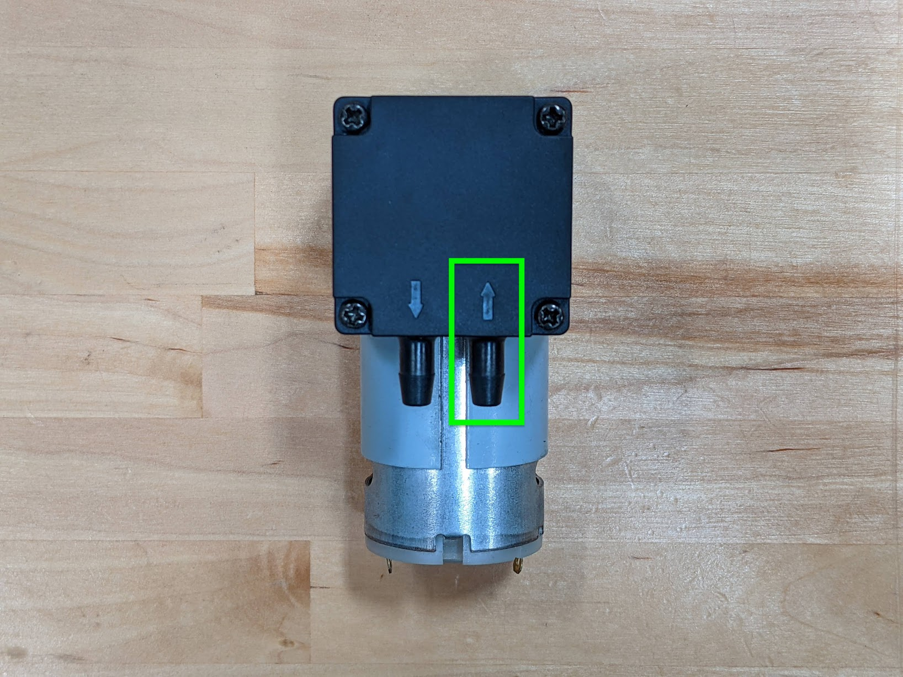

# 1. Consider seed characteristics

Seed size, weight, and shape can have considerable impact on the effectiveness and reliability of FarmBot's needle and vacuum pump based seeding mechanism. Seeds should not be excessively small or large, cannot be too heavy, and are ideally of a round, smooth shape. [Pelleted seeds](../reference/seeds.md#pelleted-seeds) are specifically designed for use with farming equipment and are an ideal choice for use with FarmBot. Consult the [seeds page](../reference/seeds.md) for more details.

# 2. Choose the correct needle size

Included with every FarmBot kit are three different luer lock needle sizes that can be easily swapped in and out of the seed injector. This allows you to choose the best needle size for the seeds you are working with. Generally speaking, a larger diameter needle should be used for larger, heavier seeds, while a smaller diameter needle should be used for smaller, lighter seeds. See the [seeds](../reference/seeds.md) page for more details.

If the needle is too small, then the vacuum pump will not be able to create enough suction to consistently and reliably pick up a larger, heavier seed. In some cases, the seed may get picked up but then dropped when FarmBot is moving in the X, Y, and Z directions. In either case, try switching to a larger needle size.

If the needle is too large, then the seeds may accidentally get sucked fully into the needle or vacuum system. If this happens, you will need to remove the seed from the system or else risk total suction loss and malfunction. Once all seeds are removed from the system, switch to a smaller needle size.

# 3. Check that the vacuum pump tube is connected to the inlet of the vacuum pump

The vacuum pump has an inlet port that sucks air in and an outlet port that blows air out. The ports are denoted by arrows embossed into the black plastic of the vacuum pump. Double check that the vacuum pump tube running between the UTM and the pump is connected to the **inlet port** of the pump.

# 4. Check the tube for kinks

If the vacuum pump tube is kinked, then airflow will be restricted and suction power at the needle will be significantly diminished. Ensure there are no kinks in the vacuum pump tube.

# 5. Check the needle and vacuum system for clogs and contamination

If the needle, seeder, vacuum pump tube, or vacuum pump become clogged with dirt, water, seeds, or other contamination, then the system can lose suction power and cease to function. In some cases, a clogged vacuum pump can actually start *blowing* air instead of sucking it in!

The most likely location for a clog to occur is in the needle. If the needle becomes clogged, first try rinsing it with warm water. If that doesn't work, try inserting a straightened paper clip or other small piece of metal into the needle to dislodge any seeds or other contaminants. If you are unable to remove the clog, you will need to discard the needle and use another one.

The most likely location for contamination to affect the system is inside the vacuum pump. The vacuum pump is a [diaphragm-based pump design](https://en.wikipedia.org/wiki/Diaphragm_pump) that will lose suction power if contaminants such as dirt, water, or seeds, are present on the diaphragm. If you suspect that the vacuum pump is contaminated, remove the four screws holding the two plastic shell components together. Then carefully remove the rubber diaphragm and clean both sides. Reinsert the diaphragm and screw the pump back together.

Using [pelleted seeds](../reference/seeds.md#pelleted-seeds) or other naturally smooth, round shaped seeds can reduce the likelihood of future contamination.
