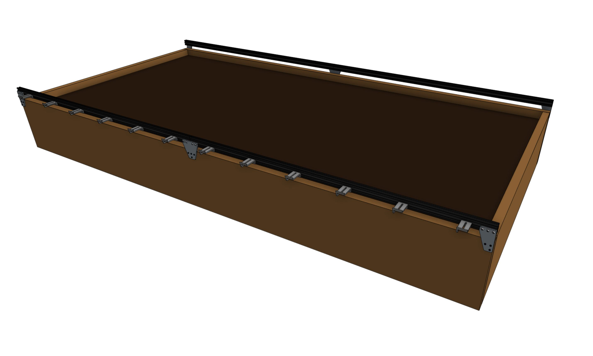
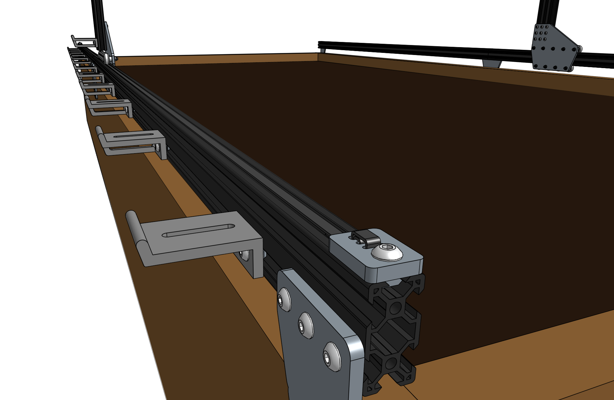
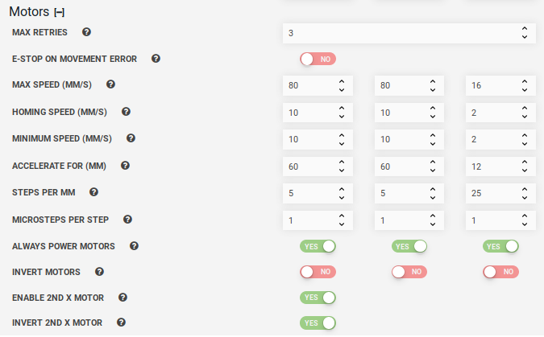

* toc
{:toc}

This troubleshooting document guides you through a checklist of FarmBot settings, diagnostic tools, and hardware checks to help you get your FarmBot moving reliably. You will start out troubleshooting with simple actions. If these don’t work for you, you should continue through this guide and perform additional actions to troubleshoot your problem. Test your setup after completing each step to see if your problem is solved.



# 1. Ensure FarmBot is connected

Your FarmBot must be connected to the internet and the web app to receive commands and download the resources you create such as sequences, plant locations, and events. If your bot is connected, the web app's **connectivity indicator** should be  green. If your bot is not connected:

1. Confirm FarmBot is [connected to the internet](https://software.farm.bot/docs/connecting-farmbot-to-the-internet) (via WiFi or ethernet).
2. Confirm FarmBot is [connected to the web app](https://software.farm.bot/docs/connecting-farmbot-to-the-web-app).

The connectivity popup should show a [code 31 diagnosis code](https://software.farm.bot/docs/connectivity-codes#code-31) when communication is functioning. Refer to the [connectivity diagnosis codes](https://software.farm.bot/docs/connecting-farmbot-to-the-internet) page for additional help troubleshooting connectivity issues.

# 2. Tighten up gantry connections

Double check and tighten all of the screws holding the gantry together so there is no "play" in the system. The gantry needs to act as one rigid/stiff body. If there is some flex in the gantry structure it can cause delays in the movement as the structure flexes prior to the movement.

Tighten up the whole gantry structure by tightening the M5 screws at the gantry wheel plates and gantry corner brackets.

# 3.  Equalize the gantry

An equalized gantry is one that is exactly perpendicular to the tracks such that it is not crooked, and so that the gantry is not being torqued. The X-axis tracks need to be aligned. If they are out of alignment they can cause a crooked or torqued gantry, which can cause creaking, extra wear on the v-wheels and motors, and introduce a high amount of friction into the system. These issues all decrease the overall reliability of the FarmBot system and decrease the lifespan of the components.

The detailed instructions to build the raised bed supporting infrastructure for the FarmBot are located [here](../../FarmBot-Genesis-V1.5/supporting-infrastructure/raised-bed.md)

 The detailed instructions to install the tracks on the raised bed supporting infrastructure for the FarmBot are located [here](../../FarmBot-Genesis-V1.5/tracks.md)

## Test the gantry

1. To see if your gantry is equalized, ensure that the x-axis motors are **unpowered** by unplugging the motor cable and the rotary encoder cables from both the X1 and X2 motors,
2. Gently push or pull on the gantry from the **middle** of the gantry main beam such that it moves slowly along the tracks about 30cm. This process will remove any torque on the gantry, and ensure it is not crooked. If you push or pull the gantry from one of the gantry columns, or anywhere that is not the middle of the main beam, then you will torque the gantry and make it crooked.
3. It should be easy to push the gantry from one end of the x-axis to the other end.  If you sense that there is resistance going back and forth along the tracks, you will need to adjust the tracks or [adjust the eccentric spacers](../reference/eccentric-spacer-adjustment.md) to remove the resistance.
4. If you need to add a lubricant to lower the resistance at the V-wheels, use a **dry** lubricant such as powdered graphite. A dry lubricant will not collect dust or dirt and will not gum the wheels or bearings like liquid lubricants or grease will. **Do not use a liquid lubricant on the belts, pulleys, or v-wheels.**
5. Once you have removed the resistance from the tracks, you will need to re-connect the motor and rotary encoder cables. Then you will re-calibrate your FarmBot from the web app.



Review the track assembly procedure [here](../../FarmBot-Genesis-V1.5/tracks.md).

# 4. Adjust the belt tension

It is possible for the belts to stretch or slip over time which can lead to missed steps, premature wearing, a gantry that binds on the tracks, as well as a loss of precision in FarmBot’s movements.

Procedure for adjusting the belt tension:

1. Loosen the belt clip that holds the belt in place.
2. Pull the clip to tension the belt - **use a small amount of tension**
3. Re-tighten the clip.
4. Make sure to check all three belts: the two along the tracks, and the one across the gantry main beam.
The belts should not be under extreme tension. If they are, FarmBot’s motors will have difficulty in moving and will miss steps. **Use a small amount of tension - just enough so that there is no slack in the system.**
5. [Re-equalize the gantry](#3--equalize-the-gantry) to prevent binding.

# 5. Adjust the eccentric spacers

Eccentric spacers are used for making fine adjustments to the spacing between the v-wheels on either side of an aluminum extrusion. Adjusting this spacing is key to achieving smooth and wobble-free movement of the gantry across the tracks, the cross-slide across the gantry main beam, and the z-axis up and down the cross-slide.

If the spacing between v-wheels is too little, then the extrusions will not fit between the v-wheels at all or there will be significant friction when moving. If the spacing is too great, then the connection will be wobbly and loose.

Follow our guide for [adjusting the eccentric spacers](../reference/eccentric-spacer-adjustment.md). After the eccentric spacers are adjusted, put the gantry back onto the tracks, [re-feed the belts through the drivetrain](../../FarmBot-Genesis-V1.5/gantry/attach-the-drivetrain.md), and secure the belts back into place for normal operation.

# 6. Change the motor settings

If you are having trouble with the movements of the FarmBot, adjust settings and reduce hardware resistance for motor stalls. You can reduce the hardware resistance by cleaning the tracks and ensuring there is no dirt or debris on belts or the pulleys.  The stepper driver power should be last thing you should try to adjust because it's difficult to adjust and easy to mess up.

Another thing to remember when you are troubleshooting these NEMA 17 stepper motors is that the faster the step rate the lower the torque. This means that if you increase the minimum or maximum speed (mm/s) (AKA the step rate) you will decrease the torque and increase the likelihood of having the motor stall. More details on motor stalls are discussed in the next section of this document.

The default settings provided are the recommended settings for the motor hardware. If you wish to restore any of these settings back to their default value, you can see the default value in the setting's tooltip by hovering over the <i class='fa fa-question'></i> icon. You can also [restore all settings](https://software.farm.bot/docs/hardware-settings#danger-zone).

If you are getting motor stalls the FarmBot will stop for a second and then continue. If you know that the track is dirty or there are small slopes or imperfections in the tracks the FarmBot will need more speed (power) to move through these track imperfections with ease. Increase the minimum speed in steps of 50mm/s until your FarmBot has the power to overcome these imperfections.

<iframe class="embedly-embed" src="//cdn.embedly.com/widgets/media.html?src=https%3A%2F%2Fwww.youtube.com%2Fembed%2FxXHt3GPACh4%3Ffeature%3Doembed&url=http%3A%2F%2Fwww.youtube.com%2Fwatch%3Fv%3DxXHt3GPACh4&image=https%3A%2F%2Fi.ytimg.com%2Fvi%2FxXHt3GPACh4%2Fhqdefault.jpg&key=02466f963b9b4bb8845a05b53d3235d7&type=text%2Fhtml&schema=youtube" width="854" height="480" scrolling="no" frameborder="0" allow="autoplay; fullscreen" allowfullscreen="true"></iframe>

This is the same FarmBot with the minimum increased the speed to 200 mm/s. There is no stalling because the motors have the power to overcome the track imperfections.

<iframe class="embedly-embed" src="//cdn.embedly.com/widgets/media.html?src=https%3A%2F%2Fwww.youtube.com%2Fembed%2FIMosnfJEi8A%3Ffeature%3Doembed&url=http%3A%2F%2Fwww.youtube.com%2Fwatch%3Fv%3DIMosnfJEi8A&image=https%3A%2F%2Fi.ytimg.com%2Fvi%2FIMosnfJEi8A%2Fhqdefault.jpg&key=f2aa6fc3595946d0afc3d76cbbd25dc3&type=text%2Fhtml&schema=youtube" width="854" height="480" scrolling="no" frameborder="0" allow="autoplay; fullscreen" allowfullscreen="true"></iframe>

If increasing the minimum speed does not solve the problem, you can attempt the alternative strategy of decreasing the minimum speed and increase the number of "Accelerate for" steps.

# 7. Motor stalls

If you are having trouble with motor stalls adjust settings in the software and reduce hardware resistance.

When the motor stalls its because the motor does not have enough additional torque to overcome the mechanical resistance. When the motor stalls it will make a buzzing sound. The default motor max retries is 3 and this setting is adjustable but we recommend keeping it at 3 tries. The video below shows that the motor quickly tried to move three times and failed each time. If you listen carefully to the video, 6 seconds into the video you can hear the motor stall out three times in a row.  Then at the 12 second mark the operators attempt to move the Z-axis again and you can hear buzz of motor stalls.

<iframe class="embedly-embed" src="//cdn.embedly.com/widgets/media.html?src=https%3A%2F%2Fwww.youtube.com%2Fembed%2F70PIuRYVZjk%3Ffeature%3Doembed&url=http%3A%2F%2Fwww.youtube.com%2Fwatch%3Fv%3D70PIuRYVZjk&image=https%3A%2F%2Fi.ytimg.com%2Fvi%2F70PIuRYVZjk%2Fhqdefault.jpg&key=f2aa6fc3595946d0afc3d76cbbd25dc3&type=text%2Fhtml&schema=youtube" width="640" height="480" scrolling="no" frameborder="0" allow="autoplay; fullscreen" allowfullscreen="true"></iframe>

This issue stall issue on the z-axis was solved by decreasing the minimum speed value and increasing the number of "Accelerate for" steps.

The video below shows the motor accelerating and then stalling out. The FarmBot Y-Axis motors are accelerating to a resonant point and then stalling out likely because of vibrations increasing the maximum load on the system. You can see in this video the motors accelerate then stall and stop six times. In the end the system stops completely because it it it's max re-tries limit was hit.

The recommended corrective action was to take out any slack from the belts and lower the maximum speed. These actions fixed the stalling.

<iframe class="embedly-embed" src="//cdn.embedly.com/widgets/media.html?src=https%3A%2F%2Fwww.youtube.com%2Fembed%2FvgtzimwKmGc%3Ffeature%3Doembed&url=http%3A%2F%2Fwww.youtube.com%2Fwatch%3Fv%3DvgtzimwKmGc&image=https%3A%2F%2Fi.ytimg.com%2Fvi%2FvgtzimwKmGc%2Fhqdefault.jpg&key=f2aa6fc3595946d0afc3d76cbbd25dc3&type=text%2Fhtml&schema=youtube" width="640" height="480" scrolling="no" frameborder="0" allow="autoplay; fullscreen" allowfullscreen="true"></iframe>

# 8. Troubleshooting encoders

Learn how to interpret and diagnose common encoder issues, what causes them and how to fix them in this [troubleshooting document](are-my-encoders-working.md).
