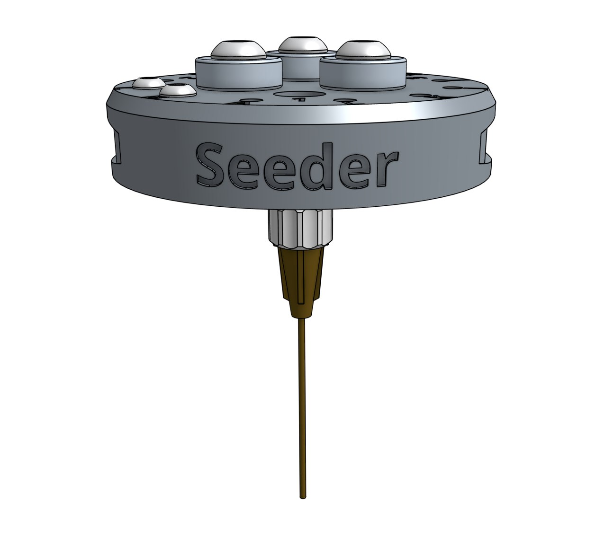
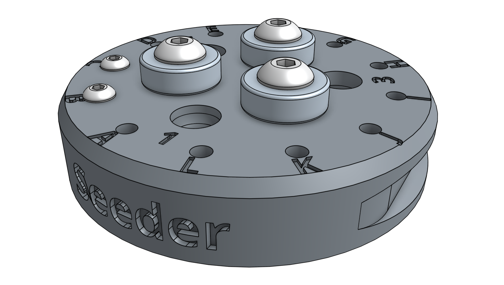
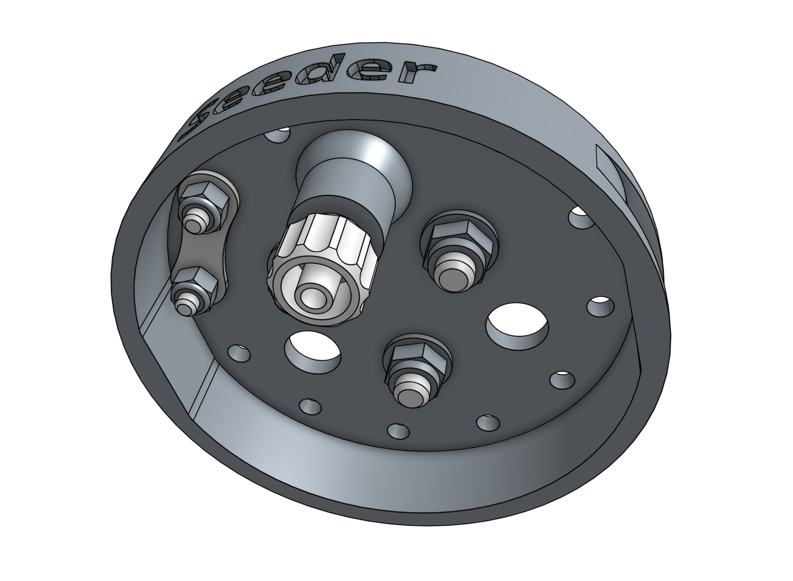
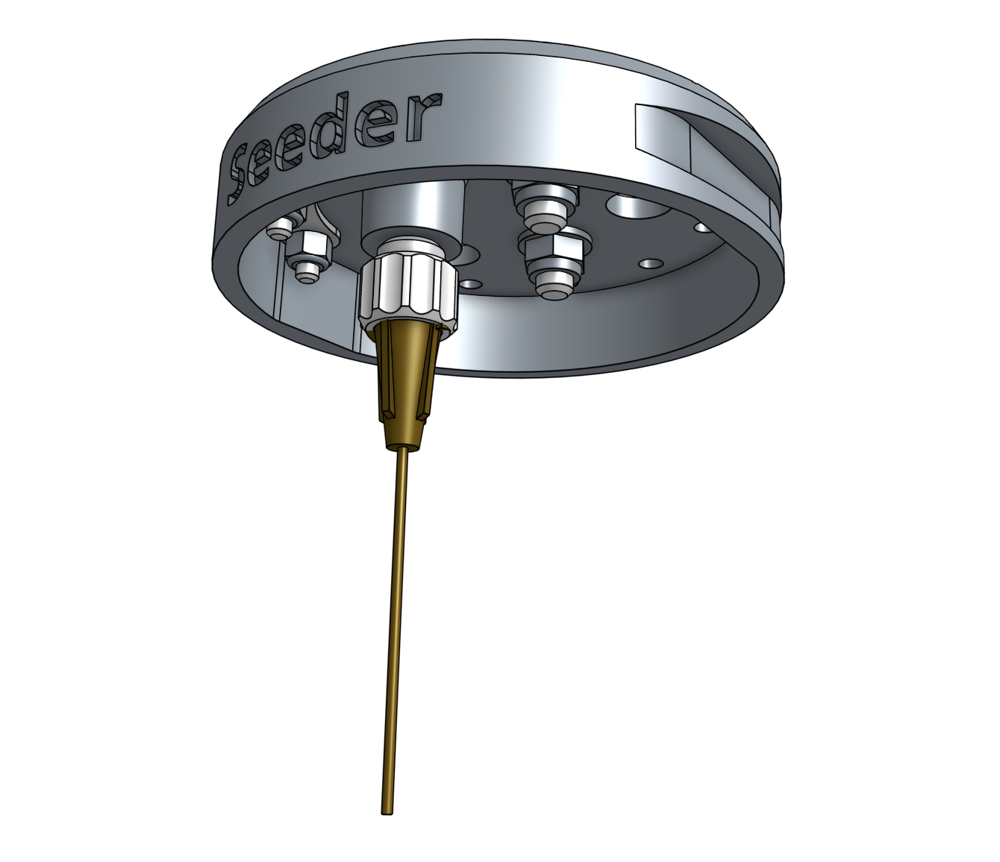
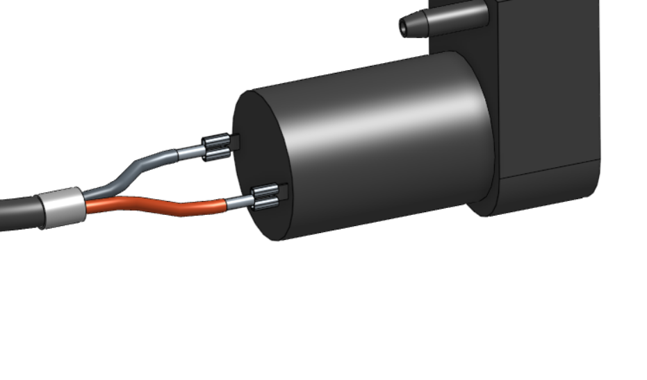
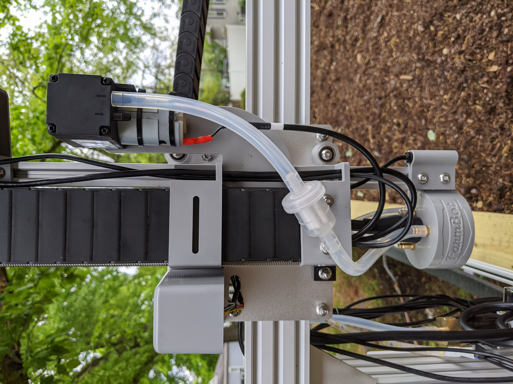
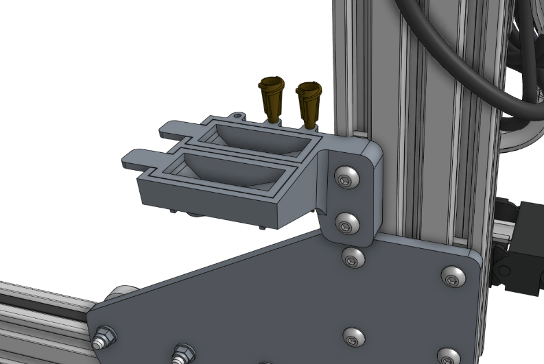

* toc
{:toc}

The seed injector works by using a vacuum pump to suction-hold a single seed at the end of a needle.

<iframe class="embedly-embed" src="//cdn.embedly.com/widgets/media.html?src=https%3A%2F%2Fwww.youtube.com%2Fembed%2FnXFdJIQaQB4%3Ffeature%3Doembed&url=http%3A%2F%2Fwww.youtube.com%2Fwatch%3Fv%3DnXFdJIQaQB4&image=https%3A%2F%2Fi.ytimg.com%2Fvi%2FnXFdJIQaQB4%2Fhqdefault.jpg&key=02466f963b9b4bb8845a05b53d3235d7&type=text%2Fhtml&schema=youtube" width="854" height="480" scrolling="no" frameborder="0" allowfullscreen></iframe>

# Step 1: Install the basic tool hardware
Install the **magnets** and tool verification **jumper link** using the instructions in the [basic tool hardware reference guide](../../Extras/reference/basic-tool-hardware.md).

# Step 2: Add the luer lock adapter
Screw the **luer lock adapter** into the brass insert on bottom of the **seeder**.

# Step 3: Selecting a luer lock needle

We've shipped all of the FarmBots with three different **luer lock needle** sizes so that you can experiment and find the best needle for your needs. The smaller needles will be better suited for smaller seeds (eg: lettuce) while the larger needles will be more suited to large seeds (eg: pumpkin). We've found that the medium sized brown needle is well suited for most seeds.

|Color                         |Gauge                         |ID                            |OD                            |
|------------------------------|------------------------------|------------------------------|------------------------------|
|Green                         |14                            |0.067"                        |0.083"
|Brown                         |19                            |0.032"                        |0.042"
|Black                         |22                            |0.019"                        |0.028"

Once you've selected a needle, attach it to the **luer lock adapter** with a 1/4 turn. At any time you can quickly swap the needle out for another size or replace a damaged one.

# Step 4: Connect the vacuum pump

Slide the **vacuum tube** onto the inlet barb of the **vacuum pump**.

_Please note that the vacuum pump has a vacuum (air suction) and a discharge (air exhaust) port._

{%
include callout.html
type="warning"
title="Take care and ensure you have installed the tube on the vacuum (air suction) port"
content="Ensure you have installed the tube on the vacuum (air suction) port. If you find during testing that  there is air blowing out of the seeder tool, please re-connect the tube on the other port.  FarmBot Inc. may provide components from kits from different suppliers and the vacuum pump configuration may be slightly different on your model. On the FarmBot Genesis v1.5 models the vacuum port is on the right side. when looking at the ports on the pump directly."
%}

# Step 5: Wire up the vacuum pump

Connect the **vacuum pump cable** to the **vacuum pump's** terminals. Note: in a few steps from now, you will connect the other end of the cable to the Farmduino.

_Note: this image does not show the vacuum pump in the mounted position on the z-axis. You may need to remove the vacuum pump cover to install the cable._

When the vacuum pump is wired in the add the air filter so that the final configuration looks like the photo below.

_Air filter configuration from the UTM to vacuum pump. Please pay special attention to the arrows on the vacuum (inlet) and discharge (exhaust) side of the pump. Take care to attach the tube to the vacuum (inlet) side of the vacuum pump._

# Step 6: Attach the seed trough holder

Attach the **seed trough holder** to the **left gantry column** using a **40mm nut bar** and **M5 x 16mm screws**. Then place the two **seed troughs** into the holder. Optionally, you may store up to three **luer lock needles** in the holder as well.

# Step 7: Understanding the seed containers

<iframe class="embedly-embed" src="//cdn.embedly.com/widgets/media.html?src=https%3A%2F%2Fwww.youtube.com%2Fembed%2FguJK9498ZA4%3Ffeature%3Doembed&url=http%3A%2F%2Fwww.youtube.com%2Fwatch%3Fv%3DguJK9498ZA4&image=https%3A%2F%2Fi.ytimg.com%2Fvi%2FguJK9498ZA4%2Fhqdefault.jpg&key=02466f963b9b4bb8845a05b53d3235d7&type=text%2Fhtml&schema=youtube" width="854" height="480" scrolling="no" frameborder="0" allowfullscreen></iframe>

We offer the following types of seed containers, each optimized for different purposes.

## Seed bins
The **seed bins** are for holding large amounts of one type of seed. This is best used when planting many plants of the same crop, for example: when growing microgreens. To use a seed bin, simply slide it into the **toolbay** and fill it with seeds. Then run a planting sequence from the web app with the corresponding seed bin sequence and location.

If desired, you can mix a variety of seed types into one seed bin and have FarmBot plant whatever it happens to grab. Keep in mind though that FarmBot will have no way of knowing which seeds it grabs, so only use this technique when you will be taking care of all those plants identically. An example for this again might be when growing microgreens - you can grow three different types in the same area at the same time, all in the same way, without having to do three planting sequences or otherwise treat them differently.

## Seed trays
The **seed trays** have 16 small area for holding seeds. They are best used when planting many different crops, and when the number of seeds per hole needs to be strictly controlled.

## Seed troughs
The **seed troughs** are small seed containers that are stored in the **seed trough holder**, which is mounted on the gantry. This allows FarmBot to bring seeds with it along the x-axis, reducing the time to sow an entire bed.

