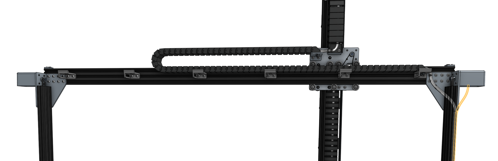
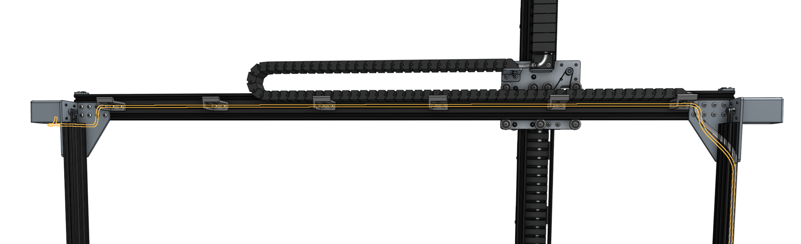

* toc
{:toc}

# Step 1: Connect the X1 motor and encoder cables

Connect the **X1 motor and encoder cables** to the **X1 motor and encoder** on the right side of FarmBot (when looking at the device from the back). The electronics box will be attached to this side in a later step.

_(highlighted in orange)_

# Step 2: Connect the X2 motor and encoder cables

Connect the **X2 motor and encoder cables** to the **X2 motor and encoder** on the left side of FarmBot (when looking at the device from the back) by feeding the cables through the slots in all of the **horizontal cable carrier supports** along the **gantry main beam**.

_(highlighted in orange)_

# What's next?

 * [Lighting](lighting.md)
