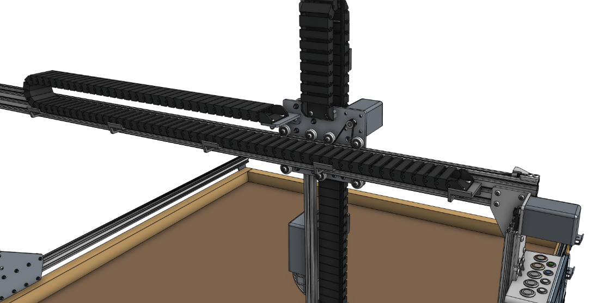
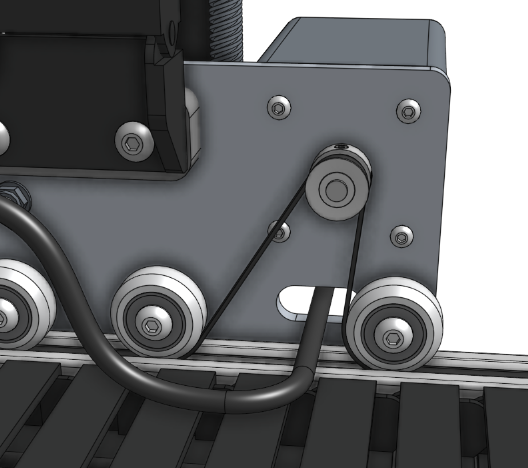
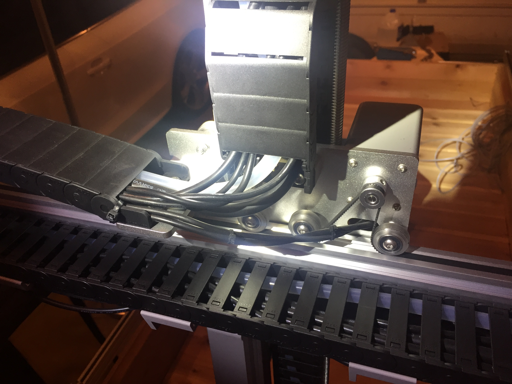
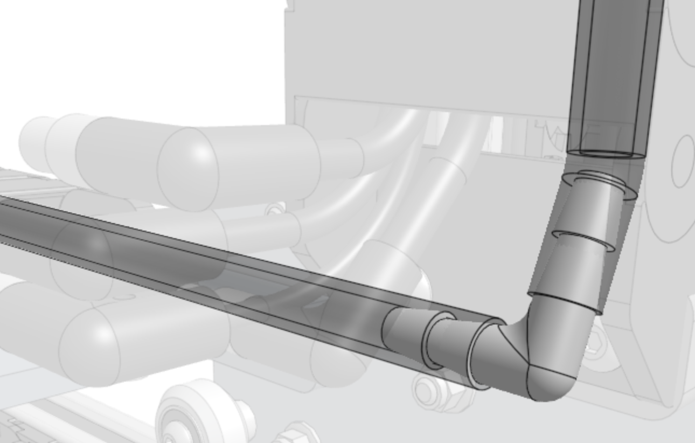
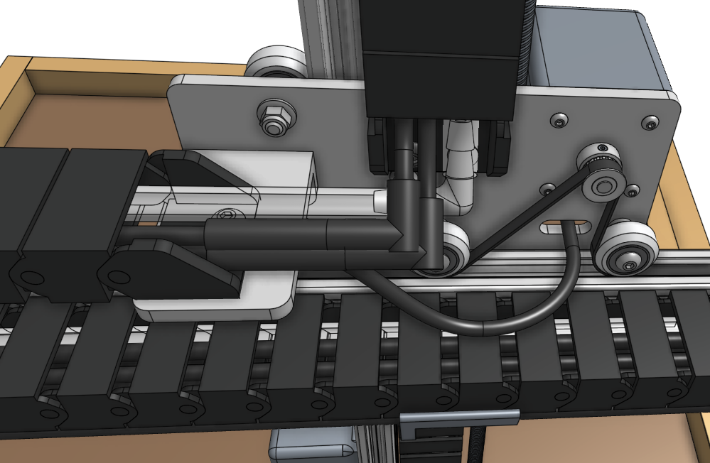
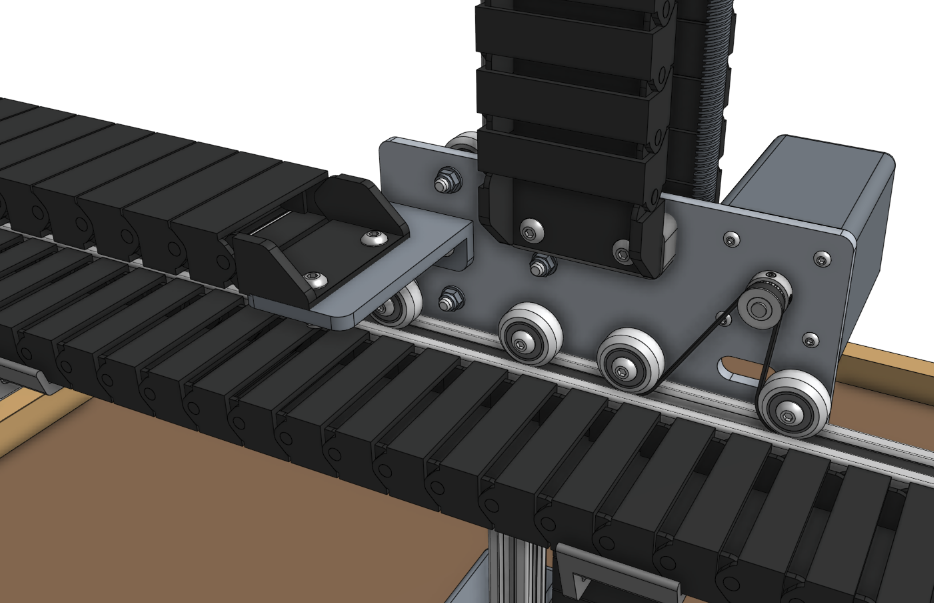
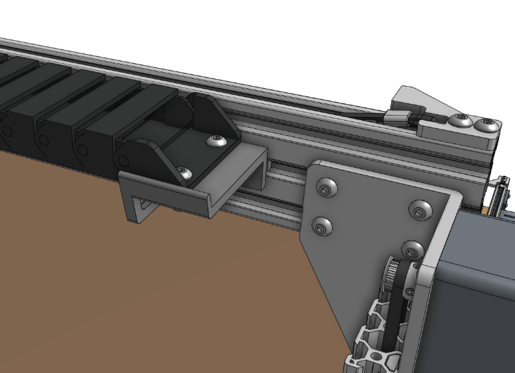
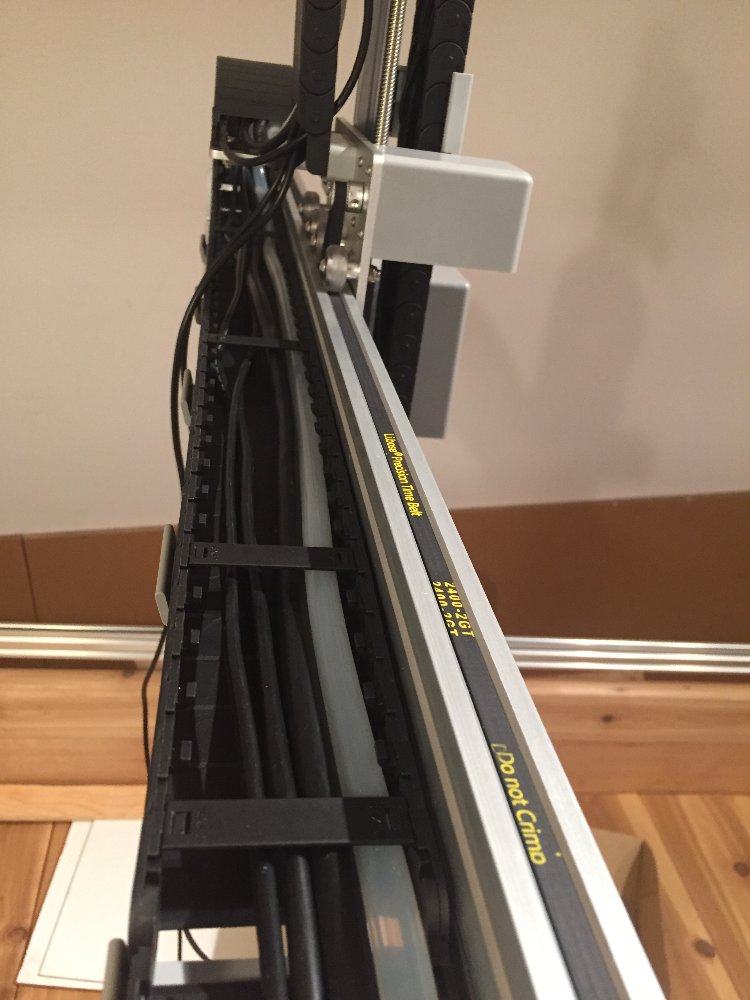

* toc
{:toc}

# Step 1: Prepare the cable carrier

Remove all of the snap-in **tabs** from the **y-axis cable carrier**. Note that the x-axis and y-axis cable carriers are the same length, but the y-axis cable carrier is wider than the x-axis one.

# Step 2: Orient the cable carrier

There is only one orientation that the **y-axis cable carrier** mounts to the **cross-slide** and **gantry**, and it is determined by the orientation of the **end pieces**. Lay the cable carrier onto the gantry's **horizontal cable carrier supports** but do not attach it at this time.

_Not pictured: The cables and tubing._

# Step 3: Add the y-axis motor and encoder cables

Feed the **y-axis motor and encoder cables** through the slot in the **cross-slide plate** such that there is enough cable length so that they can be comfortably connected to the motor and encoder. Ensure you feed the correct end of the cables through the slot by checking the connection with the y-axis motor and encoder. However, do not keep them plugged in at this time as they can be damaged if pulled on.

_Not pictured: The cables and tube coming from the z-axis cable carrier._

_Photo of the y-axis motor wires. Use the zip ties and plenty of slack to ensure the motor and encoder wires do not rub up against the belt. (This photo is of a Genesis v1.4 bot so it does not show the intermediate connectors)_

# Step 4: Connect the cables and tubing with the 90 degree connectors

Push the **90 degree barb** onto the **z-axis water tube**. Then push the **y-axis water tube** onto the other end of the barb.

Connect the z-axis and y-axis sections of the following cables together:
  * **Vacuum pump cable (z-axis section)** to **vacuum pump cable (y-axis section)** with the 2-pin 90-degree connector
  * **Z-axis encoder cable (z-axis section)** to **z-axis encoder cable (y-axis section)** with the 7-pin 90-degree connector
  * **Z-axis motor cable (z-axis section)** to **z-axis motor cable (y-axis section)** with the 4-pin 90-degree connector
  * **Camera** to **camera cable** with the 4-pin 90-degree connector

{%
include callout.html
type="danger"
title="CAUTION: The camera and z-axis motor cables use the same connectors"
content="Note that the camera and z-axis motor cables use the same connectors. When connecting the ends coming from the y-axis cable carrier to the ends coming from the z-axis cable carrier, ensure you are connecting camera to camera and z-axis motor to z-axis motor.

You can check to see which cable is which by tugging on a cable on one end of the cable carrier and seeing which cable moves on the other end.

**We strongly recommend you take your time with this step because a mistake could cause massive damage to your electronics.**"
%}

_Note: not all cables are shown_

Pay special attention that you fully insert the 90-degree connectors together. This may require a multi-step process of pushing together, slightly tightening the thumb screws, pushing together again, and tightening some more. See the video below for detail.

<iframe class="embedly-embed" src="//cdn.embedly.com/widgets/media.html?src=https%3A%2F%2Fwww.youtube.com%2Fembed%2FrPqgmoE3PbI%3Ffeature%3Doembed&display_name=YouTube&url=https%3A%2F%2Fwww.youtube.com%2Fwatch%3Fv%3DrPqgmoE3PbI&image=https%3A%2F%2Fi.ytimg.com%2Fvi%2FrPqgmoE3PbI%2Fhqdefault.jpg&key=f2aa6fc3595946d0afc3d76cbbd25dc3&type=text%2Fhtml&schema=youtube" width="854" height="480" scrolling="no" title="YouTube embed" frameborder="0" allow="autoplay; fullscreen" allowfullscreen="true"></iframe>

# Step 5: Lay everything into the cable carrier

Lay the **y-axis motor cable**, **y-axis encoder cable**, **y-axis water tube**, **UTM cable**, **camera cable (y-axis section)**, **vacuum pump cable (y-axis section)**, **z-axis motor cable (y-axis section)**, and the **z-axis encoder cable (y-axis section)** into the open **y-axis cable carrier**.



# Step 6: Snap in some tabs

Snap in three **cable carrier tabs** at both ends of the cable carrier, and ten more spread throughout the middle of the cable carrier so that as you mount the assembly, the cables and tube will stay in place. You do not want to snap in all of the tabs at this time because that will make it difficult to adjust anything if needed.

# Step 7: Mount the cable carrier to the cross-slide

Attach the **y-axis cable carrier** to the **80mm cable carrier mount** using two **M5 x 16mm screws** and **M5 flange locknuts**. The screws should thread firmly through the cable carrier end piece.





_Not pictured: The cables and tube._

# Step 8: Mount the cable carrier to the gantry

Attach the **y-axis cable carrier** to the **60mm horizontal cable carrier support** nearest the left gantry column using two **M5 x 16mm screws** and **M5 flange locknuts**. The screws should thread firmly through the cable carrier end piece.

_Not pictured: The cables and tube._

_Y-axis cable carrier with the cables and tubes_

# Step 9: Snap in the remaining tabs

Once everything is situated well, snap-in the remaining **cable carrier tabs**, ensuring that you maintain organization of the cables and tube.



# Step 10: Connect the y-axis motor and encoder cables
Connect the **y-axis motor and encoder cables** to the **y-axis motor**.

# What's next?

 * [X-Axis Cable Carrier](../cables-and-tubing/x-axis-cable-carrier.md)
