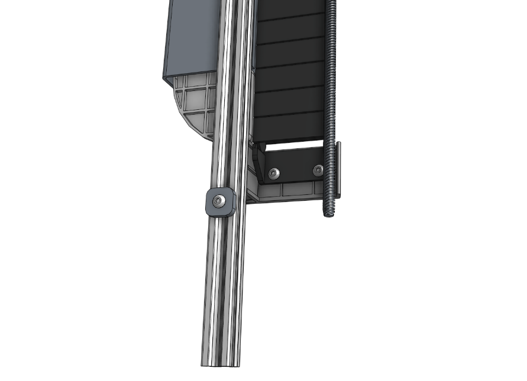
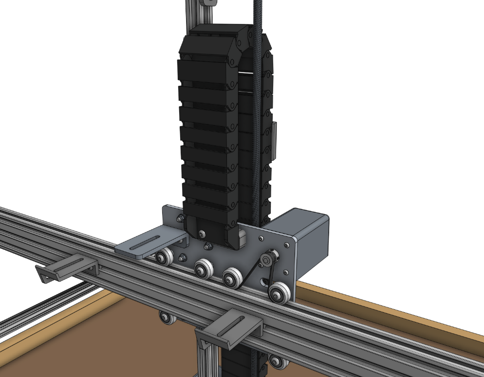
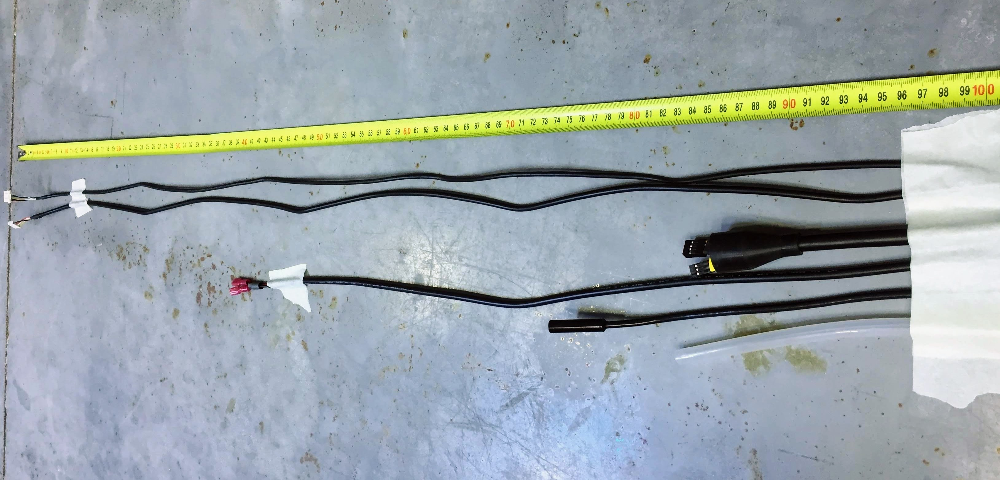
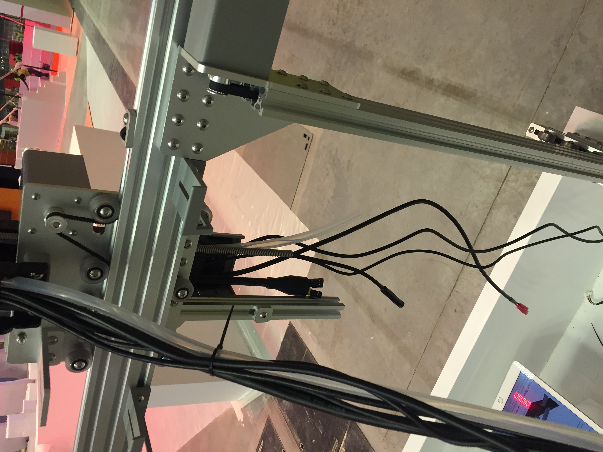
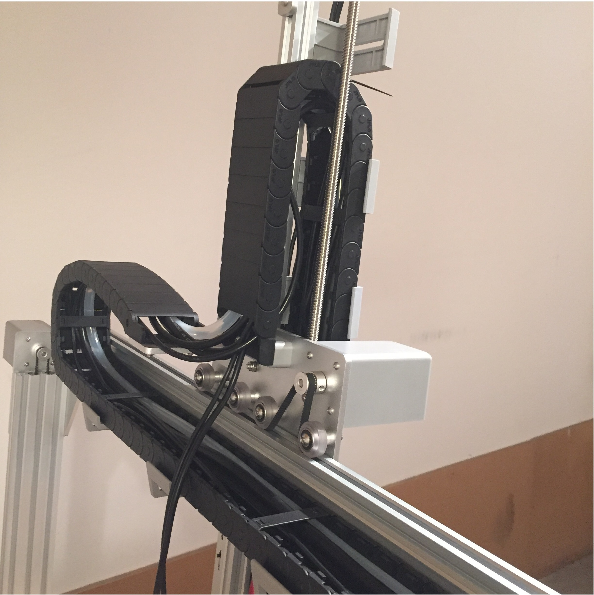
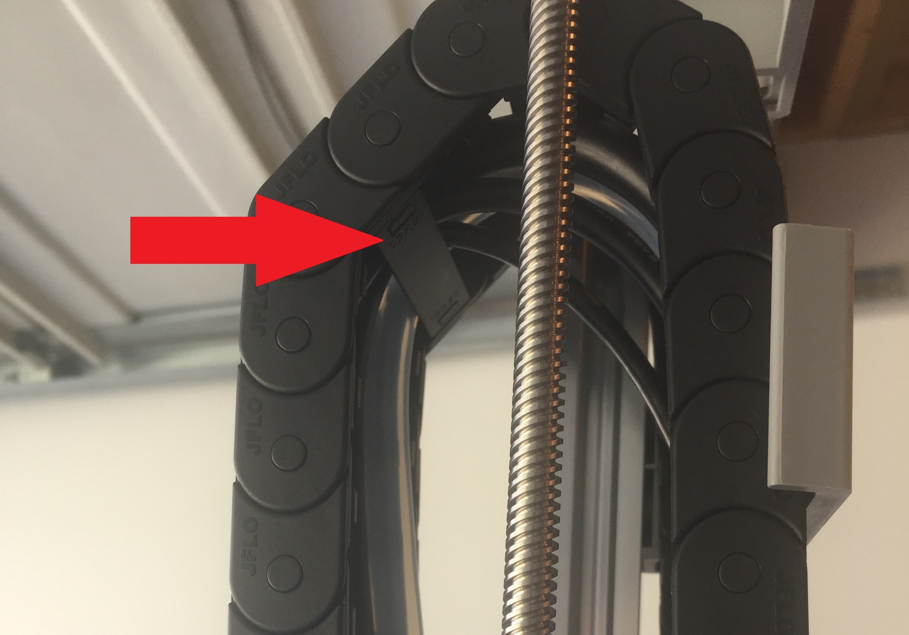
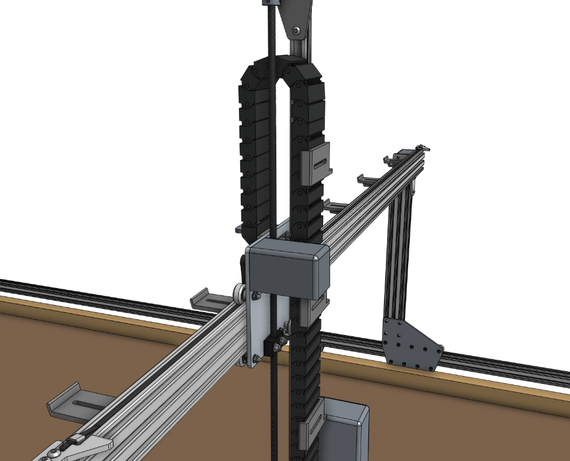
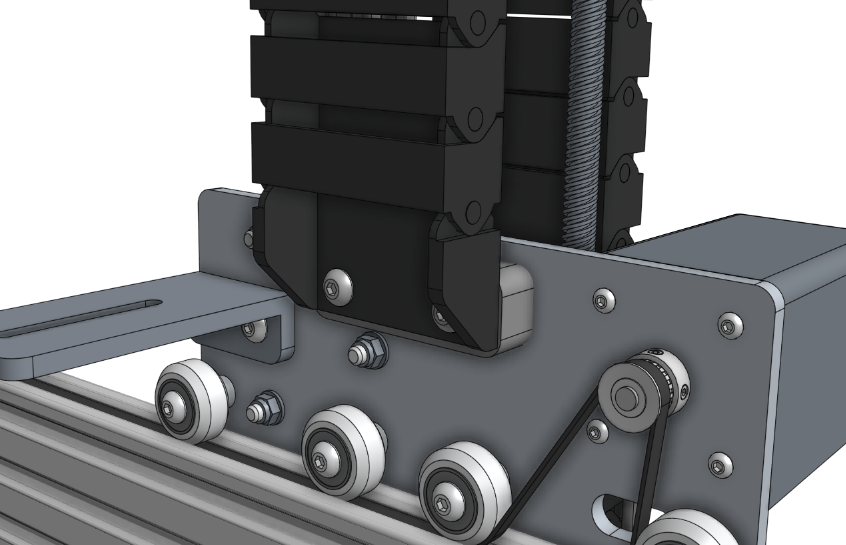
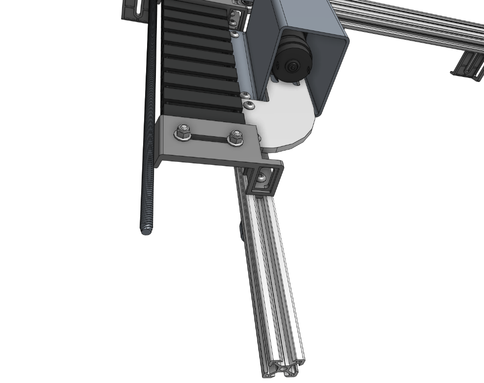
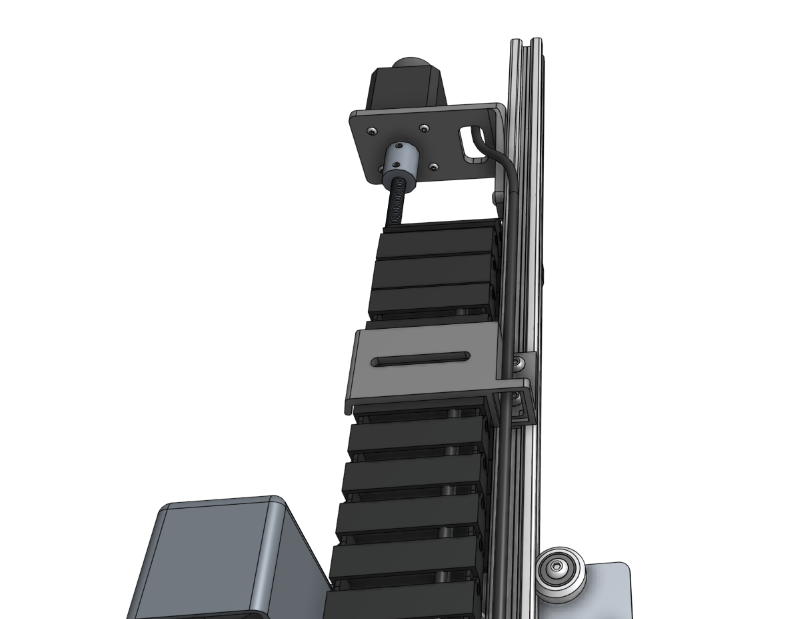

* toc
{:toc}

# Step 1: Prepare the cable carrier

Remove all of the snap-in **tabs** from the **z-axis cable carrier**. The z-axis cable carrier is the shortest cable carrier in the kit.

# Step 2: Orient the cable carrier

There is only one orientation that the **z-axis cable carrier** mounts to the **cross-slide** and **z-axis**, and it is determined by the orientation of the **end pieces**. Inspect the images below to see how the cable carrier will be mounted, but do not attach it at this time.

_The z-axis end_

_The cross-slide end_

# Step 3: Lay everything into the cable carrier

Keeping the mounting orientation of the cable carrier in mind, lay the **UTM cable**, the **z-axis water tube (0.95m)**, the **vacuum pump cable (z-axis section)**, the **camera**, the **z-axis motor cable (z-axis section)**, and the **z-axis encoder cable (z-axis section)** into the open cable carrier. The ends of all cabling and tubing should be offset from the **z-axis end** of the cable carrier as follows:

  * The end of the **z-axis water tube** (the 0.95m tube) should extend **10cm** beyond the **z-axis end** of the cable carrier.
  * The end of the **UTM cable** with the **yellow and black connectors** should extend **10cm** beyond the **z-axis end** of the cable carrier.
  * The end of the **camera** should extend **15cm** beyond the **z-axis end** of the cable carrier.
  * The end of the **vacuum pump cable (z-axis section)** with the **quick-connect terminals** should extend **30cm** beyond the **z-axis end** of the cable carrier.
  * The end of the **z-axis motor cable (z-axis section)** with the **white motor plug** should extend **100cm** beyond the **z-axis end** of the cable carrier.
  * The end of the **z-axis encoder cable (z-axis section)** with the **white encoder plug** should extend **100cm** beyond the **z-axis end** of the cable carrier.

_This photo shows what the cables will look like as they are measured out to scale._



_This photo shows the tubes and cables in the Z-Axis Cable carrier. (This is from a Genesis v1.4 so your bot may look slightly different.)_

_Z-axis and y-axis cable organization (This photo is from a Genesis v1.4 so your bot may look slightly different.)_

# Step 4: Snap in some tabs

Snap in three **cable carrier tabs** at both ends of the cable carrier, and five more spread throughout the middle of the cable carrier so that as you mount the assembly, the cables and tubing will stay in place. You do not want to snap in all of the tabs at this time because that will make it difficult to make adjustments if needed.

# Step 5: Mount the cable carrier to the cross-slide

Carefully lift the cable carrier assembly and drape it over the cross-slide.

Attach the cross-slide end of the **cable carrier** to the **cross-slide** using two **M5 x 30mm screws**, **M5 flange locknuts**, and the **60mm cable carrier spacer block**. The screws should thread firmly through the cable carrier end piece.

_Not pictured: The cables and tube coming from the z-axis cable carrier._

# Step 6: Mount the cable carrier to the z-axis

Attach the z-axis end of the **cable carrier** to the lowest **vertical cable carrier support** on the **z-axis** using two **M5 x 16mm screws** and **M5 flange locknuts**. The screws should thread firmly through the cable carrier end piece.

_Not pictured: The cables and tube coming from the cable carrier._

# Step 7: Feed the z-axis motor and encoder cables

Feed the **z-axis motor and encoder cables** up through the slots in the **vertical cable carrier supports**, and then through the slot in the **z-axis motor mount**. Then connect the cables to the motor and encoder.

# Step 8: Add the vertical motor housing

Attach the **80mm vertical motor housing** to the **z-axis extrusion** using **M5 x 10mm screws** and **tee nuts**.

# Step 9: Snap in the remaining tabs

Once everything is situated well, snap-in the remaining **cable carrier tabs**, ensuring that you maintain organization of the cables and tube.



# What's next?

 * [Y-Axis Cable Carrier](y-axis-cable-carrier.md)
