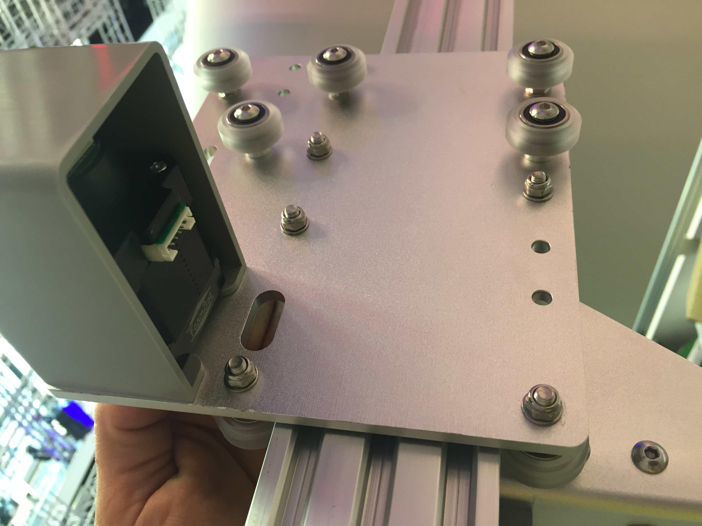

* toc
{:toc}

_View of the cross-slide from the front of FarmBot_

_View of the cross-slide from the back of FarmBot_



# Step 1: Attach the gantry V-wheels
Use four **M5 x 30mm screws** and **M5 flange locknuts** to attach four **V-wheels** with **normal 6mm spacers** to the **cross-slide plate**.



_Wheels with normal spacers._

Use three **M5 x 30mm screws** to attach three **V-wheels** with **eccentric 6mm spacers** to the holes shown. The V-wheels should be secured with an **M5 flange locknut** on the other side.

_Bottom three wheels with eccentric spacers._

# Step 2: Add the Z-axis V-wheels
Flip the cross-slide over so that all of the V-wheels you have added so far are facing away from you.

Use two **M5 x 30mm screws** to attach two **V-wheels** with **normal 6mm spacers** to the holes shown. Secure these wheels with an **M5 flange locknut** on the other side of the plate.

_Wheels with normal spacers._

Use three **M5 x 30mm screws** to attach three **V-wheels** with **eccentric 6mm spacers** to the holes shown. The V-wheels should be secured with an **M5 flange locknut** on the other side.

_Right three wheels with eccentric spacers._

# Step 3: Attach the leadscrew block
Attach the **leadscrew block** to the **cross-slide plate** using two **M5 x 30mm screws** and **M5 flange locknuts**.

# Step 4: Attach the stepper motor
Insert the **stepper motor** into the **horizontal motor housing** such that the motor and encoder connectors are facing down, out the open face of the housing.

Use four **M3 x 12mm screws** to attach the **stepper motor** and **motor housing** to the **cross-slide plate**.



Slide a **GT2 pulley** onto the **stepper motor** shaft. Make sure that both setscrews are lined up with the flat spots of the motor shaft. Then tighten the setscrews with the **2mm driver**.

# Step 5: Add the cable carrier mount
Use two **M5 x 16mm screws** and **M5 flange locknuts** to secure the **80mm cable carrier mount** to the **cross-slide plate**. The bracket should be on the opposite side of the plate as the motor.

# Step 6: Adjust the eccentric spacers
In order for the cross-slide to slide smoothly and wobble-free on the gantry main beam, you must first adjust the eccentric spacers of the bottom three V-wheels. Adjust the eccentric spacers using the [eccentric spacer adjustment reference guide](../Extras/reference/eccentric-spacer-adjustment.md).# Step 7: Slide the cross-slide onto the gantry main beam
Once you have adjusted the eccentric spacers, slide the cross-slide onto the gantry main beam.

_This is a view of the attached cross slide_

The cross slide should easily move across the gantry. If you feel any significant resistance you need to re-adjust your eccentric spacers so that there is less resistance to movement. On the XL models you should pay special attention at the connection point between the two tracks. If there is any significant bump or resistance to movement at the connection point please use some sand paper and sand away the bump.

_This is a view of the attached cross slide looking up at the Y-Axis motor_

# Step 8: Feed and secure the belt
Attach a **belt clip** to the end of the gantry main beam using two **M5 x 10mm screws** and a **20mm nut bar**. Then secure one end of the **y-axis GT2 timing belt** (2m long for Genesis, 3.5m long for XL or MAX) to the belt clip using the [belt installation](../Extras/reference/belt-installation.md) reference guide.

Feed the **belt** under the end **V-wheel** of the cross-slide, then over the **GT2 pulley** and under the remaining three **V-wheels**. The flat side of the belt should be in contact with your V-wheels while the toothed side should engage with the teeth on the pulley.



Secure the belt at the other end of the gantry with another **belt clip**, **20 mm nut bar**, and two **M5 x 10mm screws**. Ensure there is a small amount of tension on the belt once everything is in place.

# What's next?

 * [Z-Axis](../FarmBot-Genesis-V1.5/z-axis.md)
