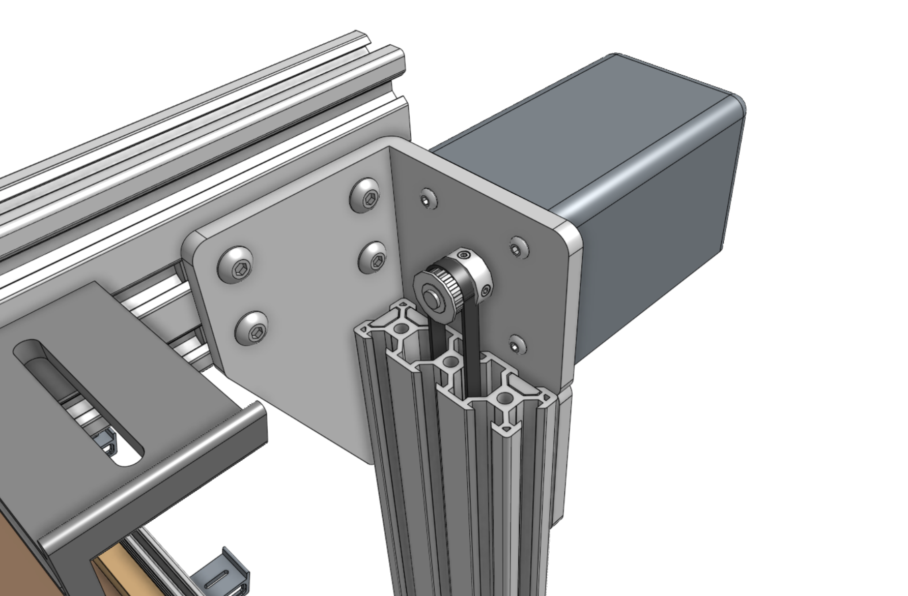
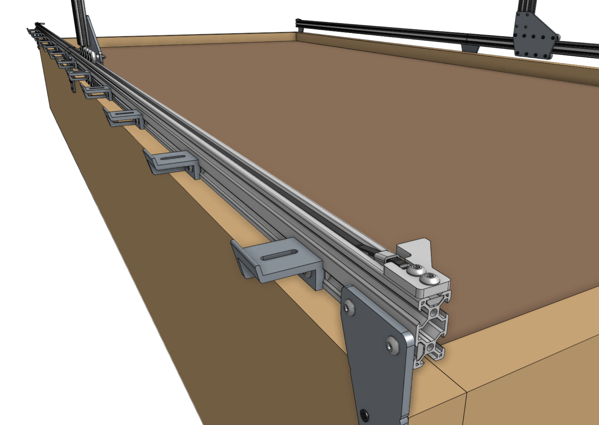

* toc
{:toc}

# Step 1: Attach the gantry motors
Slide a **motor** into a **horizontal motor housing**, ensuring that the shaft of the motor is coming out of the housing and that the motor and encoder connectors are facing down through the open bottom of the housing.

Attach the motor and housing to a **gantry corner bracket** with four **M3 x 12mm screws**. Then slide a **GT2 pulley** onto the **motor shaft** and tighten the two **set screws (pre-inserted)** with the 2mm hex driver. Make sure that the two setscrews contact the two *flat areas* on the motor shaft.

Repeat for the second motor on the other gantry corner bracket.

# Step 2: Feed the belts
Drop the ends of one of the **x-axis GT2 timing belts** down the two large openings of a **gantry column**, ensuring that the belt teeth engage the **GT2 pulley**.

Grab the ends of the **belt** at the bottom of the **gantry column** and feed them under the **V-wheels** of the **gantry wheel plate**, then along the top of the **track extrusions** to the ends of the tracks. The flat side of the belt should be in contact with the V-wheels.



_The belt has been highlighted orange for clarity._

# Step 3: Secure the belts
Secure one end of the belt to the front end of the tracks by using a **belt clip**, **belt sleeve**, **20mm nut bar**, and two **M5 x 10mm screws**. The belt must be wrapped through the clip as outlined in the [belt installation guide](../../Extras/reference/belt-installation.md).

Repeat for the other end of the belt on the other end of the tracks.

Repeat for the second x-axis belt on the other side of the gantry. Then trim or coil any extra belt, if desired.

# Step 4: Equalize the gantry
An **equalized gantry** is one that is exactly perpendicular to the **tracks** such that it is not crooked, and so that it is not being torqued. A crooked or torqued gantry can cause creaking, extra wear on the v-wheels, and introduce a high amount of friction into the system. It also just looks bad.

To equalize the gantry, first ensure that the x-axis motors are unpowered. For first time installation this will always be the case because we haven't yet added the wires or electronics! Then gently push or pull on the gantry **from the middle of the gantry main beam** such that it moves slowly along the tracks about 30cm. This process will remove any torque on the gantry, and ensure it is not crooked. If you push or pull the gantry from one of the gantry columns, or anywhere that is not the middle of the main beam, then you will torque the gantry and make it crooked. Don't do that.

If you were equalizing the gantry as part of routine maintenance, remember to recalibrate your FarmBot from the web app after equalization.





#Step 5: Tighten the Set Screws
Sometimes during normal operation the FarmBot is not able to move around because the set screws come loose on the X1,X2, and Y axis motors. This means that although the motors are turning the motor shaft, the power is not transferred to the pulley because the set screws are not engaged and the shaft is spinning around inside the pulley.  Double check the tightness of the set screws and we recommend using some blue Loctite to glue the fix the set screws in place.

When applying the Locktite glue, back out the set screw as far as possible. Apply the Locktite glue on the threads of the set screws and not in the top key portion of the screw.

# What's next?

 * [Cross-Slide](../../FarmBot-Genesis-V1.5/cross-slide.md)
