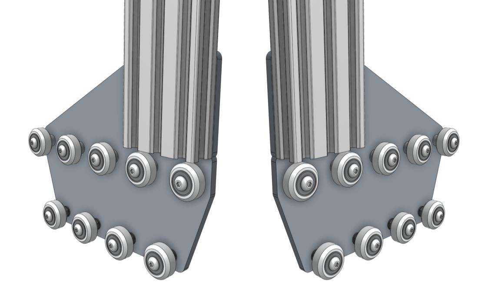

* toc
{:toc}

# Step 1: Attach the plates to the columns

Slide a **gantry column** onto the **gantry wheel plate assembly**. The extrusion should reside on the same side of the plate as the V-wheels and the end of the extrusion should be aligned with the **notch** in the plate. Tighten the **M5 x 10mm screws** using the **3mm hex driver**.



Repeat for the second gantry wheel plate and aluminum extrusion.

# Step 2: Attach the gantry corner brackets

Lightly attach three **60mm nut bars** to the **left gantry corner bracket** as shown.

Slide the corner bracket onto the gantry column/plate assembly. Pay special attention to the orientation of the bracket, extrusion, and wheel plate in the image below.

The top of the extrusion should line up with the notch in the corner bracket. Tighten the **M5 x 10mm screws** with the **3mm hex driver**.

# Step 3: Repeat

Repeat the above steps for the second corner bracket and column. You should end up with two assemblies that are mirror images of each other. Inspect the image below to ensure your corner brackets are attached to the columns in the correct orientation.

# Step 4: Slide the gantry columns onto the tracks



Slide the **gantry columns** onto the **tracks**. The direction that the wheel plates extend from the column is towards the front of FarmBot. Ensure that the cable carrier supports (mounted to the tracks) are on the left side of the FarmBot.

# Step 5: Assemble the main beam (XL and MAX kits only)



Optionally insert the slightly larger diameter half of three **dowel pins** *half-way* into the holes in a **gantry main beam**. The pins should fit snugly, and will require a small amount of force to be put in. You may want to use a mallet to lightly tap the pins into place. Be careful to not press the pins all the way inside the extrusion!



{%
include callout.html
type="info"
title="The dowel pins are meant to be tight"
content="The dowel pins are designed to very securely align extrusions to each other. However, small manufacturing differences can make a big difference in the fit of the pins in the extrusions. **If you are having difficulty inserting the dowel pins, you may try sanding them down slightly, and/or drilling out the extrusion with a slightly larger hole.**

Keep in mind that using the dowel pins is **optional**. If they are causing you more headache than help, you do not need to use them."
%}



Place both **gantry main beams** on a flat surface. Then push the two extrusions together so the exposed dowel pins are inserted into the other beam. You may need to use a mallet and block of wood to tap the end of an extrusion.



{%
include callout.html
type="info"
title="The dowel pins are meant to be tight"
content="The dowel pins are designed to very securely align extrusions to each other. However, small manufacturing differences can make a big difference in the fit of the pins in the extrusions. **If you are having difficulty inserting the dowel pins, you may try sanding them down slightly, and/or drilling out the extrusion with a slightly larger hole.**

Keep in mind that using the dowel pins is **optional**. If they are causing you more headache than help, you do not need to use them."
%}



Using four **60mm nut bars** and **M5 x 10mm screws**, attach the **gantry joining bracket** onto the *lower two slots* of the **gantry main beam**. The notch in the middle of the bracket should be aligned with the joint of the two extrusions.

# Step 6: Attach the cable carrier supports

Using **M5 x 10mm screws** and **40mm nut bars**, attach six **60mm horizontal cable carrier supports** to the *middle slot* of the **gantry main beam extrusion**. For genesis kits, there is only one main beam extrusion, so only six supports will be used. For Genesis XL and MAX kits, there are two main beam extrusions, so 12 supports will be used, and they should be positioned on the same side of the extrusions as the gantry joining bracket.

_Genesis_

_Genesis XL and MAX_

# Step 7: Attach the main beam



Lift up the **gantry main beam** and position it onto the front of the **gantry corner brackets**. The cable carrier supports should be on the same side of the main beam as the gantry corner brackets. Secure the main beam in place using four **60mm nut bars** and **M5 x 10mm screws**. The nut bars should be positioned in the *lower two extrusion slots* of the main beam such that the top face of the main beam is 20mm *above* the top edges of the gantry corner brackets.

_Note that this image is from the backside of FarmBot_

Ensure that the gantry columns are vertical and form a 90 degree angle with the main beam. Then tighten the **M5 x 10mm screws**. Depending on the spacing of your tracks, the gantry main beam may extend beyond the corner brackets. This is ok.

_This image is from the front of FarmBot_

# Step 8:  Attach the x-axis cable carrier mount

Use two **M5 x 10mm screws** and **drop-in tee nuts** to attach the aluminum **50mm cable carrier mount** to the bottom of the **left gantry column**.

# What's next?

 * [Attach the Drivetrain](../gantry/attach-the-drivetrain.md)
