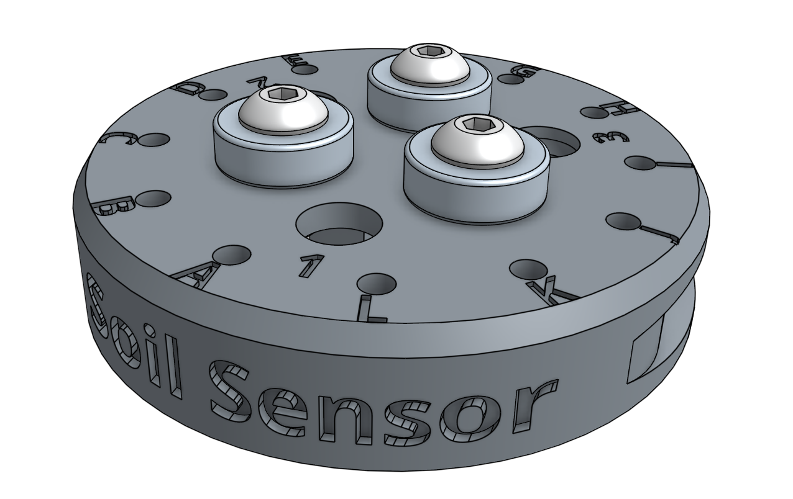
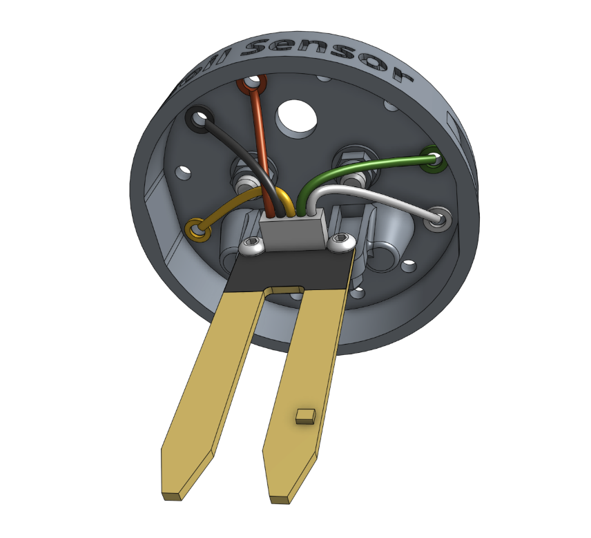
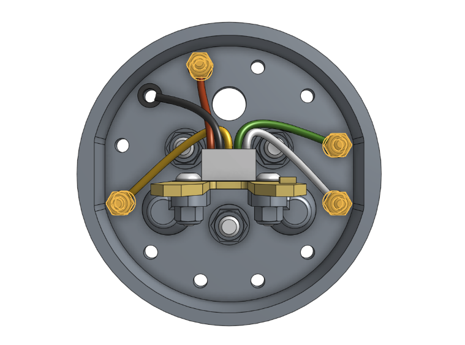
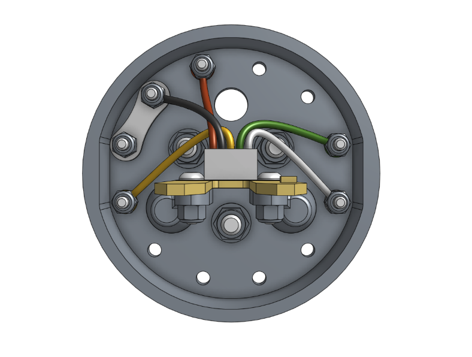

* toc
{:toc}

This single 3D printable component magnetically mounts onto FarmBot's UTM like any other tool. It works by driving the tool vertically into the soil so that the soil properties can be accurately read.

<iframe class="embedly-embed" src="//cdn.embedly.com/widgets/media.html?src=https%3A%2F%2Fwww.youtube.com%2Fembed%2Fp6CPnJoHf8E%3Ffeature%3Doembed&url=http%3A%2F%2Fwww.youtube.com%2Fwatch%3Fv%3Dp6CPnJoHf8E&image=https%3A%2F%2Fi.ytimg.com%2Fvi%2Fp6CPnJoHf8E%2Fhqdefault.jpg&key=02466f963b9b4bb8845a05b53d3235d7&type=text%2Fhtml&schema=youtube" width="854" height="480" scrolling="no" frameborder="0" allowfullscreen></iframe>

# Step 1: Install the magnets
Install *only* the **magnets** using the instructions in the [basic tool hardware reference guide](../../Extras/reference/basic-tool-hardware.md).

# Step 2: Install the soil sensor PCB
Attach the **soil sensor PCB** to the **soil sensor** using two **M3 x 12mm screws** and **M3 locknuts**. The sensor should be on the front side of the base's mounting tabs. The heads of the screws should be on the PCB's front side while the locknuts should be on the mounting tabs' back side. Do not over tighten the screws as this could damage the circuit board.

# Step 3: Install the electronic screws
Use the **2mm hex driver** and **5.5mm box wrench** to secure the following **ring terminals** to the **soil sensor** with **M3 x 12mm screws** and **M3 locknuts**. The screw heads should be on the same side as the magnets.

|Soil Sensor Position          |Wire Color                    |Connected to...               |
|------------------------------|------------------------------|------------------------------|
|A                             |Red                           |`VCC`
|D                             |Yellow                        |`SIG`
|I                             |White                         |`SCL`
|J                             |Green                         |`SDA`



_The screws and nuts are highlighted orange_

# Step 4: Install the jumper link
Attach a **jumper link** to positions **B** and **C** using two **M3 x 12mm screws** and **M3 locknuts**. The screw in the **B** position should hold the ring terminal of the **black (GND) wire**.

# What's next?

 * [Camera](../tools/camera.md)
