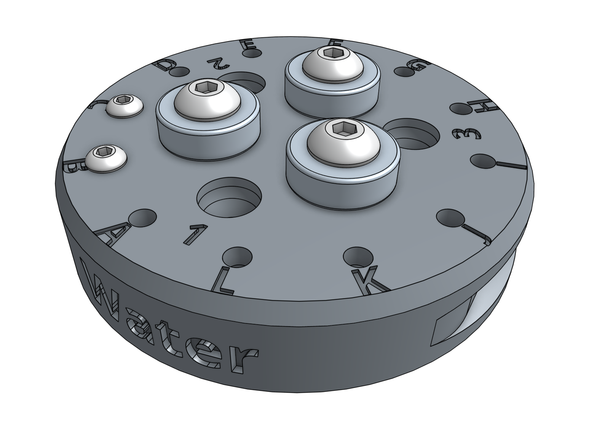
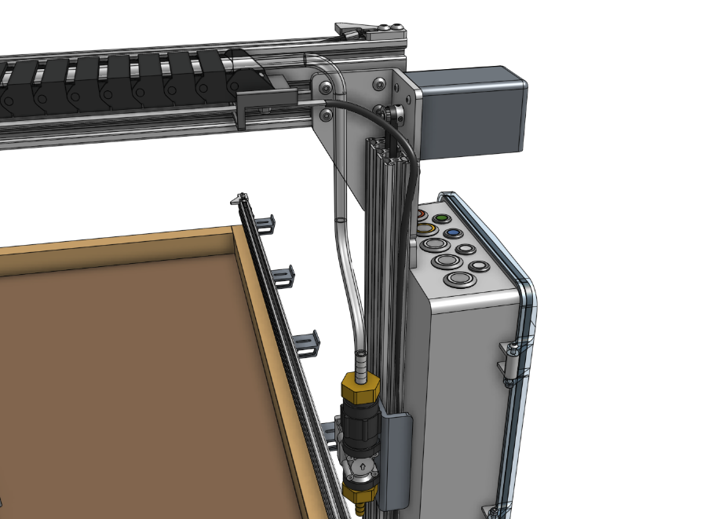

The watering nozzle accepts a concentrated stream of water coming from the UTM and turns it into a gentle shower for your plants.

<iframe class="embedly-embed" src="//cdn.embedly.com/widgets/media.html?src=https%3A%2F%2Fwww.youtube.com%2Fembed%2Fxh7imhENpLQ%3Ffeature%3Doembed&url=http%3A%2F%2Fwww.youtube.com%2Fwatch%3Fv%3Dxh7imhENpLQ&image=https%3A%2F%2Fi.ytimg.com%2Fvi%2Fxh7imhENpLQ%2Fhqdefault.jpg&key=02466f963b9b4bb8845a05b53d3235d7&type=text%2Fhtml&schema=youtube" width="854" height="480" scrolling="no" frameborder="0" allowfullscreen></iframe>

# Step 1: Assemble the watering nozzle
Press the **watering nozzle bottom** into the **watering nozzle top**. The two pieces only fit together in one orientation.

# Step 2: Install the basic tool hardware
Install the **magnets** and tool verification **jumper link** using **M5 x 30mm screws** and **M3 x 10mm screws** and the instructions in the [basic tool hardware reference guide](../../Extras/reference/basic-tool-hardware.md). The M5 screws will secure the **watering nozzle bottom** and the **watering nozzle top** together.



# Step 3: Assemble the solenoid valve and pressure regulator
Insert **rubber gaskets** into the female ends of the **pressure regulator**, the **garden hose to barb adapter**, and both **NPT to barb adapters**. Then screw one of the **NPT to barb adapters** onto the **solenoid valve** inlet, the **pressure regulator** onto the **solenoid valve** outlet, and the second **NPT to barb adapter** onto the **pressure regulator**.





# Step 4: Attach the solenoid valve
Attach the **solenoid valve** to the **solenoid valve mount** using two **200mm zip ties**. Then attach the **solenoid valve mount** to the **left gantry column** using two **M5 x 10mm screws** and **M5 drop-in tee nuts**. Cables should be routed between the mount and the box.



# Step 5: Wire up the solenoid valve

Connect the **solenoid valve cable** to the **solenoid valve's** terminals. Note: in a few steps from now, you will connect the other end of the cable to the Farmduino.

# Step 6: Connect the tubing

Push the **water tube** coming from the **y-axis cable carrier** onto the upper **NPT to barb adapter**. Then push the **water tube** coming from the **x-axis cable carrier** (where it is mounted to the gantry) onto the lower **NPT to barb adapter**.



# Step 7: Connect FarmBot to the water source

Screw the **garden hose to barb adapter** onto the **garden hose**. *Note that you will need to provide a garden hose of the appropriate length to connect FarmBot to your municipal water source - one is not provided with the FarmBot kits.* Then push the **water tube** coming from the bottom of the **x-axis cable carrier** onto the barb.

# What's next?

 * [Weeder](weeder.md)
