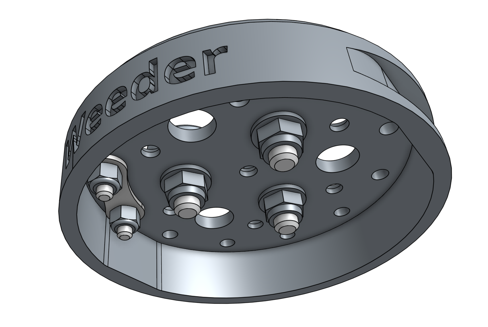
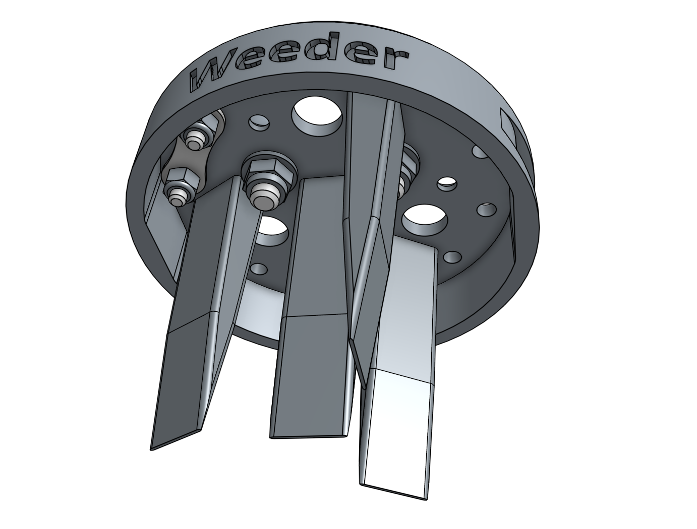

* toc
{:toc}

The weeding tool is a single 3D printable component magnetically mounts onto FarmBot's UTM like any other tool. It works by driving the tool vertically into the soil in order to push any small weeds under the soil, and disrupt their young fragile root systems.

<iframe class="embedly-embed" src="//cdn.embedly.com/widgets/media.html?src=https%3A%2F%2Fwww.youtube.com%2Fembed%2FNsEdALh3ZYY%3Ffeature%3Doembed&url=http%3A%2F%2Fwww.youtube.com%2Fwatch%3Fv%3DNsEdALh3ZYY&image=https%3A%2F%2Fi.ytimg.com%2Fvi%2FNsEdALh3ZYY%2Fhqdefault.jpg&key=02466f963b9b4bb8845a05b53d3235d7&type=text%2Fhtml&schema=youtube" width="854" height="480" scrolling="no" frameborder="0" allowfullscreen></iframe>

This tool, and FarmBot in general, is designed for removing weeds early and often such that the weeds are always **small, young, and fragile**, and therefore easily removed.

What makes this possible is FarmBot's diligence. FarmBot has 24 hours a day to maintain your garden meticulously. It can be configured to remove weeds every single day that a human would never waste their time with. This prevents weeds from even having a chance at becoming a real problem.

If you configure FarmBot well, you will never even notice weeds in your garden because they will never have a chance to survive beyond germination. Over time, the number of weed seeds in your growing area will approach zero.



# Step 1: Install the basic tool hardware
Install the **magnets** and tool verification **jumper link** using the instructions in the [basic tool hardware reference guide](../../Extras/reference/basic-tool-hardware.md).

# Step 2: Install the implements
Attach the four **medium weeder blades** to the **weeder** using **M3 x 6mm screws**.

# Customizing the weeder
The weeding tool is customizable so you can optimize it for your soil conditions, the types of weeds you are up against, and also how you configure your weeding sequences. Feel free to reconfigure the implements or just use some of them. You can also create new implements of your own design with a 3D printer or out of household materials.

# What's next?

 * [Soil Sensor](../tools/soil-sensor.md)
