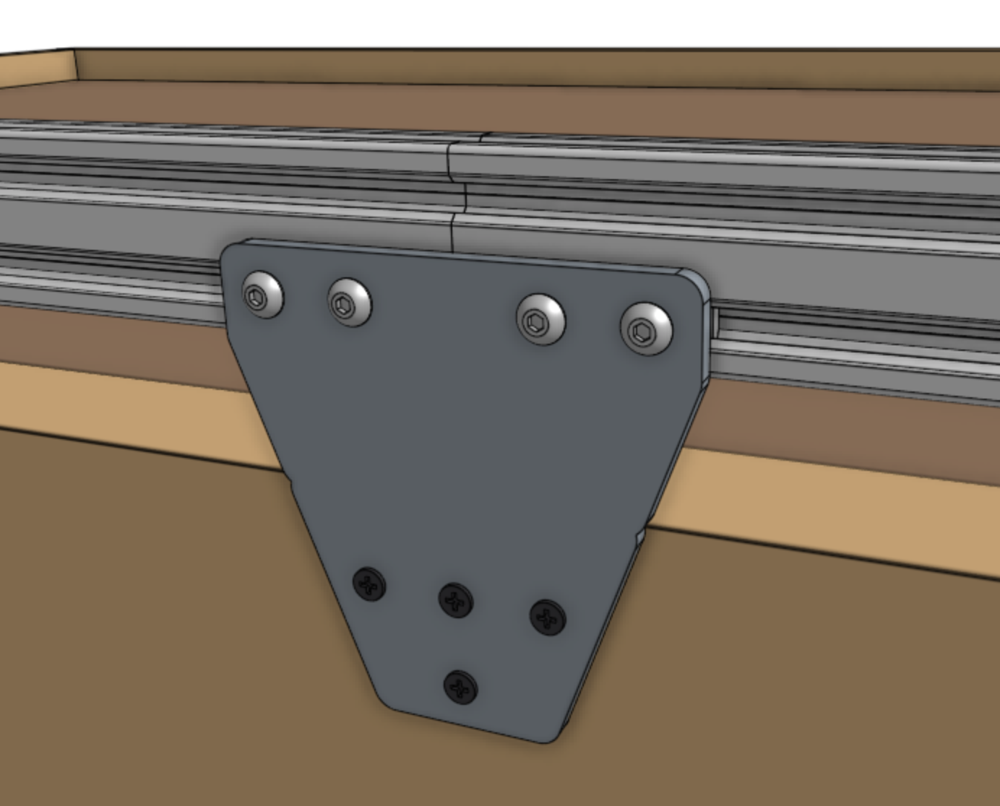
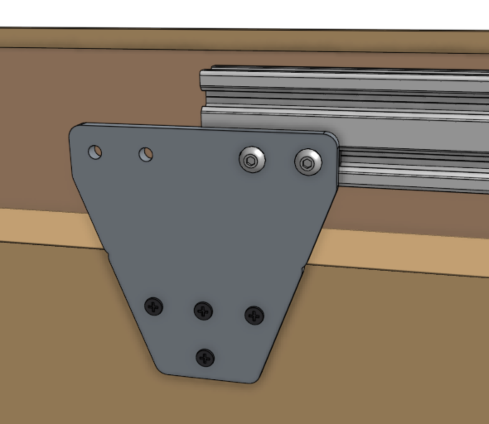

* toc
{:toc}

FarmBot's **tracks** allow the gantry to move precisely along the x-axis. They are designed to attach to a raised bed or similar [supporting infrastructure](supporting-infrastructure.md). Each track is composed of 1.5m long aluminum extrusions positioned end-to-end to form a total track length of 3m for Genesis models, 6m for Genesis XL, and 18m for Genesis MAX.



The two tracks must be a parallel distance apart between 0.5m and 1.5m for Genesis, and 1.5m and 3m for Genesis XL and Genesis MAX so that the gantry may span the distance between them. Tracks may be spaced closer together than the maximum, in which case you may consider cutting the gantry main beam so that it does not inconveniently extend beyond the tracks.

## Shortening the tracks
The easiest way to shorten the tracks is to remove extrusions. Should you want an overall track length different than the 1.5m increments the extrusions afford, then you will need to use a hacksaw or bandsaw to cut the extrusions to your desired length. You can shorten your tracks to a minimum length of around 0.5m.

## Lengthening the tracks
If you would like to extend your tracks, you will need additional extrusions, track joining plates, cable carrier supports, and hardware, as well as longer x-axis cable carrier, belt, wiring, and tubing.

{%
include callout.html
type="warning"
title="For serious hackers and DIYers only"
content="We do not currently sell extension hardware, offer kits with tracks longer than 18m, or provide support for kits that are modified in this way.

Lengthening the tracks beyond what is included with your kit may introduce significant unforeseen problems to your FarmBot. If you decide to extend your tracks you will need to purchase and/or make the additional components on your own and troubleshoot any problems you run into. You may seek support in the [community forum](http://forum.farmbot.org)."
%}

# Step 1: Lay out the track extrusions



Lay out all of the **track extrusions** in the location that you want to attach them to your **supporting infrastructure**. Make sure that extrusions are fully butted against each other. This will help you attach the plates in the correct location.



# Step 2: Attach the horizontal cable carrier supports
Attach six **40mm horizontal cable carrier supports** to the *lower slot* of a **track extrusion** using **40mm nut bars** and **M5 x 10mm screws**. The supports should be spaced evenly along the length of the extrusion, and they should be attached to the track extrusions on the side of the bed that you intend to be the left side of the FarmBot (when looking from the front).



Repeat for all of the track extrusions on the side of the bed that will eventually have the electronics box (two extrusions total for Genesis, four for Genesis XL, and 12 for Genesis MAX).

_Two extrusions with cable carrier supports - enough for Genesis._

# Step 3: Attach a track end plate
Position a **track end plate** as shown below and screw it into the **supporting infrastructure** with three **wood screws**.

{%
include callout.html
type="success"
title="Vertically aligned"
content="Use the small **notches** in the **track end plates** and **track joining plates** to help position the plates with perfect *vertical alignment* with respect to your supporting infrastructure and each other. *You should only use these notches if the top edge of your supporting infrastructure is level and straight.*

If the top edge of your supporting infrastructure is *not* level or straight, then you will need to manually ensure that your track plates are vertically aligned with other means. Because the gantry has wheels that ride on the bottom face of the track extrusions, you need to ensure that the bottom of the track extrusion will be at least 25mm away from the top of the supporting infrastructure so that the wheels have adequate clearance."
%}

# Step 4: Attach a track joining plate
Position a **track joining plate** such that one half of it will be able to attach to each **track extrusion** and so that it is vertically aligned with the first **track end plate**. Screw the plate into the **supporting infrastructure** with four **wood screws**.

# Step 5: Attach the first track extrusion
Attach the first **track extrusion** to the **track end plate** and **track joining plate** using a **60mm nut bar**, **40mm nut bar**, and **M5 x 10mm screws**.



# Step 6: Attach the next extrusion



**If you are going to use the dowel pins:** Insert the slightly larger diameter half of two **dowel pins** *half-way* into the holes in the **second track extrusion**. The pins should fit snugly, and will require some force to be put in. You may need to use a mallet to lightly tap the pins in place. Be careful to not press the pins all the way inside the extrusion!



_This is an example of damaged tracks caused by hammering the tracks together. Avoid hammering the tracks together._

{%
include callout.html
type="info"
title="The dowel pins are meant to be tight"
content="The dowel pins are designed to very securely align extrusions to each other. However, small manufacturing differences can make a big difference in the fit of the pins in the extrusions. **If you are having difficulty inserting the dowel pins, you may try sanding them down slightly, and/or drilling out the extrusion with a slightly larger hole.**

Keep in mind that using the dowel pins is **optional**. If they are causing you more headache than help, you do not need to use them."
%}

Lightly screw a **40mm nut bar** into the **track joining plate** using two **M5 x 10mm screws**. Then slide the *lower* V-slot of the **second track extrusion** onto the nut bar. Use a piece of wood or the help of another person to support the free end of the extrusion.

Push the free **extrusion** so the **dowel pins** insert into the fixed extrusion. Push until there is no gap between the extrusions. You may need to use a mallet and block of wood to tap the end of the free extrusion.



{%
include callout.html
type="info"
title="Dowel pins are optional"
content="The dowel pins are designed to very securely align extrusions to each other. However, small manufacturing differences can make a big difference in the fit of the pins in the extrusions. **If you are having difficulty inserting the dowel pins, you may try sanding them down slightly, and/or drilling out the extrusion with a slightly larger hole.**

Keep in mind that using the dowel pins is **optional**. If they are causing you more headache than help, you do not need to use them."
%}



_Perfectly aligned track extrusions are key to smooth gantry movements!_



# Step 7: Attach the next track joining plate (XL and MAX kits only)



Position another **track joining plate** such that one half of it will be able to attach to the free end of the **track extrusion** that was just put in place, and so that it is vertically aligned with the other track mounting plates. Screw the plate into the **supporting infrastructure** with four **wood screws**, and then secure the **extrusion** with another **40mm nut bar** and tighten all screws.

Repeat to install subsequent **track joining plates** and **track extrusions**.

# Step 8: Attach the second track end plate
Position the second **track end plate** and secure it to the **supporting infrastructure** with three **wood screws**. Then fasten the final **track extrusion** to the plate using a **60mm nut bar** and **M5 x 10mm screws**.

# Step 9: Install the other track
Repeat steps 3 through 8 for the track on the other side of the bed. Note that the second track will not have any horizontal cable carrier supports.



# Step 10: Sand away bumps
If needed, use **150 grit sand paper** to sand away any bumps on the diagonal surfaces of the **extrusions** that the FarmBot wheels ride upon. This will ease the movements of the FarmBot and improve longevity. Make sure that both the upper surfaces and lower surfaces are smooth to the touch and that there is no bump or uneven edges in the transition from one extrusion to another.

_This photo shows that the aluminum tracks can be sanded down so that there is no bump on the transition between one section of track to another._



# What's next?

 * [Gantry](gantry.md)
