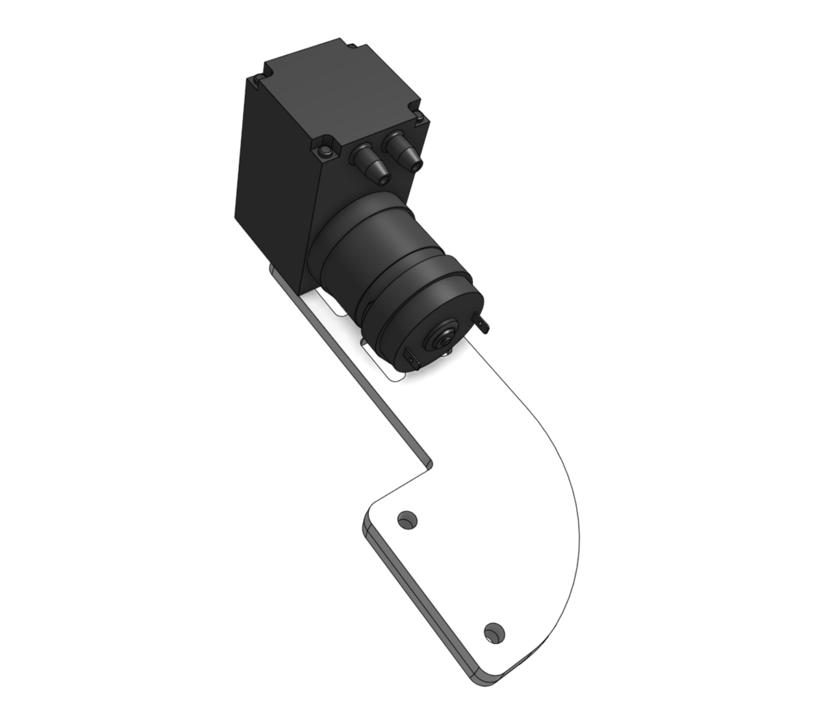
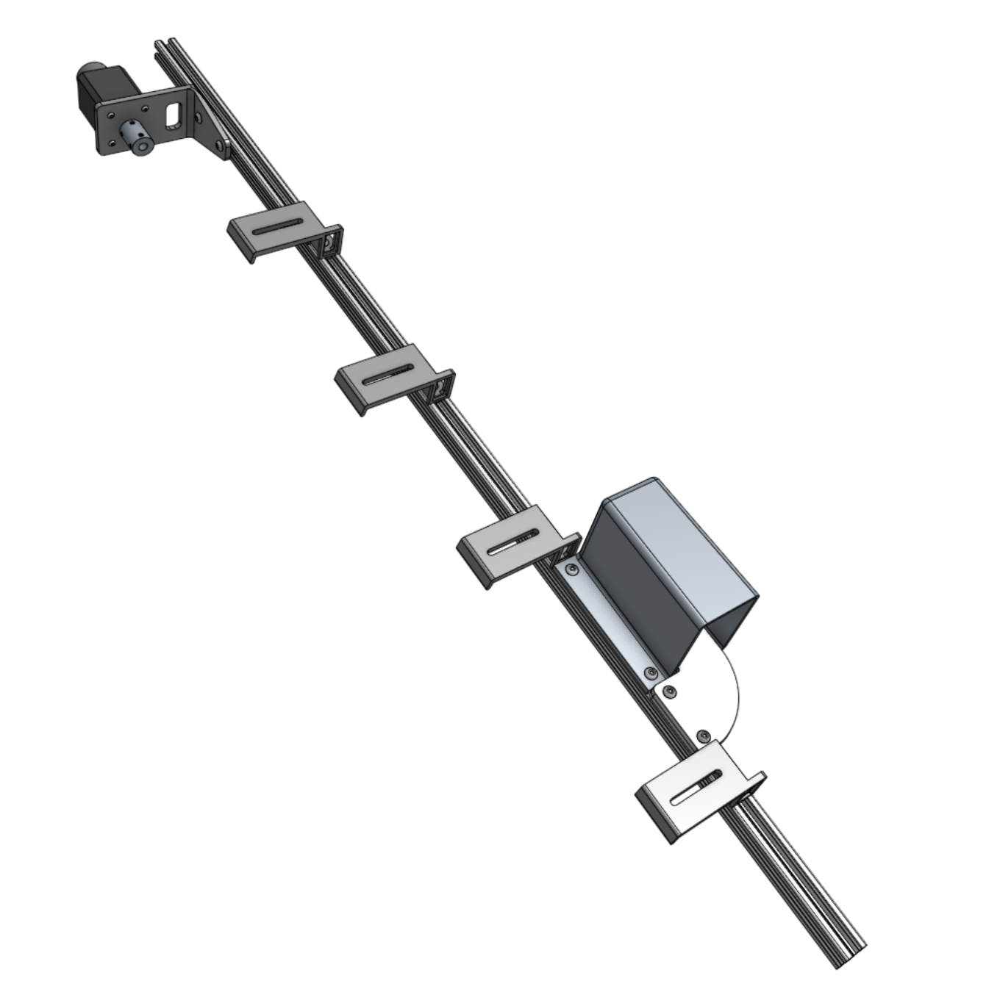
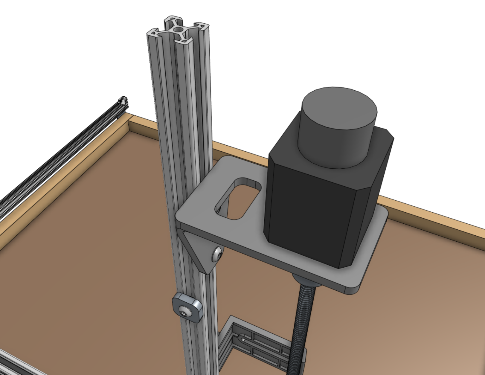

* toc
{:toc}



# Step 1: Attach the stepper motor to the Z-axis motor mount
Attach a **stepper motor** to the **z-axis motor mount** using four **M3 x 12mm screws**. The motor and encoder connectors should be facing the back flange of the mount.

# Step 2: Attach the motor mount to the Z-axis extrusion



Attach the **z-axis motor mount** to the **z-axis extrusion** using a **60mm nut bar** and **M5 x 10mm screws**. The top face of the motor mount should be 80mm from the end of the extrusion.

# Step 3: Attach the shaft coupling
Slide the **5mm to 8mm shaft coupling** onto the **motor shaft** and tighten the two setscrews with the **2.5mm hex key**. Ensure that the setscrews are positioned onto the flat parts of the motor shaft.

# Step 4: Attach three cable carrier supports
Attach three **60mm vertical cable carrier supports** to the **z-axis extrusion** using **40mm nut bars** and **M5 x 10mm screws**. Space the supports along the extrusion as shown.

# Step 5: Attach the vacuum pump cover
Attach the **vacuum pump cover** to the **z-axis extrusion** using two **M5 drop-in tee nuts** and **M5 x 10mm screws**. The cover should be butted up against the lowest **cable carrier support**.

# Step 6: Attach the vacuum pump
Fasten the **vacuum pump** to the **vacuum pump mount** using two **200mm zip ties**.

Then attach the **vacuum pump mount** to the **z-axis extrusion** using a **60mm nut bar** and two **M5 x 16mm screws**. The mount should be butted up against the **vacuum pump cover**.

# Step 7: Attach one more cable carrier support
Attach one more **60mm vertical cable carrier support** using a **40mm nut bar** and two **M5 x 10mm screws**. The support should be butted up against the **vacuum pump mount**.

# Step 8: Attach the z-axis to the cross-slide
Screw the **leadscrew** halfway into the **leadscrew block**.

Slide the **z-axis extrusion** through the v-wheels on the **cross-slide** until the **leadscrew** inserts into the **5mm to 8mm shaft coupling**.



Secure the **leadscrew** to the **5mm to 8mm shaft coupler** by tightening the two **setscrews** with the **2.5mm hex key**.

# Step 9: Install the hardstops
Attach a **z-axis hardstop** onto the backside of the **z-axis extrusion** approximately 200mm from the top of the extrusion using an **M5 x 10mm screw** and **tee nut**. Later, you can quickly adjust this to physically prevent FarmBot from ever moving too low within its working space, which could damage something.

Attach the other **z-axis hardstop** onto the backside of the **z-axis extrusion** approximately 100mm from the bottom of the extrusion. This prevents the z-axis from moving too high.

# Step 10: Add the vertical motor housing (optional)
If you plan on stopping assembly after this page, it is recommended to attach the **80mm vertical motor housing** to the **z-axis extrusion** using **M5 x 10mm screws** and **tee nuts** now. This will protect the motor from rain and other hazards until you resume assembly at a later point. Once you resume assembly, you will need to remove the housing.

If you do not plan on stopping the assembly process now, you can skip this step and install the housing after the z motor and encoder cables have been connected in the next step.

# What's next?

 * [Cables and Tubing](../FarmBot-Genesis-V1.5/cables-and-tubing.md)
