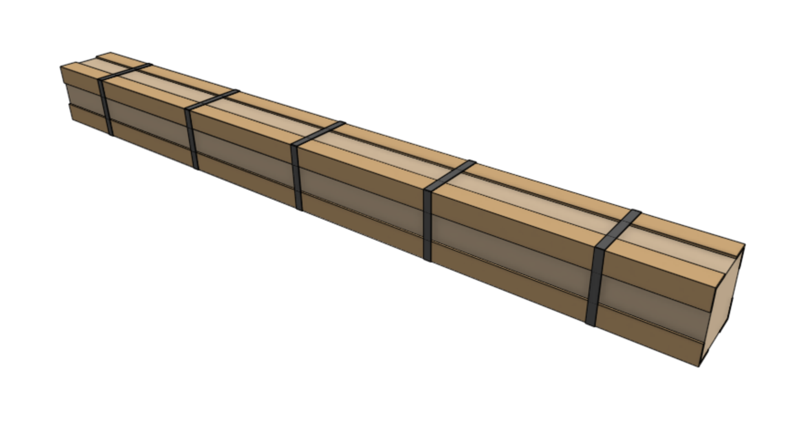

* toc
{:toc}

The tables below show the items that should be packed into the **extrusion and leadscrew kit** for each version.

# Genesis packing list

|Item                          |Sub-packing                   |Genesis Qty                   |
|------------------------------|------------------------------|------------------------------|
|[Track Extrusion](../bom/extrusions.md#track-extrusion) (20 x 40 x 1500mm)|Wrapped with recycled kraft paper|4
|[Gantry Column](../bom/extrusions.md#gantry-column) (20 x 60 x 500mm)|Wrapped with recycled kraft paper|2
|[Gantry Main Beam](../bom/extrusions.md#gantry-main-beam) (20 x 60 x 1500mm)|Wrapped with recycled kraft paper|1
|[Z-Axis Extrusion](../bom/extrusions.md#z-axis-extrusion) (20 x 20 x 1000mm)|Wrapped with recycled kraft paper|1
|[Leadscrew](../bom/drivetrain.md#leadscrew)|Clear plastic tube with end caps|1

# Genesis XL packing list

|Item                          |Sub-packing                   |Genesis XL Qty                |
|------------------------------|------------------------------|------------------------------|
|[Track Extrusion](../bom/extrusions.md#track-extrusion) (20 x 40 x 1500mm)|Wrapped with recycled kraft paper|8
|[Gantry Column](../bom/extrusions.md#gantry-column) (20 x 60 x 500mm)|Wrapped with recycled kraft paper|2
|[Gantry Main Beam](../bom/extrusions.md#gantry-main-beam) (20 x 60 x 1500mm)|Wrapped with recycled kraft paper|2
|[Z-Axis Extrusion](../bom/extrusions.md#z-axis-extrusion) (20 x 20 x 1000mm)|Wrapped with recycled kraft paper|1
|[Leadscrew](../bom/drivetrain.md#leadscrew)|Clear plastic tube with end caps|1

# Edge protectors and straps
Add four cardboard **edge protectors** on the four longest edges of the box. Then add five black polystraps.

# Box specifications

|                              |                              |
|------------------------------|------------------------------|
|**Box style**                 |Standard style box
|**Inner dimensions (L x W x H)**|Genesis: 1540 x 120 x 120mm Genesis XL: 1550 x 120 x 140mm
|**Outer dimensions (L x W x H)**|Genesis: 1550 x 130 x 130mm Genesis XL: 1550 x 120 x 150mm
|**Material**                  |Cardboard
|**Color**                     |Brown
|**Printing**                  |Genesis: Genesis Extrusion and Leadscrew Kit.pdf Genesis XL: Genesis XL Extrusion and Leadscrew Kit.pdf
|**Fill**                      |Recycled kraft paper

