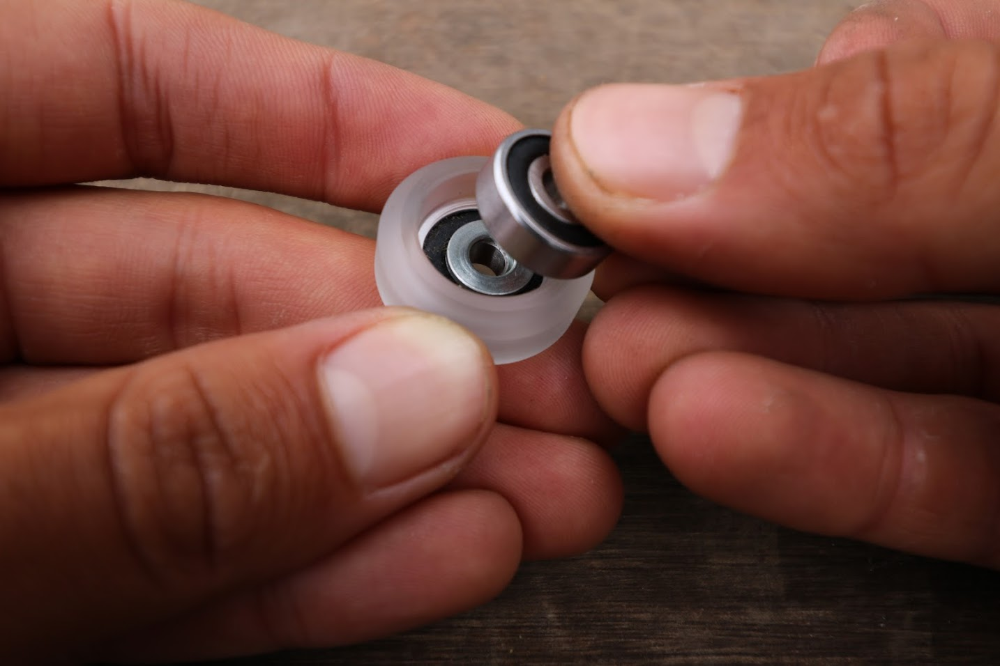

* toc
{:toc}

Each V-Wheel consists of four components:
* One [V-wheel](../../Extras/bom/drivetrain.md#v-wheel)
* Two [bearings](../../Extras/bom/drivetrain.md#v-wheel)
* One [M5 shim](../../Extras/bom/drivetrain.md#v-wheel)

# Step 1: Insert the first bearing

Press one **bearing** into the **v-wheel**.







# Step 2: Insert the precision shim

Insert the **precision shim** such that it is resting on the first bearing on the inside of the wheel. Try to position the shim in the center of the wheel.

# Step 3: Insert the second bearing

 Press the second **bearing** into the **v-wheel**.





