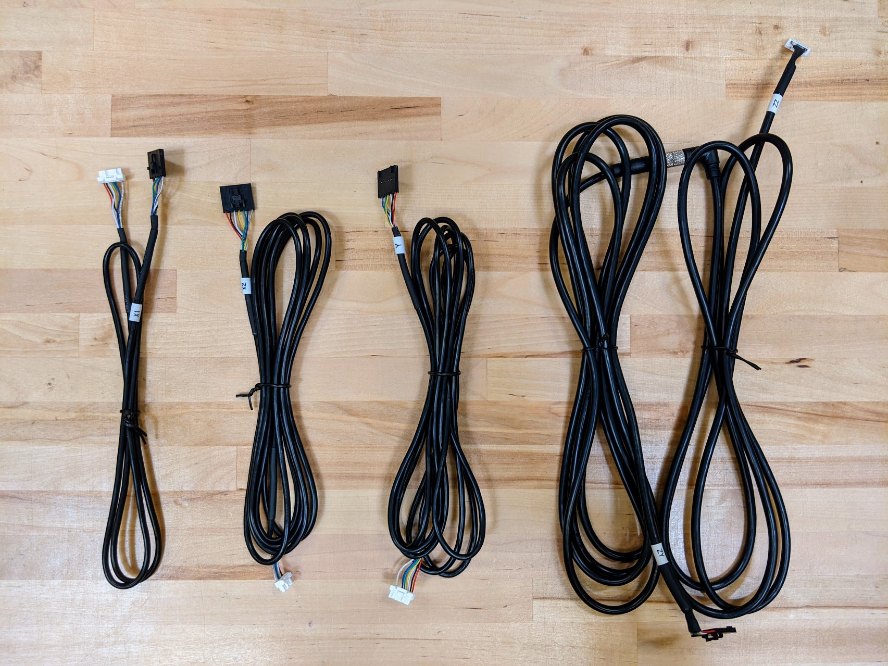

* toc
{:toc}

Installing the cables and tubing through FarmBot's cable carriers can be a tedious process. Take your time when installing the cables to ensure you complete this part of the assembly correct the first time, otherwise it might become frustrating if you need to re-do anything.

# Cable carrier reference

|Axis|Genesis                            |Genesis XL                          |
|----|-----------------------------------|------------------------------------|
|X   |15mm x 20mm x 1700mm (85 links) |15mm x 20mm x 3200mm (160 links)
|Y   |15mm x 50mm x 1700mm (85 links) |15mm x 50mm x 3200mm (160 links)
|Z   |15mm x 50mm x 740mm (37 links)  |15mm x 50mm x 740mm (37 links)

# Motor and encoder cable reference

|Axis|Genesis|Genesis XL|
|----|-------|----------|
|X1  |0.7m   |0.7m
|X2  |2.3m   |3.8m
|Y   |2.7m   |4.2m
|ZY  |2.6m   |4.1m
|ZZ  |1.8m   |1.8m



## Motor cables

## Encoder cables

# What's next?

 * [Z-Axis Cable Carrier](cables-and-tubing/z-axis-cable-carrier.md)
