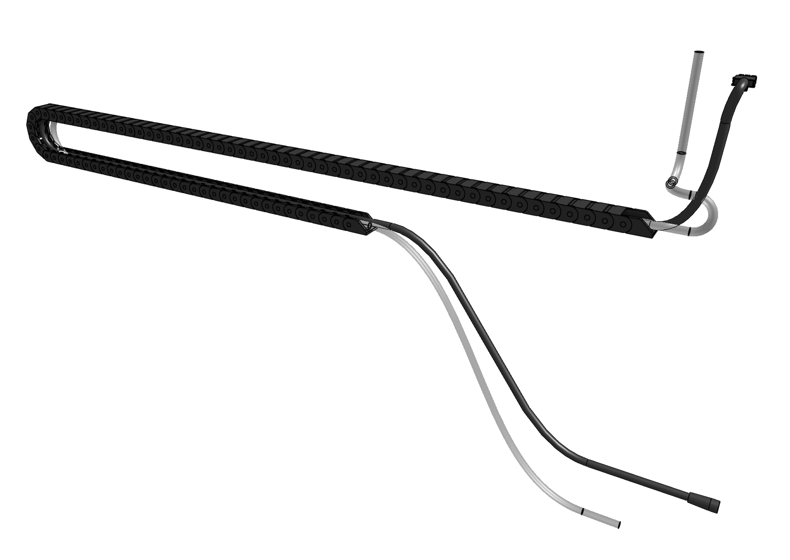
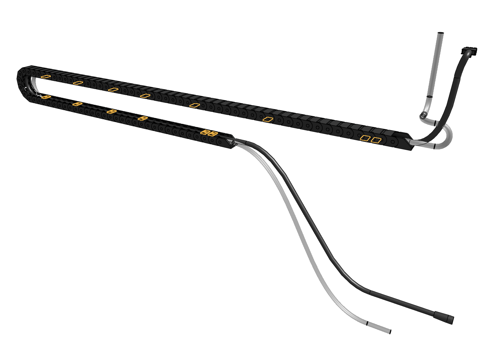
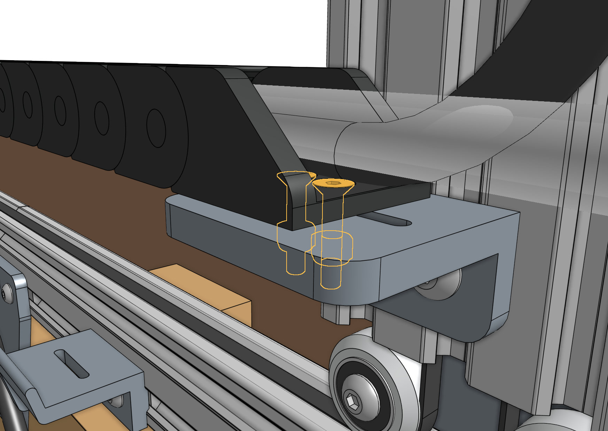
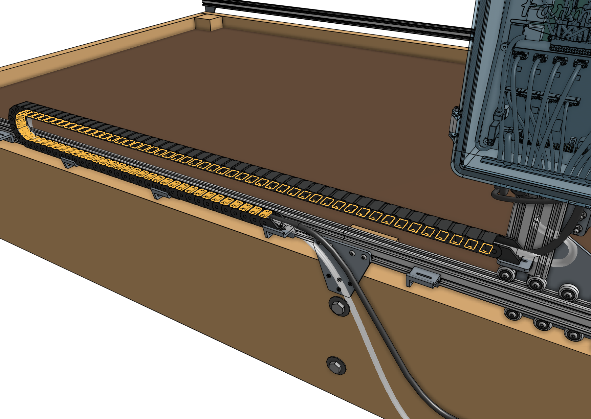

* toc
{:toc}

# Step 1: Prepare the cable carrier

Remove all of the snap-in **tabs** from the **x-axis cable carrier**. Note that the x-axis and y-axis cable carriers are the same length, but the x-axis cable carrier is narrower than the y-axis one.



# Step 2: Orient the cable carrier

There is only one orientation that the **x-axis cable carrier** mounts to the **gantry** and **tracks**, and it is determined by the orientation of the **end pieces**. Lay the cable carrier onto the track's **horizontal cable carrier supports** to ensure you have it correctly oriented. Do not attach it at this time.

# Step 3: Lay everything into the cable carrier

Disconnect the [[power supply cable]] from the [[power supply]].

Lay the **x-axis water tube** and the [[power supply cable]] into the open **x-axis cable carrier**. The gray connector of the [[power supply cable]] should extend beyond the gantry-mounted cable carrier end by about 50cm so that it can plug into the Farmduino. The water tube should be extended the same distance.



# Step 4: Snap in some tabs

Snap in three **cable carrier tabs** at both ends of the cable carrier, and a few more spread throughout the middle of the cable carrier so the cable and tube stay in place. You do not want to snap in all of the tabs at this time because that will make it difficult to make adjustments if needed.

# Step 5: Mount the cable carrier to the gantry

Attach the **x-axis cable carrier** to the **30mm horizontal cable carrier mount** using two [[M3 x 16mm flat head screws]] and [[M3 locknuts]].

# Step 6: Mount the cable carrier to the tracks

Attach the other end of the **x-axis cable carrier** to the [[30mm horizontal cable carrier support]] nearest the middle of the **tracks** using two [[M3 x 16mm flat head screws]] and [[M3 locknuts]].

# Step 7: Snap in the remaining tabs

Once everything is situated well, snap-in the remaining **cable carrier tabs**, ensuring that you maintain organization of the cable and tube.



# What's next?

 * [X-Axis Motors](x-axis-motors.md)
