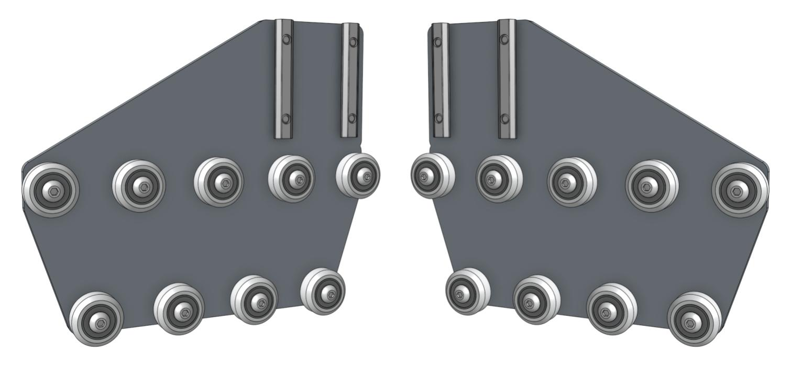
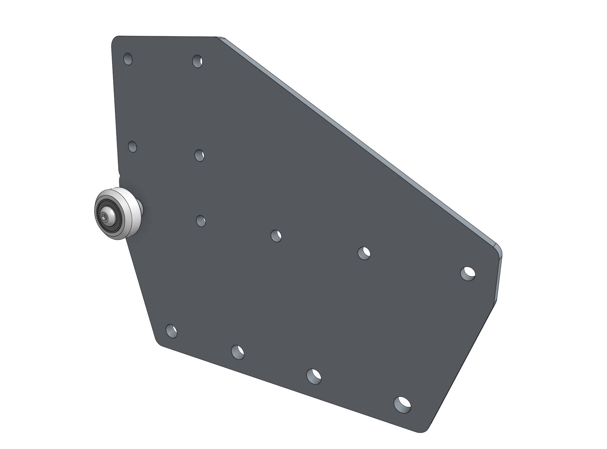
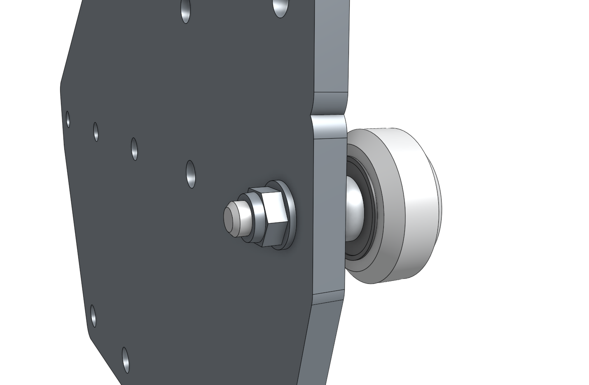
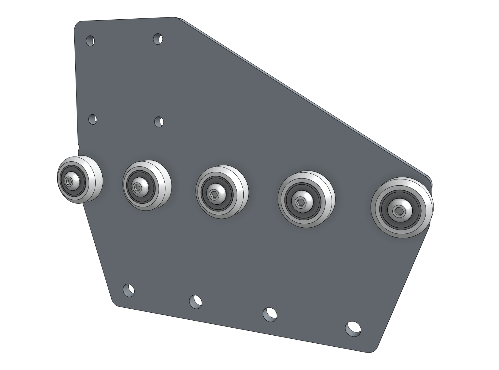
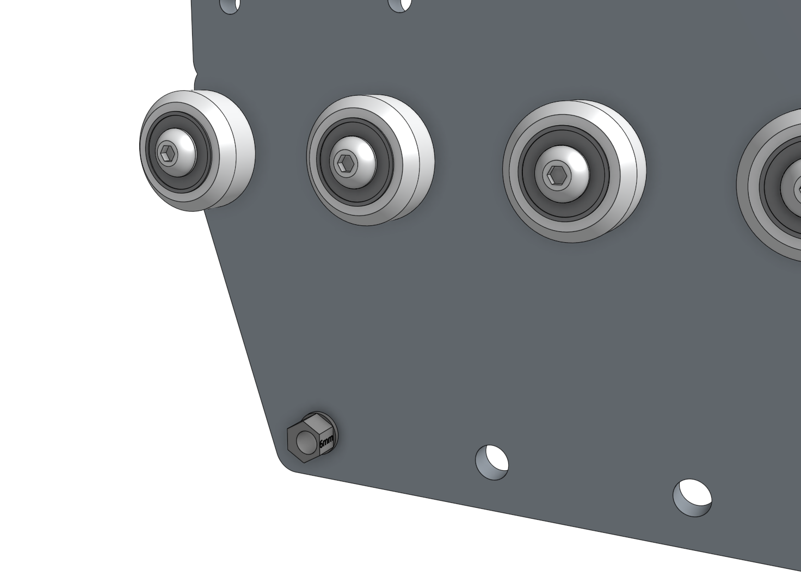
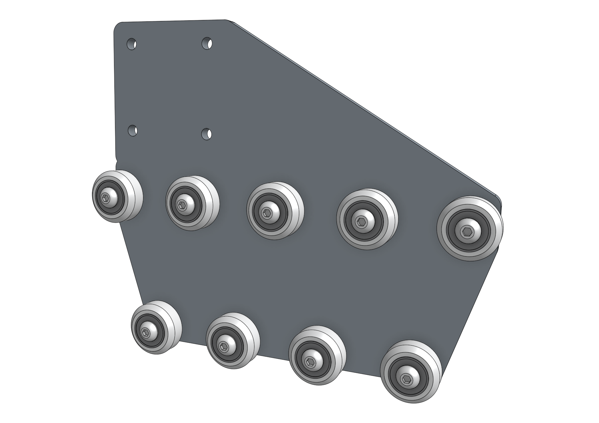
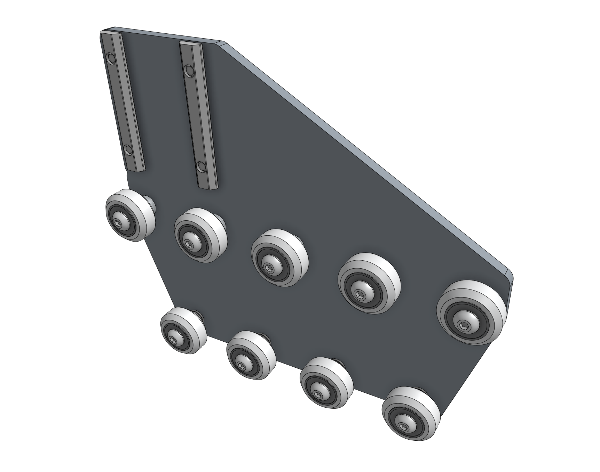

* toc
{:toc}

Each gantry wheel plate will have nine wheel assemblies attached to allow sliding along the tracks. The five wheels that ride on the top of the tracks will be attached to the plates with **[standard spacers](../../bom/fasteners-and-hardware/spacers.md#m5-x-6mm-spacers)**. The four wheels that ride underneath the tracks will be attached to the plates with **[eccentric spacers](../../bom/fasteners-and-hardware/spacers.md#m5-x-6mm-eccentric-spacers)**. The eccentric spacers will be used to finely adjust the spacing between the top and the bottom wheels such that the gantry will roll smoothly and snuggly along the tracks.



# Step 1: Attach the upper V-wheels

Insert an **M5 x 30mm screw** through a **V-wheel** and a **[standard spacer](../../bom/fasteners-and-hardware/m5-x-6mm-spacers.md)**. Then insert this into the **gantry wheel plate** as shown and add an **M5 flange locknut** on the other side of the plate. Tighten the wheel assembly using the **3mm hex driver** and the **8mm box wrench**, then repeat for the remaining four V-wheels with standard spacers. All five of these wheels should be positioned on the plate in a straight line.



# Step 2: Attach the lower V-wheels

Insert an **[eccentric spacer](../../bom/fasteners-and-hardware/m5-x-6mm-eccentric-spacers.md)** into the **gantry wheel plate**. Then insert an **M5 x 30mm screw** with a **V-wheel** through the spacer and secure the assembly with an **M5 flange locknut** on the other side of the plate. Repeat for the remaining V-wheels attached with the eccentric spacers.



# Step 3: Attach the nut bars

Loosely attach two **60mm nut bars** to the plate using four **M5 x 10mm screws**. The nut bars should reside on the same side of the plate as the V-wheels.

# Step 4: Repeat

Repeat the above steps for the second gantry wheel plate assembly. You should end up with two gantry wheel plate assemblies that are mirror images of each other.

# Step 5: Adjust the V-wheel spacing

The **[eccentric spacers](../../bom/fasteners-and-hardware/m5-x-6mm-eccentric-spacers.md)** on the lower wheels of each gantry wheel plate assembly are used for making fine adjustments to the spacing between the lower wheels and the upper wheels. Adjusting this spacing is the key to having your gantry move smoothly and wobble-free across the tracks.

If the spacing is too little, then the gantry will not fit onto the tracks at all or be tough to move. If the spacing is too great, then the gantry will be wobbly and loose. Adjust the **[eccentric spacers](../../bom/fasteners-and-hardware/m5-x-6mm-eccentric-spacers.md)** using the [eccentric spacer adjustment reference guide](../../extras/reference/eccentric-spacer-adjustment.md).

# What's next?

 * [Construct the Gantry Structure](construct-the-gantry-structure.md)
