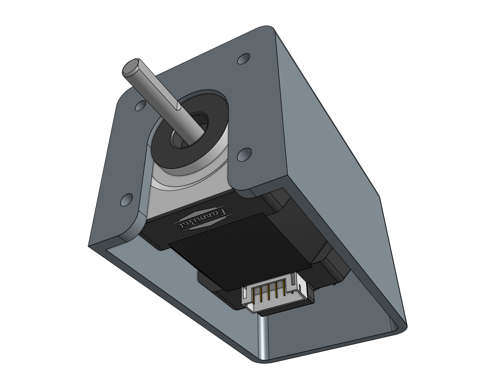
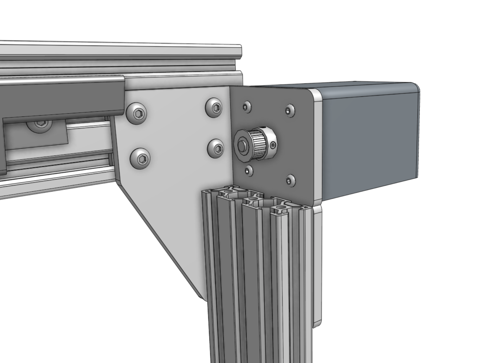
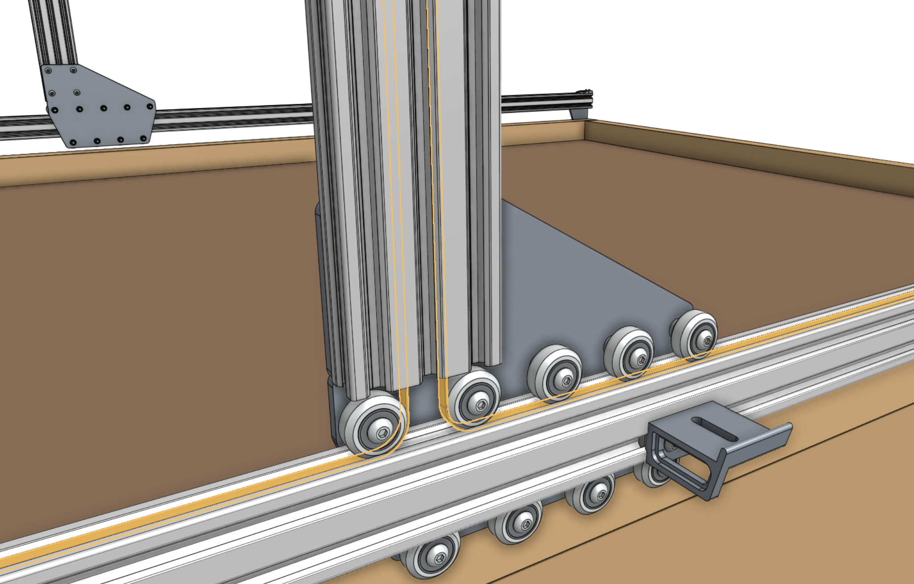

# Step 1: Attach the gantry motors

Slide a [[motor]] into a [[horizontal motor housing]], ensuring that the shaft of the motor is coming out of the housing and that the motor and encoder connectors are facing down through the open bottom of the housing. Then attach the motor and housing to a [[gantry corner bracket]] with four [[M3 x 12mm screws]]. Repeat for the second motor on the other gantry corner bracket.



Slide [[pulleys]] onto the **motor shafts** and tighten the two **set screws (pre-inserted)** with the 2mm hex driver. Make sure that the setscrews contact the *flat areas* on the motor shafts.



# Step 2: Feed the belts

Drop the ends of one of the **x-axis GT2 timing belts** down the two large openings of a [[gantry column]], ensuring that the belt teeth engage the [[pulley]]. Grab the ends of the **belt** at the bottom of the [[gantry column]] and feed them under the [[V-wheels]] of the [[gantry wheel plate]], then along the top of the [[track extrusions]] to the ends of the tracks. The flat side of the belt should be in contact with the V-wheels.





# Step 3: Secure the belts

Secure one end of the belt to the front end of the tracks by using a [[belt clip]], [[belt sleeve]], [[20mm nut bar]], and two [[M5 x 10mm screws]]. The belt must be wrapped through the clip as outlined in the [belt installation guide](../../extras/reference/belt-installation.md). Repeat for the other end of the belt on the other end of the tracks. Then repeat for the second x-axis belt on the other side of the FarmBot. Trim or coil any extra belt, if desired.



# Step 4: Equalize the gantry



To equalize the gantry, first ensure that the x-axis motors are unpowered. For first time installation this will always be the case because we haven't yet added the wires or electronics! Then gently push or pull on the gantry **from the middle of the gantry main beam** such that it moves slowly along the tracks about 30cm. This process will remove any torque on the gantry, and ensure it is not crooked. If you push or pull the gantry from one of the gantry columns, or anywhere that is not the middle of the main beam, then you will torque the gantry and make it crooked. Don't do that.

If you were equalizing the gantry as part of routine maintenance, remember to FIND HOME X after equalization.



# What's next?

 * [Cross-Slide](../cross-slide.md)
